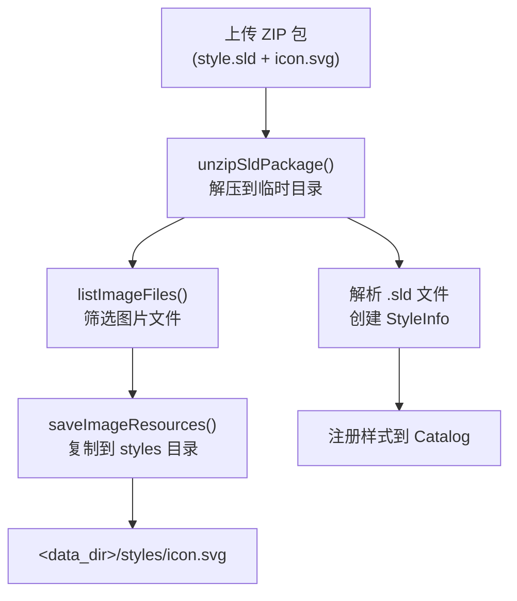

# GeoServer SVG 上传与样式资源管理

## 概述

GeoServer 中 SVG 文件作为样式引用的**外部图形资源**（ExternalGraphic）存在，不是独立的样式格式。上传方式有 3 种，涉及 2 个核心控制器。

---

## 一、上传方式总览

| 方式 | 控制器 | Content-Type | 适用场景 |
|------|--------|-------------|---------|
| 直接 PUT 上传 | ResourceController | `image/svg+xml` | 单独上传 SVG 文件 |
| ZIP 包 POST 创建 | StyleController | `application/zip` | 同时上传 SLD + SVG |
| ZIP 包 PUT 更新 | StyleController | `application/zip` | 更新样式及关联 SVG |

---

## 二、方式一：直接 PUT 上传（推荐）

### 源码位置

`src/restconfig/src/main/java/org/geoserver/rest/resources/ResourceController.java`

### 核心方法

```java
@PutMapping(consumes = {MediaType.ALL_VALUE})
@ResponseStatus(HttpStatus.CREATED)
public void resourcePut(
    HttpServletRequest request,
    HttpServletResponse response,
    @RequestParam(name = "operation", required = false, defaultValue = "default") String operationName)
```

### 逻辑说明

1. 从 URL 路径解析目标资源路径（去掉 `/resource` 前缀）
2. 将请求体 `IOUtils.copy` 直接写入目标资源
3. 新建资源返回 `201 CREATED`，更新已有资源隐式返回 `200 OK`

### 存储路径映射

| API URL | 磁盘路径 |
|---------|---------|
| `/rest/resource/styles/icon.svg` | `<data_dir>/styles/icon.svg` |
| `/rest/resource/workspaces/{ws}/styles/icon.svg` | `<data_dir>/workspaces/{ws}/styles/icon.svg` |

### 调用示例

```powershell
# 上传 SVG 到全局 styles 目录
curl -u admin:geoserver -X PUT `
  -H "Content-Type: image/svg+xml" `
  --data-binary @icon.svg `
  "http://localhost:9090/geoserver/rest/resource/styles/icon.svg"

# 上传 SVG 到工作空间 styles 目录
curl -u admin:geoserver -X PUT `
  -H "Content-Type: image/svg+xml" `
  --data-binary @icon.svg `
  "http://localhost:9090/geoserver/rest/resource/workspaces/stone/styles/icon.svg"

# 下载 SVG 文件
curl -u admin:geoserver `
  "http://localhost:9090/geoserver/rest/resource/styles/icon.svg" `
  -o icon.svg

# 删除 SVG 文件
curl -u admin:geoserver -X DELETE `
  "http://localhost:9090/geoserver/rest/resource/styles/icon.svg"
```

### ResourceController 其他操作

| 操作 | 方法 | 路径 | 说明 |
|------|------|------|------|
| 读取资源 | GET | `/rest/resource/**` | 返回文件内容或目录列表 |
| 上传资源 | PUT | `/rest/resource/**` | 请求体直接写入目标路径 |
| 移动资源 | PUT | `/rest/resource/**?operation=move` | 请求体为源路径 |
| 复制资源 | PUT | `/rest/resource/**?operation=copy` | 请求体为源路径 |
| 删除资源 | DELETE | `/rest/resource/**` | 删除指定资源 |
| 查看元数据 | GET | `/rest/resource/**?operation=metadata` | 返回名称、修改时间、类型 |

---

## 三、方式二：ZIP 包上传（POST 创建）

### 源码位置

`src/restconfig/src/main/java/org/geoserver/rest/catalog/StyleController.java`

### 核心端点

```java
@PostMapping(
    value = {"/styles", "/workspaces/{workspaceName}/styles"},
    consumes = {MediaTypeExtensions.APPLICATION_ZIP_VALUE})
public ResponseEntity<String> stylePost(
    InputStream stream,
    @RequestParam(required = false) String name,
    @PathVariable(required = false) String workspaceName,
    UriComponentsBuilder builder)
```

### 处理流程



### 关键方法说明

#### unzipSldPackage — 解压 ZIP 包

```java
private File unzipSldPackage(InputStream object) throws IOException {
    File tempDir = Files.createTempDirectory(SLD_TEMP_PREFIX).toFile();
    org.geoserver.util.IOUtils.decompress(object, tempDir);
    return tempDir;
}
```

#### listImageFiles — 识别 SVG 等图片文件

```java
private File[] listImageFiles(File directory) {
    return directory.listFiles((dir, name) -> validImageFileExtensions.contains(
        FilenameUtils.getExtension(name).toLowerCase()));
}
```

**有效图片扩展名**（定义在 `AbstractCatalogController`）：

```java
this.validImageFileExtensions = Arrays.asList("svg", "png", "jpg", "bmp", "gif");
```

#### saveImageResources — 保存图片到 styles 目录

```java
private void saveImageResources(File directory, String workspaceName) throws IOException {
    Resource stylesDir = workspaceName == null
        ? dataDir.getStyles()                    // 全局: <data_dir>/styles/
        : dataDir.getStyles(catalog.getWorkspaceByName(workspaceName));  // 工作空间: <data_dir>/workspaces/<ws>/styles/

    File[] imageFiles = listImageFiles(directory);
    for (File imageFile : imageFiles) {
        IOUtils.copyStream(
            new FileInputStream(imageFile),
            stylesDir.get(imageFile.getName()).out(),
            true, true);
    }
}
```

### 调用示例

```powershell
# 1. 将 SLD 和 SVG 打包为 ZIP
Compress-Archive -Path style.sld, icon.svg -DestinationPath style.zip -Force

# 2. 上传 ZIP 包（创建全局样式）
curl -u admin:geoserver -X POST `
  -H "Content-Type: application/zip" `
  --data-binary @style.zip `
  "http://localhost:9090/geoserver/rest/styles?name=mystyle"

# 3. 上传 ZIP 包（创建工作空间样式）
curl -u admin:geoserver -X POST `
  -H "Content-Type: application/zip" `
  --data-binary @style.zip `
  "http://localhost:9090/geoserver/rest/workspaces/stone/styles?name=mystyle"
```

---

## 四、方式三：ZIP 包更新（PUT）

### 核心端点

```java
@PutMapping(
    value = {"/styles/{styleName}", "/workspaces/{workspaceName}/styles/{styleName}"},
    consumes = {MediaTypeExtensions.APPLICATION_ZIP_VALUE})
public void styleZipPut(
    InputStream is,
    @PathVariable String styleName,
    @PathVariable(required = false) String workspaceName)
```

逻辑与 POST 创建相同，SVG 同样由 `saveImageResources()` 自动提取保存。

### 调用示例

```powershell
curl -u admin:geoserver -X PUT `
  -H "Content-Type: application/zip" `
  --data-binary @style.zip `
  "http://localhost:9090/geoserver/rest/styles/mystyle"
```

---

## 五、SVG 在 SLD 中的引用

上传后，SLD 中通过**相对路径**引用 SVG 文件：

```xml
<?xml version="1.0" encoding="UTF-8"?>
<StyledLayerDescriptor version="1.0.0" xmlns="http://www.opengis.net/sld">
  <NamedLayer>
    <Name>myLayer</Name>
    <UserStyle>
      <FeatureTypeStyle>
        <Rule>
          <PointSymbolizer>
            <Graphic>
              <ExternalGraphic>
                <OnlineResource xlink:type="simple"
                                xlink:href="icon.svg"/>
                <Format>image/svg+xml</Format>
              </ExternalGraphic>
              <Size>32</Size>
            </Graphic>
          </PointSymbolizer>
        </Rule>
      </FeatureTypeStyle>
    </UserStyle>
  </NamedLayer>
</StyledLayerDescriptor>
```

### SVG MIME 类型映射

定义在 `src/main/src/main/java/org/geoserver/catalog/StyleHandler.java`：

```java
IMAGE_TYPES.addMimeTypes("image/svg+xml svg");
```

---

## 六、存储目录结构

```
<GEOSERVER_DATA_DIR>/
├── styles/                          # 全局样式目录
│   ├── point.sld                    # SLD 样式文件
│   ├── icon.svg                     # SVG 图标资源
│   ├── marker.png                   # PNG 图标资源
│   └── ...
├── workspaces/
│   ├── stone/                       # stone 工作空间
│   │   ├── namespace.xml
│   │   ├── styles/                  # 工作空间样式目录
│   │   │   ├── mystyle.sld
│   │   │   ├── icon.svg
│   │   │   └── ...
│   │   └── ...
│   └── ...
└── ...
```

**当前开发环境数据目录**：

```
d:\code\源码\geoserver-main\src\web\app\src\main\webapp\data\
```

---

## 七、安全机制

ResourceController 对下载的文件做了安全防护：

```java
// HTML/JS 类型强制转为 text/plain，防止存储型 XSS
if (mimeType.contains("html") || mimeType.contains("javascript")) {
    return MediaType.TEXT_PLAIN;
}

// 文件下载设置 Content-Disposition: attachment
response.setHeader("Content-Disposition", "attachment; filename=" + resource.name());
```

SVG 的 MIME 类型为 `image/svg+xml`，**不受此限制**，正常返回原始内容。

---

## 八、关键源码文件索引

| 文件 | 路径 | 关键内容 |
|------|------|---------|
| `ResourceController.java` | `src/restconfig/.../resources/` | 直接文件上传/下载/删除 |
| `StyleController.java` | `src/restconfig/.../catalog/` | ZIP 包上传，SVG 自动提取 |
| `AbstractCatalogController.java` | `src/restconfig/.../catalog/` | `validImageFileExtensions` 定义 |
| `StyleHandler.java` | `src/main/.../catalog/` | SVG MIME 类型映射 |
| `GeoServerDataDirectory.java` | `src/main/.../config/` | 数据目录路径解析 |
| `RESTUtils.java` | `src/rest/.../util/` | 二进制上传工具方法 |
