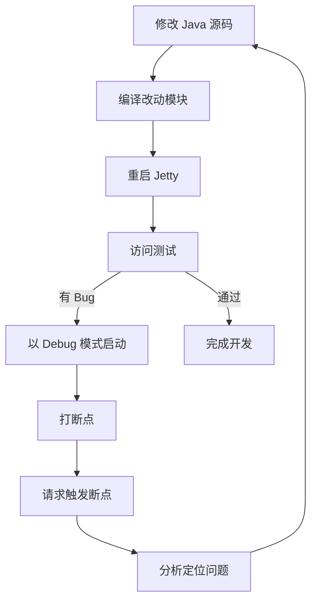

# GeoServer 开发调试指南

## 环境要求

| 项目 | 要求 |
|------|------|
| JDK | 17+（推荐 Eclipse Adoptium Temurin 17） |
| Maven | 项目自带 `apache-maven-3.9.15` |
| IDE | VS Code + Extension Pack for Java |

---

## 一、源码编译

### 首次完整编译（仅一次）

```powershell
cd "d:\code\源码\geoserver-main\src"
& "d:\code\源码\geoserver-main\apache-maven-3.9.15\bin\mvn.cmd" clean install "-DskipTests" -T 4
```

> 必须使用 `-DskipTests`（不是 `-Dmaven.test.skip=true`），确保测试代码被编译生成 `*-tests.jar`。

### 增量编译（修改代码后）

```powershell
# 只编译指定模块，如 main 模块
cd "d:\code\源码\geoserver-main\src"
& "d:\code\源码\geoserver-main\apache-maven-3.9.15\bin\mvn.cmd" install -pl main -DskipTests -am
```

---

## 二、启动开发服务器

### 方式一：Maven Jetty 启动（推荐）

```powershell
cd "d:\code\源码\geoserver-main\src\web\app"
$env:GEOSERVER_DATA_DIR = "d:\code\源码\geoserver-main\src\web\app\src\main\webapp\data"
& "d:\code\源码\geoserver-main\apache-maven-3.9.15\bin\mvn.cmd" jetty:run "-Djetty.port=9090"
```

> **注意**：必须在 `src\web\app` 目录下执行，其他目录会报 `No plugin found for prefix 'jetty'`。

### 方式二：Debug 模式启动（支持断点调试）

```powershell
cd "d:\code\源码\geoserver-main\src\web\app"
$env:GEOSERVER_DATA_DIR = "d:\code\源码\geoserver-main\src\web\app\src\main\webapp\data"
$env:MAVEN_OPTS = "-agentlib:jdwp=transport=dt_socket,server=y,suspend=n,address=*:8000"
& "d:\code\源码\geoserver-main\apache-maven-3.9.15\bin\mvn.cmd" jetty:run "-Djetty.port=9090"
```

然后在 VS Code 中按 `F5`，选择 **"Attach to GeoServer (mvnDebug)"** 附加调试器。

### 访问地址

| 地址 | 说明 |
|------|------|
| http://localhost:9090/geoserver | Web 管理界面 |
| http://localhost:9090/geoserver/rest | REST API |
| 用户名 / 密码 | `admin` / `geoserver` |

---

## 三、VS Code 调试配置

项目已配置 `.vscode/launch.json`：

```json
{
  "version": "0.2.0",
  "configurations": [
    {
      "type": "java",
      "name": "Attach to GeoServer (mvnDebug)",
      "request": "attach",
      "hostName": "localhost",
      "port": 8000
    }
  ]
}
```

### 调试步骤

1. 以 Debug 模式启动 Jetty（方式二）
2. 在 VS Code 左侧调试图标中，选择 **"Attach to GeoServer (mvnDebug)"**
3. 按 `F5` 附加调试器
4. 在 Java 源码中点击行号左侧设置断点
5. 浏览器访问 API 触发请求，命中断点自动暂停

---

## 四、日志查看

### 日志文件位置

```
d:\code\源码\geoserver-main\src\web\app\src\main\webapp\data\logs\geoserver.log
```

> 前提：启动时设置了 `$env:GEOSERVER_DATA_DIR`

### 终端查看日志

```powershell
# 实时跟踪日志（类似 tail -f）
Get-Content "d:\code\源码\geoserver-main\src\web\app\src\main\webapp\data\logs\geoserver.log" -Wait -Tail 50

# 查看最后 100 行
Get-Content "d:\code\源码\geoserver-main\src\web\app\src\main\webapp\data\logs\geoserver.log" -Tail 100

# 查看完整日志
Get-Content "d:\code\源码\geoserver-main\src\web\app\src\main\webapp\data\logs\geoserver.log"
```

### 调整日志级别

在 GeoServer Web 界面中：**全局设置 → 日志级别**

| 级别 | 说明 |
|------|------|
| `DEFAULT_LOGGING` | 默认，INFO 级别 |
| `VERBOSE_LOGGING` | 详细，DEBUG 级别 |
| `GEOSERVER_DEVELOPER_LOGGING` | 开发者模式，最详细 |

---

## 五、常见问题排查

### 1. `No plugin found for prefix 'jetty'`

**原因**：不在 `src/web/app` 目录下执行。

**解决**：
```powershell
cd "d:\code\源码\geoserver-main\src\web\app"
```

### 2. `Could not find artifact org.geoserver:gs-main:jar:tests:3.0.0-SNAPSHOT`

**原因**：本地 Maven 仓库中 SNAPSHOT 缓存损坏或缺失。

**解决**：重新安装 `gs-main` 模块：
```powershell
cd "d:\code\源码\geoserver-main\src"
& "d:\code\源码\geoserver-main\apache-maven-3.9.15\bin\mvn.cmd" install -pl main -DskipTests -am
```

### 3. `gov.nasa:worldwind:jar:0.6` 下载失败

**原因**：OSGeo 仓库网络不稳定，Maven 缓存了失败结果。

**解决**：
```powershell
# 清除本地缓存
Remove-Item -Recurse -Force "$env:USERPROFILE\.m2\repository\gov\nasa\worldwind" -ErrorAction SilentlyContinue

# 强制更新
& "d:\code\源码\geoserver-main\apache-maven-3.9.15\bin\mvn.cmd" clean install "-DskipTests" -U
```

### 4. 端口 8080 被占用

**原因**：安装版 GeoServer 占用了 8080 端口。

**解决**：使用其他端口启动：`-Djetty.port=9090`

### 5. `Workspace xxx not found`

**原因**：REST API 路径中引用了不存在的工作空间。

**解决**：参见下方 API 调用章节，确保 workspace 已创建或使用全局样式路径。

---

## 六、REST API 调用指南

### 认证方式

所有 REST API 请求需要 Basic 认证：

```powershell
curl -u admin:geoserver "http://localhost:9090/geoserver/rest/..."
```

### 工作空间（Workspace）API

| 操作 | 方法 | 路径 |
|------|------|------|
| 列出所有工作空间 | GET | `/rest/workspaces` |
| 获取工作空间详情 | GET | `/rest/workspaces/{name}` |
| 创建工作空间 | POST | `/rest/workspaces` |
| 删除工作空间 | DELETE | `/rest/workspaces/{name}` |

```powershell
# 列出工作空间
curl -u admin:geoserver "http://localhost:9090/geoserver/rest/workspaces.json"

# 创建工作空间
curl -u admin:geoserver -X POST \
  -H "Content-Type: application/json" \
  -d '{"workspace":{"name":"stone"}}' \
  "http://localhost:9090/geoserver/rest/workspaces"
```

### 样式（Style）API

源码位置：`src/restconfig/src/main/java/org/geoserver/rest/catalog/StyleController.java`

关键校验逻辑（第 774-778 行）：

```java
private void checkWorkspaceName(String workspaceName) throws RestException {
    if (workspaceName != null && catalog.getWorkspaceByName(workspaceName) == null) {
        throw new ResourceNotFoundException("Workspace " + workspaceName + " not found");
    }
}
```

#### 全局样式

| 操作 | 方法 | 路径 | 说明 |
|------|------|------|------|
| 列出所有样式 | GET | `/rest/styles` | |
| 获取样式元数据 | GET | `/rest/styles/{name}` | Accept: application/json |
| 获取样式 SLD 内容 | GET | `/rest/styles/{name}` | Accept: application/vnd.ogc.sld+xml |
| 创建样式 | POST | `/rest/styles` | |
| 更新样式内容 | PUT | `/rest/styles/{name}` | raw=true 直接写入 |
| 删除样式 | DELETE | `/rest/styles/{name}` | |

#### 工作空间样式

| 操作 | 方法 | 路径 | 说明 |
|------|------|------|------|
| 列出工作空间样式 | GET | `/rest/workspaces/{ws}/styles` | |
| 获取样式 | GET | `/rest/workspaces/{ws}/styles/{name}` | |
| 创建样式 | POST | `/rest/workspaces/{ws}/styles` | |
| 更新样式 | PUT | `/rest/workspaces/{ws}/styles/{name}` | |
| 删除样式 | DELETE | `/rest/workspaces/{ws}/styles/{name}` | |

> **重要**：`{ws}` 必须是已存在的工作空间名称，否则返回 `404 Workspace not found`。

#### 示例

```powershell
# 列出全局样式
curl -u admin:geoserver "http://localhost:9090/geoserver/rest/styles.json"

# 创建样式（先创建元数据，再上传 SLD）
curl -u admin:geoserver -X POST \
  -H "Content-Type: application/json" \
  -d '{"style":{"name":"mystyle","filename":"mystyle.sld"}}' \
  "http://localhost:9090/geoserver/rest/styles"

# 上传 SLD 内容
curl -u admin:geoserver -X PUT \
  -H "Content-Type: application/vnd.ogc.sld+xml" \
  -d @mystyle.sld \
  "http://localhost:9090/geoserver/rest/styles/mystyle"

# 在工作空间下创建样式（workspace 必须存在）
curl -u admin:geoserver -X POST \
  -H "Content-Type: application/json" \
  -d '{"style":{"name":"mystyle","filename":"mystyle.sld"}}' \
  "http://localhost:9090/geoserver/rest/workspaces/stone/styles"

# 删除样式（purge=true 物理删除文件）
curl -u admin:geoserver -X DELETE \
  "http://localhost:9090/geoserver/rest/styles/mystyle?purge=true"

# 删除样式（recurse=true 级联删除引用）
curl -u admin:geoserver -X DELETE \
  "http://localhost:9090/geoserver/rest/workspaces/stone/styles/mystyle?recurse=true"
```

---

## 七、日常开发流程



### 快速参考

```powershell
# 编译指定模块
cd "d:\code\源码\geoserver-main\src"
& "d:\code\源码\geoserver-main\apache-maven-3.9.15\bin\mvn.cmd" install -pl main -DskipTests -am

# 启动（普通模式）
cd "d:\code\源码\geoserver-main\src\web\app"
$env:GEOSERVER_DATA_DIR = "d:\code\源码\geoserver-main\src\web\app\src\main\webapp\data"
& "d:\code\源码\geoserver-main\apache-maven-3.9.15\bin\mvn.cmd" jetty:run "-Djetty.port=9090"

# 启动（调试模式）
$env:MAVEN_OPTS = "-agentlib:jdwp=transport=dt_socket,server=y,suspend=n,address=*:8000"
& "d:\code\源码\geoserver-main\apache-maven-3.9.15\bin\mvn.cmd" jetty:run "-Djetty.port=9090"

# 查看实时日志
Get-Content "d:\code\源码\geoserver-main\src\web\app\src\main\webapp\data\logs\geoserver.log" -Wait -Tail 50
```
