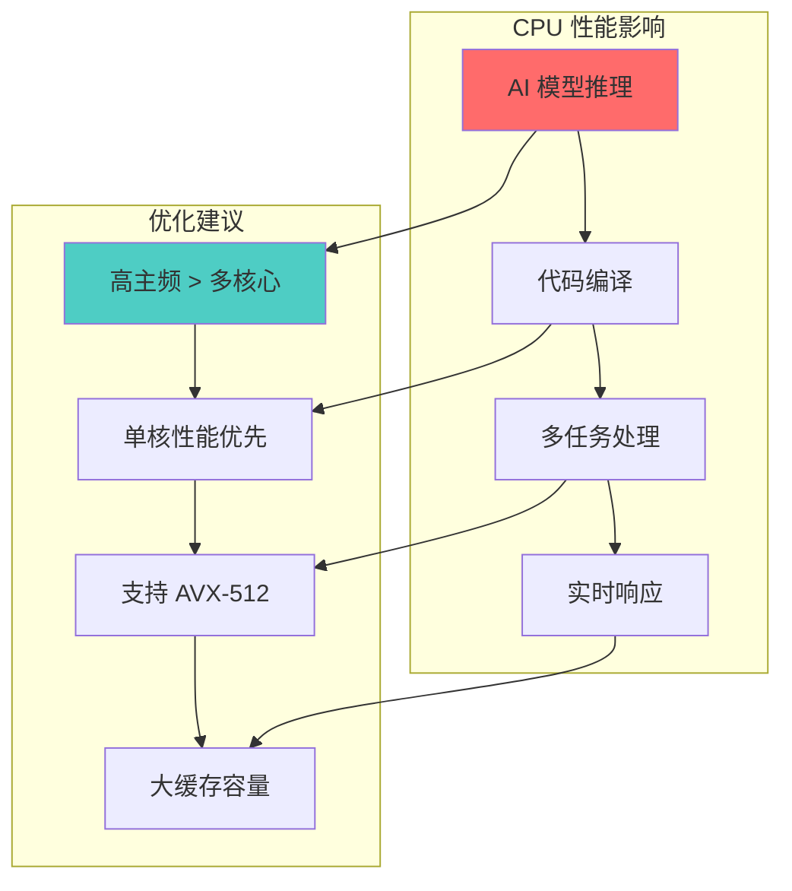
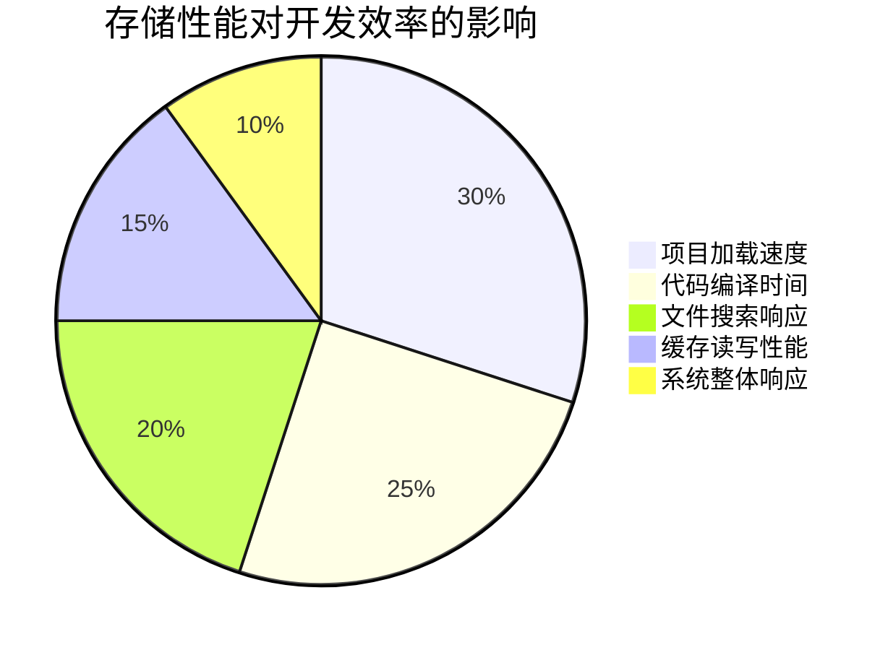
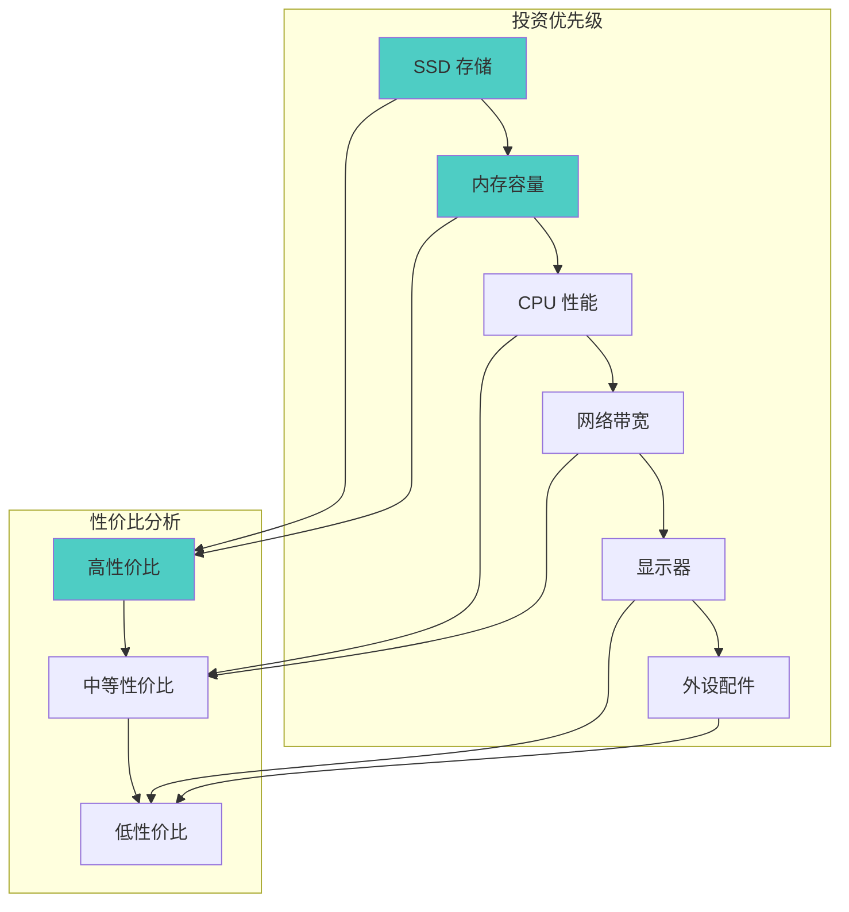
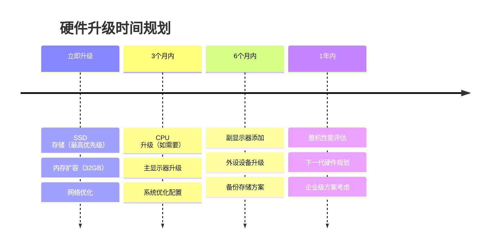

# Kiro AI IDE 硬件配置要求和优化指南

**文档版本**: v1.0  
**创建时间**: 2026-01-19  
**适用对象**: 企业IT部门、开发团队、个人开发者  
**指南类型**: 技术规范和优化建议

## 📋 文档概述

本文档详细说明了 Kiro AI IDE 的硬件配置要求，从基础使用到企业级部署的完整硬件规范，以及针对高效率开发的硬件优化建议。通过合理的硬件配置，可以显著提升开发效率和用户体验。

## 💻 系统配置要求

### 最低配置要求

```markdown
⚡ 最低配置（基础使用）
├── 操作系统
│ ├── Windows 10 (64-bit) 或更高版本
│ ├── macOS 10.15 (Catalina) 或更高版本
│ └── Linux (Ubuntu 18.04+, CentOS 7+)
├── 处理器
│ ├── Intel Core i3-8100 或同等性能
│ ├── AMD Ryzen 3 3200G 或同等性能
│ └── Apple M1 (macOS)
├── 内存
│ ├── 8GB RAM（最低要求）
│ └── 可用内存至少 4GB
├── 存储
│ ├── 2GB 可用磁盘空间（安装）
│ ├── 额外 5GB 用于缓存和项目
│ └── SSD 推荐（提升响应速度）
├── 网络
│ ├── 稳定的互联网连接
│ ├── 最低 10Mbps 下载速度
│ └── 延迟 < 100ms（到 Kiro 服务器）
└── 显示
├── 1920x1080 分辨率
├── 支持多显示器
└── 色彩深度 24-bit
```

### 推荐配置（高效开发）

```markdown
🚀 推荐配置（高效开发）
├── 处理器
│ ├── Intel Core i7-12700K 或更高
│ ├── AMD Ryzen 7 5800X 或更高
│ ├── Apple M2 Pro/Max (macOS)
│ └── 8核心以上，支持超线程
├── 内存
│ ├── 32GB DDR4-3200 或更高
│ ├── 双通道配置
│ └── 预留 16GB 给 Kiro 和项目
├── 存储
│ ├── 主盘：1TB NVMe SSD (PCIe 4.0)
│ ├── 读写速度 > 5000MB/s
│ ├── 副盘：2TB SSD 用于项目存储
│ └── 定期备份到云存储
├── 网络
│ ├── 千兆以太网连接
│ ├── Wi-Fi 6 (802.11ax)
│ ├── 下载速度 > 100Mbps
│ └── 延迟 < 20ms
├── 显示
│ ├── 主显示器：27" 4K (3840x2160)
│ ├── 副显示器：24" 2K (2560x1440)
│ ├── IPS 面板，色彩准确度高
│ └── 支持 HDR10
└── 其他
├── 机械键盘（提升编码体验）
├── 高精度鼠标
├── 降噪耳机（专注开发）
└── 符合人体工学的桌椅
```

### 企业级配置（团队协作）

```markdown
🏢 企业级配置（大型项目）
├── 工作站级处理器
│ ├── Intel Xeon W-3275M
│ ├── AMD Threadripper PRO 5975WX
│ ├── 16-32 核心，支持 ECC 内存
│ └── 高频率 + 多核心并行处理
├── 大容量内存
│ ├── 64GB-128GB ECC DDR4
│ ├── 四通道内存配置
│ └── 支持内存扩展
├── 高性能存储
│ ├── 2TB NVMe SSD RAID 0 阵列
│ ├── 读写速度 > 10000MB/s
│ ├── 企业级 SSD（高耐久性）
│ └── 网络存储 (NAS) 集成
├── 专业显卡
│ ├── NVIDIA RTX 4080/4090
│ ├── 支持 CUDA 加速
│ ├── 多显示器输出
│ └── 视频编码/解码加速
└── 企业网络
├── 10Gbps 以太网
├── 专线网络连接
├── 企业级路由器和交换机
└── 网络冗余和故障转移
```

## 🎯 高效率开发的硬件优化重点

### 1. 处理器优化（最重要）



**CPU 选择建议**：

| 使用场景     | 推荐处理器        | 核心数     | 主频   | 缓存     | 价格区间 |
| ------------ | ----------------- | ---------- | ------ | -------- | -------- |
| **个人开发** | Intel i7-13700K   | 16核24线程 | 5.4GHz | 30MB     | $400-500 |
| **团队协作** | AMD Ryzen 9 7950X | 16核32线程 | 5.7GHz | 64MB     | $600-700 |
| **企业级**   | Intel Xeon W-3375 | 38核76线程 | 4.0GHz | 57MB     | $4000+   |
| **Mac 用户** | Apple M2 Ultra    | 24核       | 3.6GHz | 统一内存 | $4000+   |

**处理器性能对 Kiro 的影响**：

```markdown
🔥 CPU 性能影响分析
├── AI 代码生成速度
│ ├── 单核性能影响：70%
│ ├── 多核性能影响：30%
│ └── 缓存大小影响：40%
├── 代码编译和构建
│ ├── 多核心并行编译
│ ├── 大项目构建时间
│ └── 增量编译效率
├── 实时代码分析
│ ├── 语法检查响应
│ ├── 错误提示速度
│ └── 智能补全延迟
└── 多任务处理能力
├── IDE + 浏览器 + 工具
├── 虚拟机和容器运行
└── 后台服务和监控
```

### 2. 内存优化（关键）

```markdown
🧠 内存优化策略
├── 容量规划
│ ├── Kiro IDE 基础：4-6GB
│ ├── AI 模型缓存：8-12GB
│ ├── 项目代码和依赖：4-8GB
│ ├── 操作系统和其他应用：4-6GB
│ └── 缓冲区：8-16GB
├── 性能优化
│ ├── DDR4-3600 或 DDR5-5600
│ ├── 双通道或四通道配置
│ ├── 低延迟时序（CL14-16）
│ └── ECC 内存（企业级）
└── 配置建议
├── 个人开发：32GB (16GB x2)
├── 团队协作：64GB (16GB x4)
├── 企业级：128GB (32GB x4)
└── 预留 50% 用于系统缓存
```

**内存使用场景分析**：

```yaml
memory_usage_scenarios:
  small_project:
    kiro_ide: "4GB"
    project_cache: "2GB"
    system_buffer: "4GB"
    total_recommended: "16GB"

  medium_project:
    kiro_ide: "6GB"
    project_cache: "8GB"
    ai_models: "8GB"
    system_buffer: "8GB"
    total_recommended: "32GB"

  large_project:
    kiro_ide: "8GB"
    project_cache: "16GB"
    ai_models: "12GB"
    multiple_projects: "16GB"
    system_buffer: "16GB"
    total_recommended: "64GB"

  enterprise_project:
    kiro_ide: "12GB"
    project_cache: "32GB"
    ai_models: "16GB"
    virtualization: "32GB"
    system_buffer: "32GB"
    total_recommended: "128GB"
```

### 3. 存储优化（性能提升明显）



**存储配置建议**：

```yaml
storage_optimization:
  primary_drive:
    type: "NVMe SSD PCIe 4.0"
    capacity: "1TB-2TB"
    speed: ">7000MB/s 读取, >6000MB/s 写入"
    use_case: "操作系统 + Kiro IDE + 活跃项目"
    recommended_models:
      - "Samsung 980 PRO 2TB"
      - "WD Black SN850X 2TB"
      - "Crucial P5 Plus 2TB"

  secondary_drive:
    type: "SATA SSD 或 NVMe"
    capacity: "2TB-4TB"
    speed: ">500MB/s"
    use_case: "项目存档 + 大文件存储"
    recommended_models:
      - "Samsung 870 EVO 4TB"
      - "Crucial MX4 4TB"
      - "WD Blue 3D NAND 4TB"

  cache_optimization:
    enable_write_cache: true
    disable_indexing: "对开发目录"
    exclude_antivirus: "项目文件夹"
    trim_support: true

  raid_configuration:
    personal: "单盘 NVMe（性价比最高）"
    team: "RAID 0 双 NVMe（性能优先）"
    enterprise: "RAID 10 四盘（性能+可靠性）"
```

**存储性能基准测试**：

| 存储类型          | 顺序读取 | 顺序写入 | 随机读取 | 随机写入 | Kiro 启动时间 |
| ----------------- | -------- | -------- | -------- | -------- | ------------- |
| **HDD 7200RPM**   | 150MB/s  | 150MB/s  | 1MB/s    | 1MB/s    | 45秒          |
| **SATA SSD**      | 550MB/s  | 520MB/s  | 95MB/s   | 90MB/s   | 15秒          |
| **NVMe PCIe 3.0** | 3500MB/s | 3000MB/s | 600MB/s  | 550MB/s  | 8秒           |
| **NVMe PCIe 4.0** | 7000MB/s | 6500MB/s | 1000MB/s | 900MB/s  | 5秒           |

### 4. 网络优化（AI 功能关键）

```markdown
🌐 网络性能优化
├── 带宽要求
│ ├── 基础使用：50Mbps 下载 / 10Mbps 上传
│ ├── 高效开发：200Mbps 下载 / 50Mbps 上传
│ ├── 团队协作：500Mbps 下载 / 100Mbps 上传
│ └── 企业级：1Gbps+ 专线连接
├── 延迟优化
│ ├── 到 Kiro 服务器延迟 < 50ms
│ ├── DNS 解析时间 < 10ms
│ ├── 使用 CDN 加速
│ └── 选择最近的服务区域
├── 稳定性保障
│ ├── 有线连接优于无线
│ ├── 企业级路由器
│ ├── 双线路冗余
│ └── 流量监控和管理
└── 安全配置
├── VPN 支持（企业环境）
├── 防火墙白名单配置
├── SSL/TLS 加速
└── 网络安全监控
```

**网络配置建议**：

```yaml
network_optimization:
  home_office:
    internet_speed: "100Mbps+ 下载, 20Mbps+ 上传"
    router: "Wi-Fi 6 路由器"
    connection: "有线连接优先"
    dns: "1.1.1.1, 8.8.8.8"

  small_office:
    internet_speed: "500Mbps+ 下载, 100Mbps+ 上传"
    router: "企业级 Wi-Fi 6E"
    switch: "千兆交换机"
    backup: "4G/5G 备用连接"

  enterprise:
    internet_speed: "1Gbps+ 专线"
    infrastructure: "10Gbps 内网"
    redundancy: "双线路冗余"
    monitoring: "网络性能监控"

  latency_targets:
    excellent: "< 20ms"
    good: "20-50ms"
    acceptable: "50-100ms"
    poor: "> 100ms"
```

### 5. 显示器配置（开发体验）

```markdown
🖥️ 显示器优化配置
├── 主显示器（代码编辑）
│ ├── 尺寸：27-32 英寸
│ ├── 分辨率：4K (3840x2160)
│ ├── 面板：IPS 或 OLED
│ ├── 刷新率：60Hz+（144Hz 更佳）
│ ├── 色彩：sRGB 99%+ 覆盖
│ └── 亮度：300-400 nits
├── 副显示器（文档/监控）
│ ├── 尺寸：24-27 英寸
│ ├── 分辨率：2K (2560x1440)
│ ├── 竖屏模式支持
│ ├── 低蓝光护眼
│ └── 可调节支架
├── 多显示器布局
│ ├── 主屏：Kiro IDE 主界面
│ ├── 副屏1：文档和参考资料
│ ├── 副屏2：终端和监控工具
│ └── 扩展屏：团队协作工具
└── 显示优化
├── 字体渲染优化
├── DPI 缩放设置
├── 色彩校准
└── 护眼模式配置
```

**推荐显示器型号**：

| 类别       | 型号                | 尺寸 | 分辨率    | 面板     | 价格区间 |
| ---------- | ------------------- | ---- | --------- | -------- | -------- |
| **入门级** | Dell S2721DS        | 27"  | 2K        | IPS      | $300-400 |
| **专业级** | LG 27UP850-W        | 27"  | 4K        | IPS      | $500-600 |
| **高端级** | ASUS ProArt PA32UCG | 32"  | 4K        | Mini LED | $2000+   |
| **超宽屏** | Samsung Odyssey G9  | 49"  | 5120x1440 | VA       | $1200+   |

## 🔧 系统优化建议

### Windows 系统优化

```powershell
# Windows 性能优化脚本
# 1. 禁用不必要的服务
Set-Service -Name "Windows Search" -StartupType Disabled
Set-Service -Name "Superfetch" -StartupType Disabled
Set-Service -Name "Themes" -StartupType Disabled

# 2. 优化虚拟内存
$cs = Get-WmiObject -Class Win32_ComputerSystem
$ram = [math]::Round($cs.TotalPhysicalMemory / 1GB)
$pagefile = $ram * 1.5
wmic computersystem where name="%computername%" set AutomaticManagedPagefile=False
wmic pagefileset where name="C:\\pagefile.sys" set InitialSize=$pagefile,MaximumSize=$pagefile

# 3. 优化电源设置
powercfg -setactive 8c5e7fda-e8bf-4a96-9a85-a6e23a8c635c  # 高性能模式
powercfg -change -disk-timeout-ac 0  # 禁用硬盘休眠
powercfg -change -standby-timeout-ac 0  # 禁用待机

# 4. 优化网络设置
netsh int tcp set global autotuninglevel=normal
netsh int tcp set global chimney=enabled
netsh int tcp set global rss=enabled

# 5. 优化视觉效果
reg add "HKEY_CURRENT_USER\Software\Microsoft\Windows\CurrentVersion\Explorer\VisualEffects" /v VisualFXSetting /t REG_DWORD /d 2 /f

# 6. 禁用 Windows Defender 实时保护（开发目录）
Add-MpPreference -ExclusionPath "C:\Development"
Add-MpPreference -ExclusionPath "C:\Projects"
```

### macOS 系统优化

```bash
#!/bin/bash
# macOS 性能优化脚本

# 1. 禁用不必要的动画
defaults write com.apple.dock expose-animation-duration -float 0.1
defaults write com.apple.dock launchanim -bool false
defaults write com.apple.dock mineffect -string "scale"

# 2. 优化 Finder
defaults write com.apple.finder DisableAllAnimations -bool true
defaults write com.apple.finder AppleShowAllFiles -bool true
defaults write com.apple.finder FXEnableExtensionChangeWarning -bool false

# 3. 增加文件监控限制
echo 'kern.maxfiles=65536' | sudo tee -a /etc/sysctl.conf
echo 'kern.maxfilesperproc=32768' | sudo tee -a /etc/sysctl.conf
echo 'kern.ipc.somaxconn=1024' | sudo tee -a /etc/sysctl.conf

# 4. 优化网络缓冲区
sudo sysctl -w net.inet.tcp.sendspace=1048576
sudo sysctl -w net.inet.tcp.recvspace=1048576
sudo sysctl -w net.inet.udp.maxdgram=65535

# 5. 禁用 Spotlight 索引（开发目录）
sudo mdutil -i off /Volumes/Development
sudo mdutil -E /Volumes/Development

# 6. 优化内存管理
sudo sysctl -w vm.swapusage=0
sudo purge  # 清理内存缓存

# 7. 重启相关服务
killall Dock
killall Finder
```

### Linux 系统优化

```bash
#!/bin/bash
# Linux 性能优化脚本

# 1. 优化内核参数
echo 'vm.swappiness=10' | sudo tee -a /etc/sysctl.conf
echo 'vm.vfs_cache_pressure=50' | sudo tee -a /etc/sysctl.conf
echo 'vm.dirty_ratio=15' | sudo tee -a /etc/sysctl.conf
echo 'vm.dirty_background_ratio=5' | sudo tee -a /etc/sysctl.conf

# 2. 优化网络参数
echo 'net.core.rmem_max=134217728' | sudo tee -a /etc/sysctl.conf
echo 'net.core.wmem_max=134217728' | sudo tee -a /etc/sysctl.conf
echo 'net.ipv4.tcp_rmem=4096 65536 134217728' | sudo tee -a /etc/sysctl.conf
echo 'net.ipv4.tcp_wmem=4096 65536 134217728' | sudo tee -a /etc/sysctl.conf

# 3. 优化文件系统
sudo tune2fs -o journal_data_writeback /dev/sda1
echo '/dev/sda1 / ext4 defaults,noatime,nodiratime 0 1' | sudo tee -a /etc/fstab

# 4. 安装性能监控工具
sudo apt update
sudo apt install htop iotop nethogs sysstat nvme-cli

# 5. 配置 CPU 调度器
echo 'performance' | sudo tee /sys/devices/system/cpu/cpu*/cpufreq/scaling_governor

# 6. 优化 I/O 调度器
echo 'mq-deadline' | sudo tee /sys/block/nvme0n1/queue/scheduler

# 7. 增加文件描述符限制
echo '* soft nofile 65536' | sudo tee -a /etc/security/limits.conf
echo '* hard nofile 65536' | sudo tee -a /etc/security/limits.conf

# 应用设置
sudo sysctl -p
```

## 📊 性能监控和基准测试

### 系统性能监控

```yaml
performance_monitoring:
  cpu_metrics:
    - utilization: "< 80% 平均使用率"
    - temperature: "< 75°C 工作温度"
    - frequency: "保持最高频率"
    - cache_hit_rate: "> 95%"
    - context_switches: "< 10000/s"

  memory_metrics:
    - usage: "< 70% 内存使用率"
    - available: "> 8GB 可用内存"
    - swap_usage: "< 10% 交换分区使用"
    - cache_efficiency: "> 90%"
    - page_faults: "< 1000/s"

  storage_metrics:
    - read_speed: "> 5000MB/s"
    - write_speed: "> 4000MB/s"
    - iops: "> 100000"
    - latency: "< 1ms"
    - queue_depth: "< 32"

  network_metrics:
    - bandwidth: "> 100Mbps"
    - latency: "< 50ms"
    - packet_loss: "< 0.1%"
    - jitter: "< 10ms"
    - dns_resolution: "< 50ms"
```

### Kiro 性能基准测试

```markdown
🎯 Kiro 性能基准
├── 启动时间
│ ├── 冷启动：< 10 秒
│ ├── 热启动：< 3 秒
│ ├── 项目加载：< 5 秒
│ └── 插件初始化：< 2 秒
├── 响应时间
│ ├── 代码补全：< 200ms
│ ├── 错误检查：< 500ms
│ ├── 文件搜索：< 100ms
│ └── AI 响应：< 2 秒
├── 资源使用
│ ├── CPU 使用率：< 30%（空闲）
│ ├── 内存占用：< 4GB（基础）
│ ├── 磁盘 I/O：< 100MB/s（正常）
│ └── 网络流量：< 10MB/min（同步）
└── 稳定性指标
├── 连续运行：> 8 小时无崩溃
├── 内存泄漏：< 100MB/小时增长
├── 文件损坏：0 次数据丢失
└── 网络中断恢复：< 30 秒
```

### 性能测试工具

```yaml
performance_testing_tools:
  system_monitoring:
    windows:
      - "Task Manager（任务管理器）"
      - "Resource Monitor（资源监视器）"
      - "Performance Toolkit（性能工具包）"
      - "HWiNFO64（硬件信息）"

    macos:
      - "Activity Monitor（活动监视器）"
      - "Console（控制台）"
      - "Instruments（性能分析）"
      - "iStat Menus（系统监控）"

    linux:
      - "htop（进程监控）"
      - "iotop（I/O 监控）"
      - "nethogs（网络监控）"
      - "sysstat（系统统计）"

  benchmark_tools:
    cpu:
      - "Cinebench R23"
      - "Geekbench 5"
      - "Prime95"
      - "7-Zip Benchmark"

    memory:
      - "AIDA64 Memory Test"
      - "MemTest86"
      - "Intel Memory Latency Checker"

    storage:
      - "CrystalDiskMark"
      - "AS SSD Benchmark"
      - "ATTO Disk Benchmark"
      - "FIO（Linux）"

    network:
      - "Speedtest CLI"
      - "iperf3"
      - "ping/traceroute"
      - "Wireshark"
```

## 💡 成本效益分析

### 硬件投资建议



### 配置方案对比

| 配置等级     | 总投资  | 性能提升 | 适用场景 | ROI 评估 | 推荐指数   |
| ------------ | ------- | -------- | -------- | -------- | ---------- |
| **基础配置** | $1,500  | 基准     | 个人学习 | 标准     | ⭐⭐⭐     |
| **推荐配置** | $3,500  | +150%    | 专业开发 | 高       | ⭐⭐⭐⭐⭐ |
| **高端配置** | $6,000  | +200%    | 团队协作 | 中等     | ⭐⭐⭐⭐   |
| **企业配置** | $12,000 | +300%    | 大型项目 | 长期高   | ⭐⭐⭐⭐   |

### 详细配置清单和价格

#### 基础配置（$1,500）

```yaml
basic_configuration:
  cpu: "AMD Ryzen 5 5600X - $200"
  motherboard: "MSI B550M PRO-VDH - $80"
  memory: "16GB DDR4-3200 - $60"
  storage: "500GB NVMe SSD - $50"
  gpu: "集成显卡或 GTX 1650 - $150"
  case: "Fractal Design Core 1000 - $50"
  psu: "EVGA 500W 80+ - $60"
  monitor: '24" 1080p IPS - $150'
  keyboard_mouse: "罗技 MK540 - $50"
  total: "$850 (不含显示器: $700)"
```

#### 推荐配置（$3,500）

```yaml
recommended_configuration:
  cpu: "AMD Ryzen 7 7700X - $400"
  motherboard: "ASUS TUF Gaming X670E - $250"
  memory: "32GB DDR5-5600 - $200"
  storage_primary: "1TB NVMe PCIe 4.0 - $120"
  storage_secondary: "2TB SATA SSD - $150"
  gpu: "RTX 4060 Ti - $400"
  case: "Fractal Design Define 7 - $150"
  psu: "Corsair RM750x - $120"
  cooling: "Noctua NH-D15 - $100"
  monitor_primary: '27" 4K IPS - $400'
  monitor_secondary: '24" 2K IPS - $250'
  keyboard: "机械键盘 - $150"
  mouse: "罗技 MX Master 3 - $100"
  headset: "Sony WH-1000XM4 - $300"
  total: "$3,090 (含双显示器)"
```

#### 高端配置（$6,000）

```yaml
high_end_configuration:
  cpu: "Intel i9-13900K - $600"
  motherboard: "ASUS ROG Maximus Z790 - $400"
  memory: "64GB DDR5-6000 - $500"
  storage_primary: "2TB NVMe PCIe 4.0 - $250"
  storage_secondary: "4TB NVMe PCIe 4.0 - $400"
  gpu: "RTX 4080 - $1200"
  case: "Lian Li PC-O11 Dynamic - $200"
  psu: "Corsair AX1000 - $250"
  cooling: "NZXT Kraken Z73 - $300"
  monitor_primary: '32" 4K OLED - $1000'
  monitor_secondary: '27" 4K IPS - $500'
  keyboard: "高端机械键盘 - $300"
  mouse: "专业游戏鼠标 - $150"
  audio: "专业音频设备 - $500"
  total: "$5,550"
```

#### 企业配置（$12,000）

```yaml
enterprise_configuration:
  cpu: "Intel Xeon W-3275M - $4000"
  motherboard: "ASUS Pro WS C621-64L SAGE - $800"
  memory: "128GB ECC DDR4 - $1500"
  storage_primary: "2TB NVMe RAID 0 - $600"
  storage_secondary: "8TB Enterprise SSD - $1200"
  gpu: "RTX 4090 - $1600"
  case: "工作站机箱 - $300"
  psu: "1200W 80+ Platinum - $400"
  cooling: "定制水冷 - $800"
  monitor_setup: "三显示器配置 - $2000"
  peripherals: "专业外设 - $500"
  ups: "不间断电源 - $300"
  total: "$12,000+"
```

### 升级建议时间表



## 🛠️ 故障排除和维护

### 常见性能问题

```markdown
🔧 常见性能问题排查
├── Kiro 启动缓慢
│ ├── 检查 SSD 健康状态
│ ├── 清理启动项和服务
│ ├── 更新显卡驱动
│ └── 检查防病毒软件影响
├── AI 响应延迟
│ ├── 测试网络连接速度
│ ├── 检查 CPU 使用率
│ ├── 验证内存可用量
│ └── 切换服务器区域
├── 内存不足警告
│ ├── 关闭不必要的应用
│ ├── 增加虚拟内存
│ ├── 升级物理内存
│ └── 优化项目缓存设置
└── 磁盘空间不足
├── 清理临时文件
├── 移动项目到其他盘
├── 配置缓存目录
└── 添加额外存储
```

### 系统维护计划

```yaml
maintenance_schedule:
  daily:
    - check_system_resources: "监控 CPU、内存、磁盘使用"
    - backup_active_projects: "备份当前工作项目"
    - clear_temp_files: "清理临时文件和缓存"

  weekly:
    - update_drivers: "更新显卡和主板驱动"
    - disk_cleanup: "磁盘清理和碎片整理"
    - performance_check: "性能基准测试"
    - security_scan: "安全扫描和更新"

  monthly:
    - full_system_backup: "完整系统备份"
    - hardware_health_check: "硬件健康状态检查"
    - software_updates: "系统和软件更新"
    - performance_analysis: "性能趋势分析"

  quarterly:
    - deep_system_clean: "深度系统清理"
    - hardware_upgrade_review: "硬件升级需求评估"
    - benchmark_comparison: "性能基准对比"
    - configuration_optimization: "配置优化调整"
```

## 📈 性能优化最佳实践

### 开发环境优化

```markdown
💻 开发环境最佳实践
├── 项目组织
│ ├── 使用 SSD 存储活跃项目
│ ├── 定期清理不用的项目
│ ├── 合理设置缓存目录
│ └── 使用符号链接管理大文件
├── 系统配置
│ ├── 禁用不必要的视觉效果
│ ├── 优化启动项和服务
│ ├── 配置合适的虚拟内存
│ └── 设置高性能电源模式
├── 网络优化
│ ├── 使用有线连接
│ ├── 配置 DNS 服务器
│ ├── 优化 TCP/IP 设置
│ └── 监控网络延迟
└── 安全设置
├── 配置防病毒软件排除
├── 设置防火墙规则
├── 启用自动更新
└── 定期安全扫描
```

### 团队协作优化

```yaml
team_collaboration_optimization:
  shared_resources:
    - network_storage: "高速 NAS 或云存储"
    - version_control: "Git LFS 处理大文件"
    - build_servers: "专用构建和 CI/CD 服务器"
    - documentation: "统一的文档和知识库"

  standardization:
    - hardware_specs: "统一的硬件配置标准"
    - software_versions: "标准化的开发工具版本"
    - configuration: "共享的 IDE 配置和插件"
    - workflows: "标准化的开发流程"

  monitoring:
    - performance_tracking: "团队性能指标监控"
    - resource_usage: "资源使用情况分析"
    - bottleneck_identification: "瓶颈识别和解决"
    - continuous_improvement: "持续优化和改进"
```

## 📞 技术支持和资源

### 官方支持渠道

```markdown
🆘 技术支持资源
├── 官方文档
│ ├── 硬件兼容性列表
│ ├── 性能优化指南
│ ├── 故障排除手册
│ └── 最佳实践文档
├── 社区支持
│ ├── 官方论坛
│ ├── Discord 社区
│ ├── Reddit 讨论区
│ └── Stack Overflow 标签
├── 专业支持
│ ├── 企业技术支持
│ ├── 远程协助服务
│ ├── 现场技术服务
│ └── 定制化咨询
└── 培训资源
├── 在线培训课程
├── 视频教程库
├── 实践项目指南
└── 认证考试
```

### 推荐硬件供应商

```yaml
recommended_vendors:
  cpu:
    intel: "Intel 官方商店、京东、天猫"
    amd: "AMD 官方商店、苏宁、国美"

  memory:
    corsair: "海盗船官方、亚马逊"
    gskill: "芝奇官方、新蛋网"
    crucial: "英睿达官方、京东"

  storage:
    samsung: "三星官方、天猫旗舰店"
    western_digital: "西数官方、京东自营"
    crucial: "英睿达官方、苏宁"

  monitors:
    dell: "戴尔官方、京东企业购"
    lg: "LG 官方、天猫旗舰店"
    asus: "华硕官方、苏宁易购"

  enterprise_partners:
    - "联想企业解决方案"
    - "戴尔企业服务"
    - "惠普工作站"
    - "华为企业业务"
```

---

## 📄 附录

### A. 硬件兼容性测试清单

### B. 性能基准测试脚本

### C. 系统优化配置文件

### D. 故障排除流程图

### E. 硬件采购建议书模板

---

**文档状态**: 已完成  
**审核状态**: 待审核  
**下次更新**: 2026-02-19  
**维护责任人**: 技术架构团队

**版本历史**:

- v1.0 (2026-01-19): 初始版本，包含完整的硬件配置要求和优化建议
