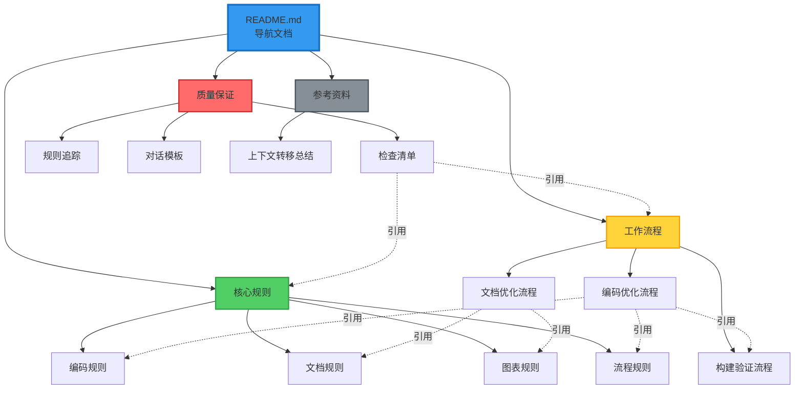

# 协作文档导航

**文档版本**: v2.2  
**创建时间**: 2026-01-15  
**更新时间**: 2026-01-16  
**适用项目**: SpacewareConops v3.0.1

## 📚 文档结构

本目录包含项目协作的所有规则、流程和模板文档，按职能分类组织。

## 🎯 快速导航

### 核心规则（必读）

这些文档定义了项目的核心协作规则，所有团队成员必须遵守。

| 文档                                           | 说明                             | 适用场景          |
| ---------------------------------------------- | -------------------------------- | ----------------- |
| [编码规则](./核心规则/编码规则.md)             | 代码生成、编码风格、类型安全规范 | 编写代码时        |
| [文档规则](./核心规则/文档规则.md)             | 文档生成、命名、结构、内容规范   | 创建文档时        |
| [图表规则](./核心规则/图表规则.md)             | Mermaid 图表生成、颜色、样式规范 | 绘制流程图时      |
| [流程规则](./核心规则/流程规则.md)             | 工作流程、审批机制、状态流转规范 | 执行任务时        |
| [子组件分析规则](./核心规则/子组件分析规则.md) | 子组件和子包分析方法、文档模板   | 分析组件/包结构时 |

### 工作流程

这些文档描述了具体的工作流程和操作步骤。

| 文档                                       | 说明                                      | 适用场景 |
| ------------------------------------------ | ----------------------------------------- | -------- |
| [编码优化流程](./工作流程/编码优化流程.md) | 完整的编码工作流程（理解→分析→执行→验证） | 编码任务 |
| [文档优化流程](./工作流程/文档优化流程.md) | 文档创建和维护流程                        | 文档任务 |
| [构建验证流程](./工作流程/构建验证流程.md) | Turbo 增量构建规则和验证流程              | 构建验证 |
| [流程优化流程](./工作流程/流程优化流程.md) | 迭代优化自身流程的完整流程                | 流程改进 |

### 质量保证

这些文档用于确保工作质量和规则遵循。

| 文档                               | 说明                   | 适用场景   |
| ---------------------------------- | ---------------------- | ---------- |
| [检查清单](./质量保证/检查清单.md) | 对话前、中、后的检查项 | 每次对话   |
| [规则追踪](./质量保证/规则追踪.md) | 规则遵循状态追踪       | 质量审计   |
| [对话模板](./质量保证/对话模板.md) | 标准化对话流程模板     | 标准化交流 |

### 参考资料

这些文档提供历史记录和参考信息。

| 文档                                           | 说明               |
| ---------------------------------------------- | ------------------ |
| [协作文档体系说明](./协作文档体系说明.md)      | 文档体系完整说明   |
| [上下文转移总结](./参考资料/上下文转移总结.md) | 上次对话的工作总结 |

## 🚀 快速开始

### 新成员入门

1. **第一步**: 阅读 [编码规则](./核心规则/编码规则.md) 了解编码规范
2. **第二步**: 阅读 [流程规则](./核心规则/流程规则.md) 了解工作流程
3. **第三步**: 使用 [检查清单](./质量保证/检查清单.md) 进行自检

### AI 助手使用

每次对话开始前：

1. ✅ 阅读 [流程规则](./核心规则/流程规则.md) 确认工作流程
2. ✅ 使用 [检查清单](./质量保证/检查清单.md) 进行自检
3. ✅ 参考 [对话模板](./质量保证/对话模板.md) 标准化交流

编码任务时：

1. ✅ 遵循 [编码规则](./核心规则/编码规则.md)
2. ✅ 按照 [编码优化流程](./工作流程/编码优化流程.md) 执行
3. ✅ 使用 [构建验证流程](./工作流程/构建验证流程.md) 验证

创建文档时：

1. ✅ 遵循 [文档规则](./核心规则/文档规则.md)
2. ✅ 按照 [文档优化流程](./工作流程/文档优化流程.md) 执行
3. ✅ 使用 [图表规则](./核心规则/图表规则.md) 绘制流程图

## 📋 核心原则速览

### 🔴 用户审批机制（最重要）

**核心原则**: 在执行任何代码修改操作之前，必须等待用户明确同意。

**关键审批点**:

1. **方案审批**: 分析完成 → 等待用户同意 → 执行方案
2. **测试验证**: 执行完成 → 等待用户测试 → 输出总结

详见：[流程规则 - 审批机制](./核心规则/流程规则.md#审批机制)

### 🟢 编码核心原则

1. **最小化修改**: 只改必要的代码
2. **保持一致性**: 遵循项目编码风格
3. **向后兼容**: 不破坏现有功能
4. **质量优先**: 先记录问题，统一优化

详见：[编码规则](./核心规则/编码规则.md)

### 🟡 文档核心原则

1. **全程中文**: 所有文档使用中文
2. **流程可视化**: 必须使用 Mermaid 图表
3. **结构清晰**: 使用统一模板
4. **自动触发**: 分析活动自动创建文档

详见：[文档规则](./核心规则/文档规则.md)

### 🔵 构建核心原则

1. **增量构建**: 使用 Turbo 缓存
2. **修改必建**: 每次修改后必须构建
3. **验证完整**: 检查构建输出和产物

详见：[构建验证流程](./工作流程/构建验证流程.md)

## 🔄 文档更新流程

### 何时更新文档

- ✅ 发现新的最佳实践
- ✅ 规则需要调整
- ✅ 流程需要优化
- ✅ 问题解决后提取经验

### 如何更新文档

1. 在对应的职能文档中添加或修改内容
2. 更新文档版本号
3. 在更新说明中记录变更
4. 提交 Git 并说明更新原因

## 📊 文档关系图

## 🎓 学习路径

### 路径 1: 快速上手（30 分钟）

1. 阅读本导航文档（5 分钟）
2. 阅读 [流程规则](./核心规则/流程规则.md)（10 分钟）
3. 阅读 [检查清单](./质量保证/检查清单.md)（5 分钟）
4. 浏览 [编码规则](./核心规则/编码规则.md)（10 分钟）

### 路径 2: 深入学习（2 小时）

1. 完成路径 1
2. 详细阅读 [编码规则](./核心规则/编码规则.md)（30 分钟）
3. 详细阅读 [文档规则](./核心规则/文档规则.md)（20 分钟）
4. 详细阅读 [编码优化流程](./工作流程/编码优化流程.md)（30 分钟）
5. 实践：使用模板完成一次标准对话（10 分钟）

### 路径 3: 全面掌握（4 小时）

1. 完成路径 2
2. 阅读所有核心规则文档（1 小时）
3. 阅读所有工作流程文档（1 小时）
4. 实践：完成一次完整的编码任务（1 小时）
5. 总结：创建个人最佳实践文档（30 分钟）

## 📞 获取帮助

### 常见问题

**Q: 不确定应该遵循哪个规则？**  
A: 查看本导航文档的"适用场景"列，找到对应的规则文档。

**Q: 规则之间有冲突怎么办？**  
A: 优先级：流程规则 > 编码规则 > 文档规则 > 图表规则

**Q: 如何快速检查是否遵循了所有规则？**  
A: 使用 [检查清单](./质量保证/检查清单.md) 进行逐项检查。

**Q: 发现规则不合理怎么办？**  
A: 提出改进建议，经团队讨论后更新文档。

### 反馈渠道

- 📝 在对应文档中添加改进建议
- 💬 在团队会议中讨论规则优化
- 📊 定期审查规则遵循情况

## 📈 版本历史

- **v2.2** (2026-01-16): 完善子组件分析规则文档，基于软件工程理论和实际项目
- **v2.1** (2026-01-16): 新增子组件分析规则文档
- **v2.0** (2026-01-15): 重构文档结构，按职能分类，创建导航文档
- **v1.0** (2026-01-14): 初始版本，创建基础协作规则文档

---

**维护者**: 开发团队  
**最后更新**: 2026-01-16  
**下次审查**: 2026-02-15
