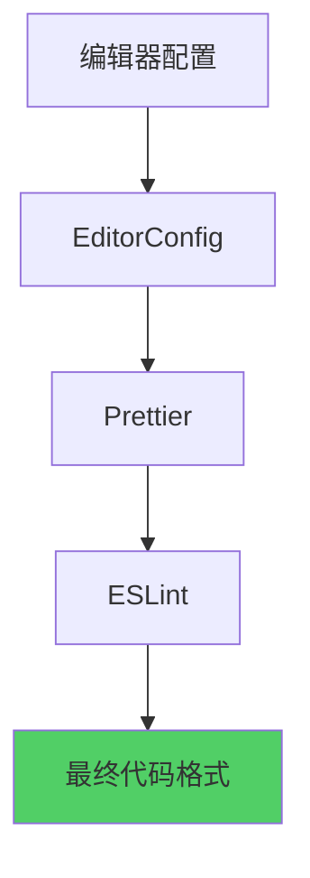

# 代码格式规范

## 📋 概述

本文档说明项目的代码格式规范，确保 ESLint、Prettier 和编辑器配置的一致性。

**创建时间**: 2026-01-16  
**适用范围**: 整个 SpacewareConops 项目

## 🎯 核心配置

### 1. Prettier 配置

**文件**: `.prettierrc.json`

```json
{
  "singleQuote": true,
  "trailingComma": "es5",
  "tabWidth": 2,
  "semi": true,
  "printWidth": 80,
  "endOfLine": "auto"
}
```

**关键规则**:

- ✅ 使用单引号
- ✅ ES5 风格的尾随逗号
- ✅ 2 空格缩进
- ✅ 使用分号
- ✅ 每行最多 80 字符
- ✅ 自动处理行尾符

### 2. ESLint 配置

**文件**: `config/eslint/.eslintrc.cjs`

**关键规则**:

- ✅ 继承 Prettier 配置（避免冲突）
- ✅ Vue 3 推荐规则
- ✅ TypeScript 推荐规则
- ✅ Import 排序规则
- ✅ 代码风格规则

**Prettier 集成**:

```javascript
extends: [
  // ... 其他配置
  "prettier", // 必须放在最后，覆盖其他规则
],
rules: {
  "prettier/prettier": [
    "error",
    {
      endOfLine: "auto",
    },
  ],
}
```

### 3. EditorConfig 配置

**文件**: `.editorconfig`

```ini
[*]
charset = utf-8
end_of_line = lf
insert_final_newline = true
trim_trailing_whitespace = true

[*.{js,jsx,ts,tsx,vue,json,yml,yaml}]
indent_style = space
indent_size = 2
```

### 4. VSCode/Kiro 编辑器配置

**文件**: `.vscode/settings.json`

```json
{
  "editor.formatOnSave": true,
  "editor.defaultFormatter": "esbenp.prettier-vscode",
  "editor.codeActionsOnSave": {
    "source.fixAll.eslint": "explicit"
  },
  "eslint.validate": ["javascript", "javascriptreact", "typescript", "typescriptreact", "vue"]
}
```

## 🔧 使用方法

### 自动格式化

#### 保存时自动格式化

编辑器已配置为保存时自动格式化：

1. Prettier 格式化代码
2. ESLint 自动修复问题

#### 手动格式化

```bash
# 格式化所有文件
pnpm format:fix

# 修复 ESLint 问题
pnpm lint:fix

# 检查格式（不修改）
pnpm format:check
pnpm lint:check
```

### 提交前检查

项目配置了 `lint-staged`，在 Git 提交前自动格式化：

```json
{
  "lint-staged": {
    "*.{js,jsx,ts,tsx,vue}": ["eslint --fix", "prettier --write"],
    "*.{css,scss,less,html,json,md}": ["prettier --write"]
  }
}
```

## 📊 配置优先级



**说明**:

1. **EditorConfig**: 基础编辑器设置（缩进、换行符等）
2. **Prettier**: 代码格式化（引号、分号、换行等）
3. **ESLint**: 代码质量和风格检查
4. **ESLint + Prettier**: ESLint 使用 Prettier 的格式规则

## 🎨 常见格式规则

### 缩进

```typescript
// ✅ 正确：2 空格缩进
function example() {
  const value = 1;
  if (value) {
    console.log('hello');
  }
}

// ❌ 错误：4 空格或 Tab
function example() {
  const value = 1;
}
```

### 引号

```typescript
// ✅ 正确：单引号
const str = 'hello';
import { Component } from 'vue';

// ❌ 错误：双引号
const str = 'hello';
```

### 分号

```typescript
// ✅ 正确：使用分号
const value = 1;
console.log(value);

// ❌ 错误：省略分号
const value = 1;
console.log(value);
```

### 尾随逗号

```typescript
// ✅ 正确：ES5 风格尾随逗号
const obj = {
  a: 1,
  b: 2,
};

const arr = [1, 2, 3];

// ❌ 错误：无尾随逗号或函数参数有尾随逗号
const obj = {
  a: 1,
  b: 2,
};

function fn(a, b) {} // 函数参数不应有尾随逗号
```

### 行宽

```typescript
// ✅ 正确：每行不超过 80 字符
const longString = 'This is a very long string that needs to be ' + 'split across multiple lines';

// ❌ 错误：超过 80 字符
const longString = 'This is a very long string that should be split but is not';
```

### Import 排序

```typescript
// ✅ 正确：按组排序
import { ref } from 'vue';
import { useRouter } from 'vue-router';

import { useStore } from '@spaceware/stores';
import { useEventBus } from '@spaceware/event-bus';

import { helper } from './utils';
import type { Config } from './types';

// ❌ 错误：无序导入
import { helper } from './utils';
import { ref } from 'vue';
import type { Config } from './types';
```

## 🔍 故障排查

### 问题 1: 格式化不生效

**症状**: 保存文件后格式没有改变

**解决方案**:

1. 检查编辑器是否安装了 Prettier 扩展
2. 检查 `.vscode/settings.json` 配置
3. 重启编辑器

### 问题 2: ESLint 和 Prettier 冲突

**症状**: ESLint 报错但 Prettier 格式化后又出现

**解决方案**:

1. 确保 ESLint 配置中包含 `"prettier"` 扩展
2. 确保 `"prettier"` 在 `extends` 数组的最后
3. 运行 `pnpm lint:fix` 和 `pnpm format:fix`

### 问题 3: 行尾符问题

**症状**: Git 显示整个文件都被修改（CRLF vs LF）

**解决方案**:

1. 配置 Git：`git config --global core.autocrlf false`
2. 使用 EditorConfig 统一行尾符
3. Prettier 配置 `"endOfLine": "auto"`

### 问题 4: 编辑器显示格式错误但构建通过

**症状**: 编辑器显示红色波浪线，但 `pnpm lint` 通过

**解决方案**:

1. 重启 ESLint 服务器（VSCode: Ctrl+Shift+P → "ESLint: Restart ESLint Server"）
2. 清除编辑器缓存
3. 检查编辑器使用的 ESLint 配置路径

## 📝 最佳实践

### 1. 提交前检查

```bash
# 检查所有格式问题
pnpm format:check
pnpm lint:check

# 自动修复
pnpm format:fix
pnpm lint:fix
```

### 2. 团队协作

- ✅ 所有团队成员使用相同的编辑器配置
- ✅ 提交前运行格式化命令
- ✅ 使用 Husky 和 lint-staged 自动化检查
- ✅ 定期更新依赖和配置

### 3. 新文件

创建新文件时：

1. 使用编辑器模板（如果有）
2. 保存后自动格式化
3. 检查 ESLint 警告

### 4. 修改现有文件

修改现有文件时：

1. 只修改必要的部分
2. 保存后自动格式化
3. 提交前检查 diff

## 🔗 相关命令

```bash
# 格式化
pnpm format:fix              # 格式化所有文件
pnpm format:check            # 检查格式（不修改）

# ESLint
pnpm lint:fix                # 修复 ESLint 问题
pnpm lint:check              # 检查 ESLint 问题

# 样式
pnpm style                   # 修复样式问题
pnpm style:check             # 检查样式问题

# 提交前检查
pnpm precommit               # 运行 lint-staged

# 完整检查
pnpm check-all               # 运行所有检查
```

## 📚 参考资源

- [Prettier 官方文档](https://prettier.io/docs/en/)
- [ESLint 官方文档](https://eslint.org/docs/latest/)
- [EditorConfig 官方文档](https://editorconfig.org/)
- [Vue 风格指南](https://vuejs.org/style-guide/)
- [TypeScript 编码规范](https://www.typescriptlang.org/docs/handbook/declaration-files/do-s-and-don-ts.html)

## 🎓 常见问题

### Q: 为什么使用单引号而不是双引号？

A: 单引号是 JavaScript 社区的常见约定，也是 Airbnb 风格指南的推荐。

### Q: 为什么使用 2 空格缩进？

A: 2 空格是 JavaScript/TypeScript 社区的标准，也是 Vue 官方推荐。

### Q: 可以修改这些规则吗？

A: 可以，但需要：

1. 团队讨论并达成一致
2. 更新所有配置文件
3. 重新格式化所有代码
4. 更新文档

### Q: 如何处理第三方代码？

A: 第三方代码（node_modules、dist 等）已在 `.eslintignore` 和 `.prettierignore` 中排除。

---

**文档版本**: v1.0  
**创建时间**: 2026-01-16  
**维护人**: 开发团队  
**更新日志**:

- v1.0: 初始版本，统一代码格式规范
