# 企业 Kiro AI IDE 解决方案

**文档版本**: v1.0  
**创建时间**: 2026-01-19  
**适用对象**: 企业决策者、技术负责人、开发团队  
**方案类型**: 企业级 AI 开发环境部署方案

## 📋 方案概述

### 核心价值主张

Kiro 是由 AWS 开发的革命性代理式 AI 集成开发环境，专为企业级软件开发而设计。它通过规范驱动开发（Spec-Driven Development）将传统的"感觉式编程"转化为系统化、可治理的生产就绪应用开发流程。

### 目标收益

- **开发效率提升 70-80%**：从概念到原型的时间大幅缩短
- **代码质量改善 50-60%**：减少技术债务和维护成本
- **文档自动化 80%**：自动生成和维护技术文档
- **团队协作优化 60%**：减少需求理解偏差

## 🏗️ 技术架构

### 核心组件架构

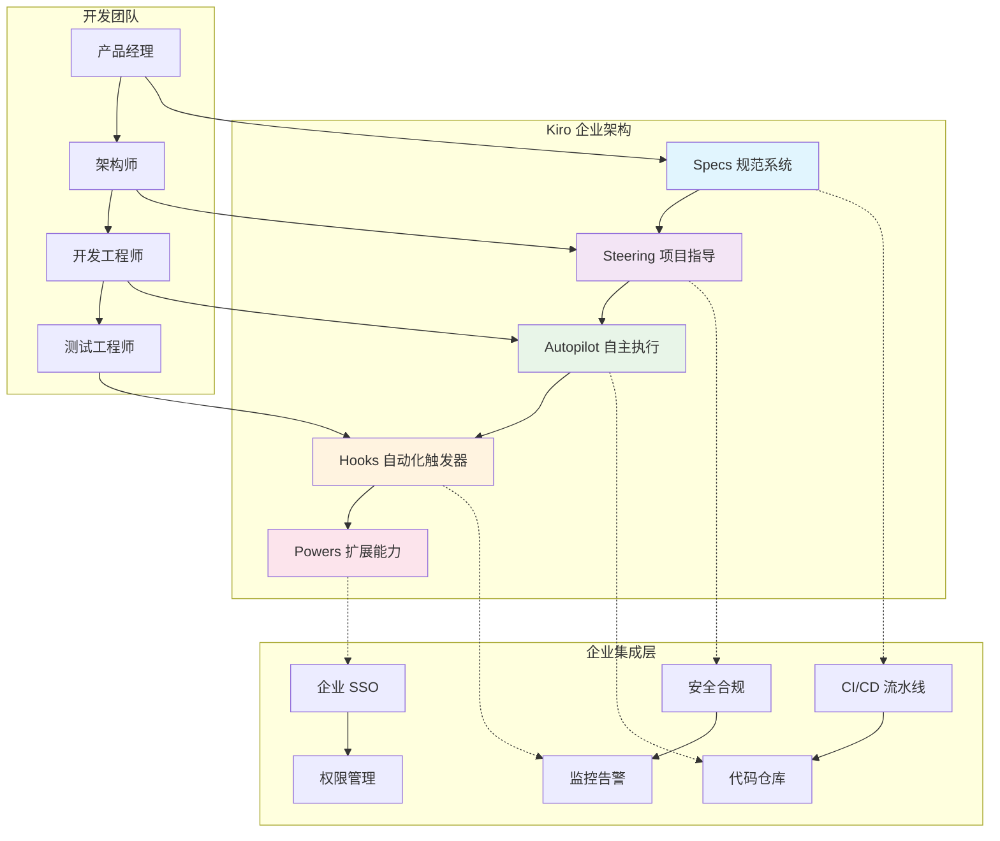

### 数据流架构

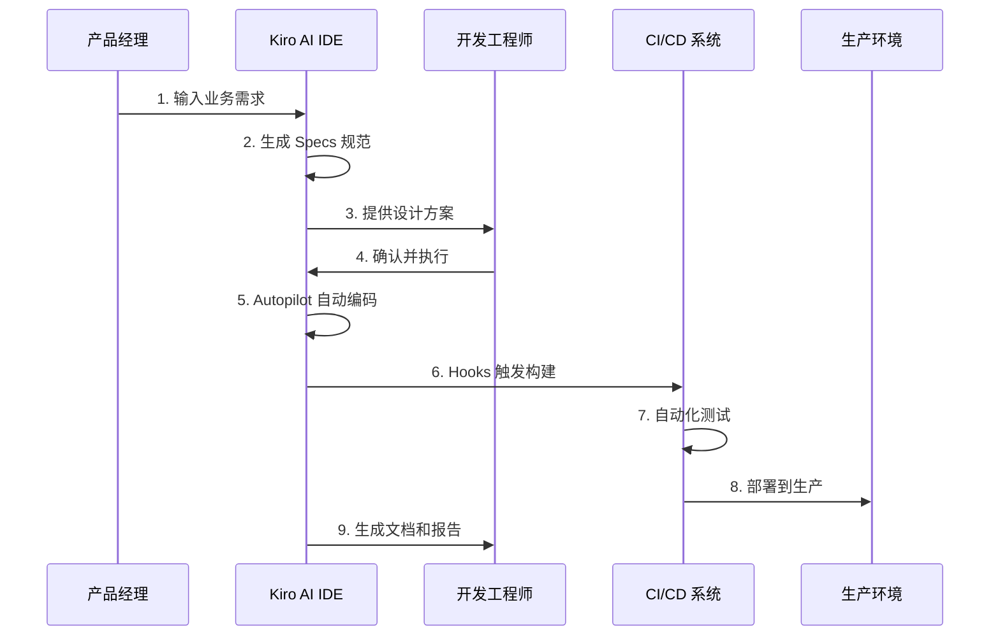

## 🎯 企业应用场景

### 适用企业类型

#### 大型企业（强烈推荐）

- **金融服务**：严格合规要求，复杂业务逻辑
- **医疗健康**：数据安全，监管合规
- **政府机构**：标准化流程，可审计性
- **制造业**：复杂 ERP/MES 系统集成
- **云服务商**：基础设施即代码（IaC）

#### 中型企业（条件推荐）

- 有明确技术治理需求
- 多团队协作项目
- 长期维护的核心系统

### 不适用场景

- **快速原型验证**：建议使用 Cursor 等轻量工具
- **简单脚本开发**：过度工程化
- **学习型项目**：学习曲线较陡

## 📊 成本效益分析

### 投资成本

#### 直接成本

- **软件许可**：免费使用（开源版本）
- **培训成本**：每人 2-4 周适应期
- **基础设施**：额外计算资源需求

#### 间接成本

- **流程改造**：现有开发流程调整
- **文化适应**：从"编码"到"工程"思维转换
- **风险缓解**：备用方案和回退机制

### 预期收益

#### 量化收益（年度）

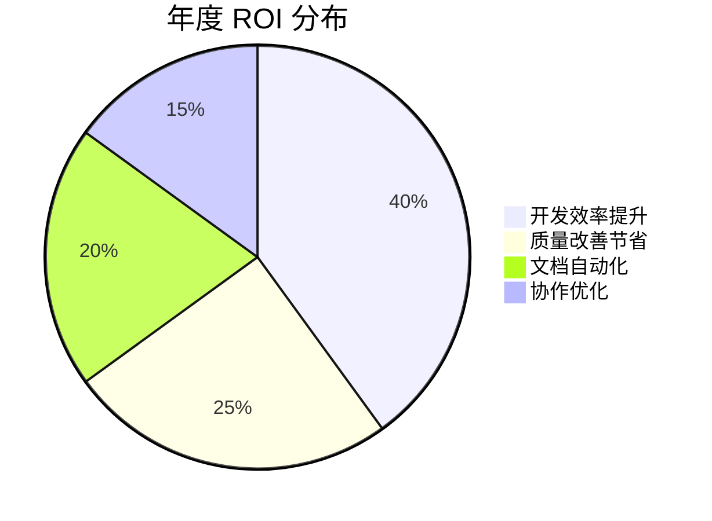

#### 具体指标

- **开发周期缩短**：平均项目交付时间减少 30-50%
- **缺陷率降低**：生产环境 Bug 减少 40-60%
- **维护成本**：长期维护成本降低 35-45%
- **团队效率**：跨团队协作效率提升 50-70%

## 🚀 实施路线图

### 阶段一：试点验证（1-2个月）

#### 目标

- 验证 Kiro 在企业环境中的适用性
- 建立初步的最佳实践
- 培养种子用户和内部专家

#### 关键活动

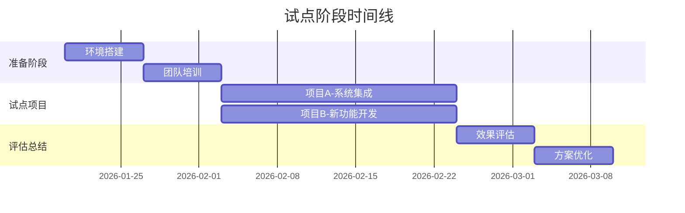

#### 成功标准

- 开发效率提升 ≥ 30%
- 代码质量评分提升 ≥ 20%
- 团队满意度 ≥ 75%
- 技术债务减少 ≥ 25%

### 阶段二：团队扩展（3-4个月）

#### 目标

- 核心开发团队全面采用
- 建立企业级标准和规范
- 集成现有工具链

#### 关键活动

- **标准制定**：建立企业级 Specs 和 Steering 模板
- **工具集成**：CI/CD、代码仓库、监控系统
- **培训推广**：全团队培训和认证
- **流程优化**：基于试点经验优化工作流程

### 阶段三：企业推广（6-12个月）

#### 目标

- 全公司标准化部署
- 建立完整的治理体系
- 实现全面的自动化集成

#### 关键活动

- **全面部署**：所有开发团队采用
- **高级定制**：企业级 Powers 和 Hooks 开发
- **治理体系**：完整的代码治理和合规流程
- **持续优化**：基于使用数据持续改进

## 🔧 技术集成方案

### CI/CD 集成

#### GitHub Actions 集成

```yaml
name: Kiro 自动化流水线
on:
  push:
    branches: [main, develop]
  pull_request:
    branches: [main]

jobs:
  kiro-validation:
    runs-on: ubuntu-latest
    steps:
      - uses: actions/checkout@v3
      - name: Kiro Specs 验证
        run: kiro validate --specs
      - name: 代码质量检查
        run: kiro lint --fix
      - name: 自动化测试
        run: kiro test --coverage
      - name: 文档生成
        run: kiro docs --update
```

#### Jenkins 集成

```groovy
pipeline {
    agent any
    stages {
        stage('Kiro 验证') {
            steps {
                sh 'kiro validate --all'
            }
        }
        stage('构建部署') {
            steps {
                sh 'kiro build --production'
                sh 'kiro deploy --environment=staging'
            }
        }
    }
    post {
        always {
            sh 'kiro report --generate'
        }
    }
}
```

### 安全集成

#### 企业 SSO 配置

```json
{
  "authentication": {
    "provider": "enterprise-sso",
    "saml": {
      "entityId": "kiro-enterprise",
      "ssoUrl": "https://sso.company.com/saml",
      "certificate": "path/to/cert.pem"
    }
  },
  "authorization": {
    "rbac": {
      "roles": ["developer", "architect", "admin"],
      "permissions": {
        "specs": ["read", "write"],
        "autopilot": ["execute"],
        "hooks": ["configure"]
      }
    }
  }
}
```

#### 代码安全扫描

```yaml
security:
  scanners:
    - name: "SonarQube"
      enabled: true
      config:
        url: "https://sonar.company.com"
        token: "${SONAR_TOKEN}"
    - name: "Snyk"
      enabled: true
      config:
        api_key: "${SNYK_API_KEY}"
  policies:
    - "no-hardcoded-secrets"
    - "dependency-vulnerability-check"
    - "code-quality-gate"
```

## 📋 治理框架

### 开发规范

#### Specs 模板标准

```markdown
# 功能规范模板

## 业务需求

- 用户故事：作为 [角色]，我希望 [功能]，以便 [价值]
- 验收标准：[具体可测试的标准]
- 优先级：P0/P1/P2

## 技术设计

- 架构图：[Mermaid 图表]
- 接口定义：[API 规范]
- 数据模型：[数据结构]

## 实施计划

- 任务分解：[具体任务列表]
- 依赖关系：[任务依赖图]
- 时间估算：[工作量评估]
```

#### Steering 规则示例

```yaml
# 企业级 Steering 配置
project:
  standards:
    - "企业编码规范 v2.0"
    - "安全开发指南 v1.5"
    - "API 设计标准 v3.0"

  workflows:
    - name: "代码审查"
      trigger: "pull_request"
      reviewers: 2
      approvals: 1

    - name: "安全扫描"
      trigger: "code_commit"
      tools: ["sonar", "snyk"]

  quality_gates:
    - coverage: ">= 80%"
    - complexity: "<= 10"
    - duplication: "<= 3%"
```

### 权限管理

#### 角色权限矩阵

| 角色       | Specs | Steering | Autopilot | Hooks | Powers |
| ---------- | ----- | -------- | --------- | ----- | ------ |
| 开发工程师 | 读写  | 读       | 执行      | 使用  | 使用   |
| 高级工程师 | 读写  | 读写     | 执行      | 配置  | 配置   |
| 架构师     | 读写  | 管理     | 审批      | 管理  | 开发   |
| 技术经理   | 读    | 管理     | 审批      | 管理  | 管理   |

## 🎓 培训计划

### 培训体系

#### 基础培训（1周）

- **Kiro 概念**：规范驱动开发理念
- **核心功能**：Specs、Steering、Autopilot 使用
- **最佳实践**：企业级开发流程

#### 进阶培训（1周）

- **高级功能**：Hooks 配置、Powers 开发
- **集成配置**：CI/CD、安全工具集成
- **故障排除**：常见问题和解决方案

#### 专家认证（2周）

- **架构设计**：复杂系统的 Specs 设计
- **治理配置**：企业级 Steering 规则
- **定制开发**：自定义 Powers 和插件

### 培训资源

#### 在线学习平台

```markdown
📚 学习路径
├── 基础课程
│ ├── Kiro 入门指南
│ ├── 规范驱动开发
│ └── 企业最佳实践
├── 进阶课程
│ ├── 高级配置管理
│ ├── 自动化集成
│ └── 性能优化
└── 专家认证
├── 架构设计专题
├── 治理体系建设
└── 创新应用案例
```

## 📈 监控与度量

### 关键指标（KPI）

#### 效率指标

- **开发速度**：功能点/人天
- **交付周期**：需求到上线时间
- **代码复用率**：组件复用比例
- **自动化率**：自动化任务占比

#### 质量指标

- **缺陷密度**：缺陷数/KLOC
- **代码覆盖率**：测试覆盖百分比
- **技术债务**：代码质量评分
- **文档完整性**：文档覆盖率

#### 协作指标

- **需求变更率**：需求变更频次
- **沟通效率**：问题解决时间
- **知识共享**：文档访问频次
- **团队满意度**：定期调研评分

### 监控仪表板

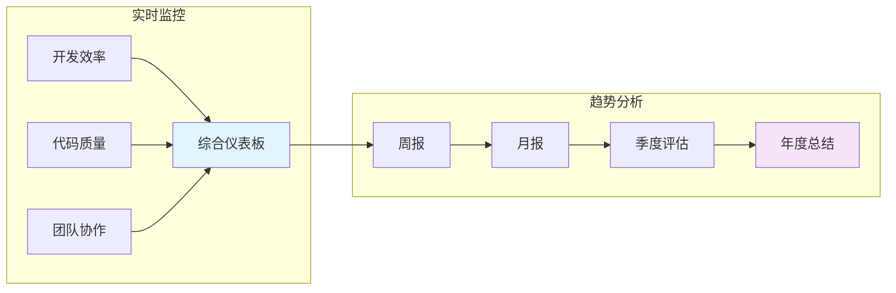

## 🔄 持续改进

### 反馈机制

#### 用户反馈收集

- **每周调研**：使用体验和问题收集
- **月度回顾**：效果评估和改进建议
- **季度评估**：ROI 分析和策略调整

#### 数据驱动优化

- **使用分析**：功能使用频次和效果
- **性能监控**：系统性能和响应时间
- **错误追踪**：问题模式和解决方案

### 版本升级策略

#### 升级计划

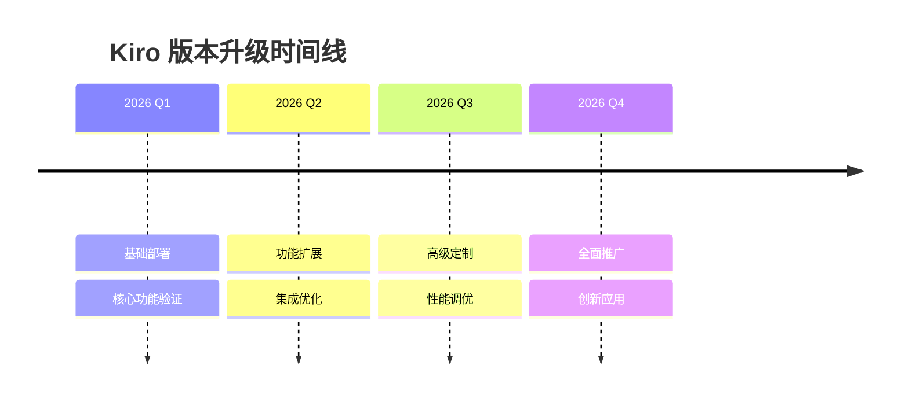

## 🎯 成功标准

### 短期目标（3个月）

- ✅ 试点项目成功率 ≥ 90%
- ✅ 开发效率提升 ≥ 30%
- ✅ 团队采用率 ≥ 80%
- ✅ 代码质量改善 ≥ 20%

### 中期目标（6个月）

- ✅ 全团队部署完成
- ✅ 开发效率提升 ≥ 50%
- ✅ 技术债务减少 ≥ 40%
- ✅ 文档自动化率 ≥ 70%

### 长期目标（12个月）

- ✅ 企业标准化完成
- ✅ 开发效率提升 ≥ 70%
- ✅ 整体 ROI ≥ 300%
- ✅ 行业标杆地位

## 🚨 风险管理

### 主要风险识别

#### 技术风险

- **学习曲线**：团队适应时间较长
- **集成复杂性**：现有系统集成困难
- **性能影响**：额外资源消耗

#### 业务风险

- **流程中断**：现有开发流程受影响
- **抗拒变化**：团队接受度不高
- **投资回报**：短期内 ROI 不明显

### 风险缓解策略

#### 技术缓解

```markdown
🔧 技术风险缓解
├── 渐进式部署
│ ├── 小规模试点
│ ├── 逐步扩展
│ └── 并行运行
├── 备用方案
│ ├── 传统工具保留
│ ├── 快速回退机制
│ └── 应急预案
└── 技术支持
├── 专家团队
├── 7x24 支持
└── 定期培训
```

#### 业务缓解

```markdown
💼 业务风险缓解
├── 变更管理
│ ├── 高层支持
│ ├── 沟通计划
│ └── 激励机制
├── 培训支持
│ ├── 分层培训
│ ├── 实践指导
│ └── 认证体系
└── 效果验证
├── 阶段评估
├── 数据驱动
└── 持续优化
```

## 💳 企业账号管理

### 账号体系架构

#### 企业账号层级结构

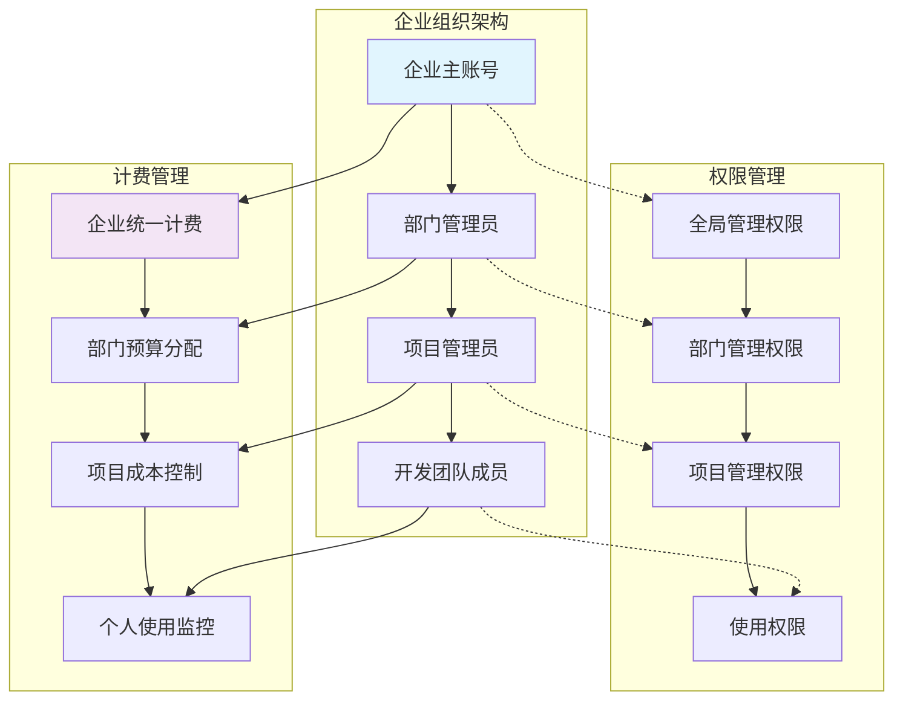

### 企业账号开通流程

#### 申请响应时间


**标准响应时间**：

- **首次响应**：24小时内销售团队主动联系
- **需求分析**：2-3个工作日完成深入评估
- **方案设计**：3-5个工作日提供定制方案
- **正式报价**：1周内完成完整企业方案

**影响时间的因素**：

```markdown
⏱️ 时间影响因素
├── 企业规模
│ ├── 小型企业（<50人）：标准流程，较快
│ ├── 中型企业（50-500人）：需要定制，中等
│ └── 大型企业（500+人）：复杂需求，较慢
├── 需求复杂度
│ ├── 标准需求：使用模板方案
│ ├── 定制需求：需要额外设计时间
│ └── 特殊合规：需要法务和安全审查
└── 集成要求
├── 标准 SSO：快速配置
├── 复杂集成：需要技术评估
└── 定制开发：需要开发时间评估
```

**加速申请建议**：

```markdown
📋 申请前准备清单
├── 企业基础信息
│ ├── 公司名称和规模
│ ├── 技术团队结构
│ ├── 联系人信息（技术负责人、财务负责人）
│ └── 企业邮箱域名
├── 技术需求
│ ├── 预期用户数量和角色分布
│ ├── 现有技术栈和工具
│ ├── SSO 和集成需求
│ └── 安全和合规要求
├── 商务信息
│ ├── 预算范围
│ ├── 付费偏好（月付/年付）
│ ├── 预期开始时间
│ └── 决策流程和时间表
└── 特殊需求
├── 定制化功能需求
├── 数据驻留要求
└── SLA 和支持级别需求
```

**紧急申请处理**：

对于大型企业（1000+用户）或战略合作项目，可申请加急处理：

- 邮件主题标注"URGENT"
- 说明紧急原因和时间要求
- 提供完整决策人联系方式
- **加急响应**：4小时内初步响应，48小时内完成方案

#### 第一步：联系企业销售

```markdown
📞 企业销售联系方式
├── 官方网站：https://kiro.dev/enterprise/
├── 销售邮箱：enterprise-sales@kiro.dev
├── 联系电话：+1-XXX-XXX-XXXX（美国）
└── 在线咨询：官网 "Contact Sales" 按钮
```

##### 申请响应时间和处理流程

**标准响应时间**：

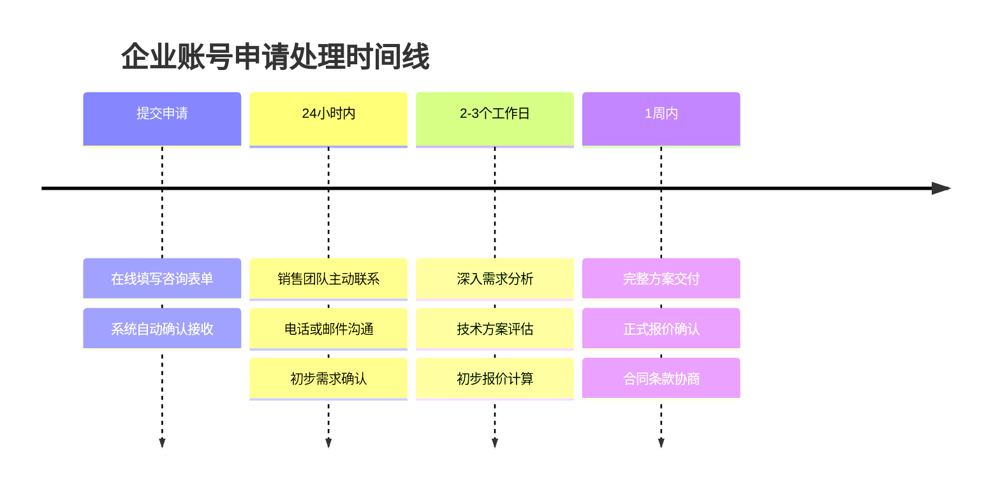

**详细时间节点**：

- **首次响应**：24小时内销售团队主动联系
- **需求分析**：2-3个工作日完成深入评估
- **方案设计**：3-5个工作日提供定制方案
- **正式报价**：1周内完成完整企业方案

**影响处理时间的因素**：

| 因素类型             | 处理时间 | 说明                   |
| -------------------- | -------- | ---------------------- |
| **企业规模**         |          |                        |
| 小型企业（<50人）    | 标准流程 | 使用标准模板，处理较快 |
| 中型企业（50-500人） | 3-5天    | 需要定制化方案设计     |
| 大型企业（500+人）   | 1-2周    | 复杂需求，多轮沟通     |
| **需求复杂度**       |          |                        |
| 标准需求             | 2-3天    | SSO集成、基础功能      |
| 定制需求             | 5-7天    | 特殊集成、定制开发     |
| 合规要求             | 1-2周    | 法务审查、安全评估     |

**加速申请的建议**：

```markdown
🚀 加速申请技巧
├── 准备完整信息
│ ├── 企业基础信息（规模、联系人）
│ ├── 技术需求清单（用户数、集成需求）
│ ├── 预算范围和决策时间表
│ └── 特殊需求和合规要求
├── 选择最佳联系方式
│ ├── 官网在线咨询（推荐，实时响应）
│ ├── 企业销售邮箱（24小时回复）
│ └── 电话咨询（工作时间内）
└── 紧急情况处理
├── 邮件主题标注"URGENT"
├── 说明紧急原因和时间要求
├── 提供完整决策人信息
└── 加急响应：4小时内初步回复
```

**申请前准备清单**：

```markdown
📋 申请前准备清单
├── 企业基础信息
│ ├── 公司名称和规模
│ ├── 技术团队结构
│ ├── 联系人信息（技术负责人、财务负责人）
│ └── 企业邮箱域名
├── 技术需求
│ ├── 预期用户数量和角色分布
│ ├── 现有技术栈和工具
│ ├── SSO 和集成需求
│ └── 安全和合规要求
├── 商务信息
│ ├── 预算范围
│ ├── 付费偏好（月付/年付）
│ ├── 预期开始时间
│ └── 决策流程和时间表
└── 特殊需求
├── 定制化功能需求
├── 数据驻留要求
└── SLA 和支持级别需求
```

**紧急申请处理**：

对于大型企业（1000+用户）或战略合作项目，可申请加急处理：

- 邮件主题标注"URGENT"
- 说明紧急原因和时间要求
- 提供完整决策人联系方式
- **加急响应**：4小时内初步响应，48小时内完成方案

#### 第二步：需求评估和方案定制

- **团队规模评估**：确定用户数量和使用模式
- **功能需求分析**：评估所需的企业级功能
- **集成需求确认**：SSO、API、第三方工具集成
- **合规要求审查**：安全、隐私、数据驻留要求

#### 第三步：合同签署和账号创建

- **企业合同签署**：包含 SLA、支持级别、数据处理协议
- **主账号创建**：企业管理员账号设置
- **组织架构配置**：部门、项目、权限体系设置

#### 第四步：SSO 集成配置

```yaml
# 企业 SSO 配置示例
sso_configuration:
  provider: "AWS IAM Identity Center"
  saml_settings:
    entity_id: "kiro-enterprise-{org-id}"
    acs_url: "https://kiro.dev/saml/acs/{org-id}"
    sso_url: "https://your-org.awsapps.com/start"
    certificate: "path/to/saml-cert.pem"

  scim_provisioning:
    enabled: true
    endpoint: "https://kiro.dev/scim/v2/{org-id}"
    token: "scim-provisioning-token"

  user_attributes:
    email: "http://schemas.xmlsoap.org/ws/2005/05/identity/claims/emailaddress"
    name: "http://schemas.xmlsoap.org/ws/2005/05/identity/claims/name"
    department: "http://schemas.xmlsoap.org/ws/2005/05/identity/claims/department"
```

### 付费方案和定价

#### 个人版定价（参考）

| 方案      | 月费 | 积分额度    | 超额费用   | 适用场景 |
| --------- | ---- | ----------- | ---------- | -------- |
| **Free**  | $0   | 50 积分     | 不可超额   | 个人试用 |
| **Pro**   | $20  | 1,000 积分  | $0.04/积分 | 小团队   |
| **Pro+**  | $40  | 2,000 积分  | $0.04/积分 | 中型团队 |
| **Power** | $200 | 10,000 积分 | $0.04/积分 | 大型项目 |

#### 企业版定价（定制）

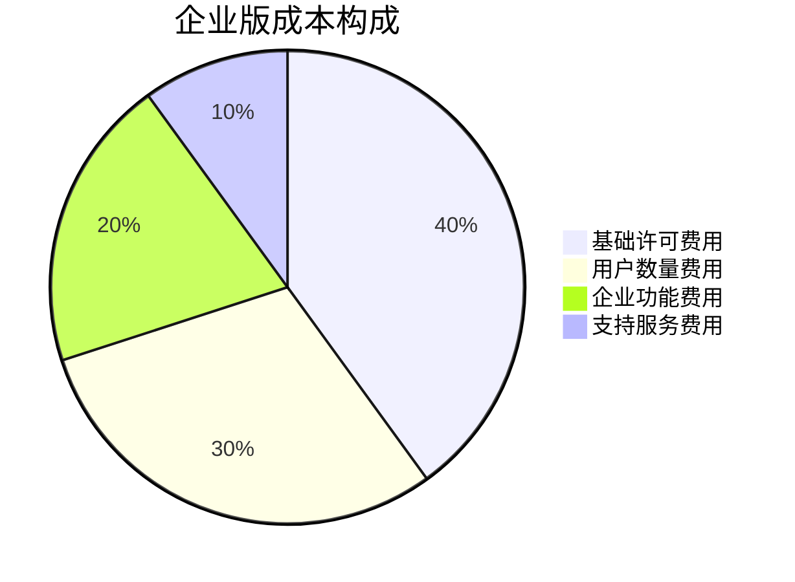

**企业版核心功能**：

- ✅ **统一计费管理**：企业级账单和成本控制
- ✅ **用户权限管理**：细粒度的角色和权限控制
- ✅ **使用分析报告**：详细的使用统计和成本分析
- ✅ **SAML/SCIM SSO**：通过 AWS IAM Identity Center 集成
- ✅ **企业安全控制**：数据加密、审计日志、合规报告
- ✅ **组织管理面板**：可视化的企业管理界面
- ✅ **IP 保护承诺**：代码输出的知识产权保护

### 企业充值和计费管理

#### 充值方式

##### 1. 预付费模式（推荐）

```markdown
💰 预付费充值流程
├── 登录企业管理后台
├── 选择充值金额（最低 $1,000）
├── 选择支付方式
│ ├── 企业银行转账
│ ├── 信用卡支付
│ └── AWS 账单集成
└── 获得对应积分额度
```

##### 2. 后付费模式

```markdown
📊 后付费计费流程
├── 月度使用统计
├── 自动生成账单
├── 企业财务审批
└── 统一支付结算
```

#### 积分消费机制

##### 积分计算规则

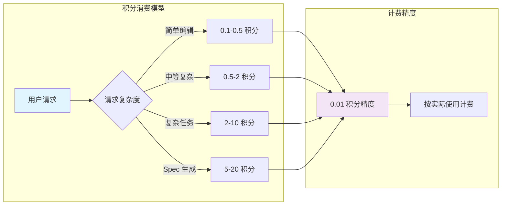

##### 使用场景和积分消耗

| 功能类型           | 积分消耗 | 说明                 |
| ------------------ | -------- | -------------------- |
| **简单代码编辑**   | 0.1-0.5  | 变量重命名、简单修复 |
| **代码生成**       | 0.5-2    | 函数、组件生成       |
| **复杂重构**       | 2-5      | 架构调整、大规模重构 |
| **Spec 创建**      | 5-15     | 完整的规范文档生成   |
| **Autopilot 任务** | 10-50    | 自主完成复杂开发任务 |

#### 企业计费管理功能

##### 成本控制机制

```yaml
# 企业成本控制配置
cost_management:
  budgets:
    - department: "研发部"
      monthly_limit: 10000 # 美元
      alert_threshold: 80 # 百分比

    - project: "核心产品"
      monthly_limit: 5000
      alert_threshold: 75

  user_limits:
    - role: "junior_developer"
      daily_limit: 50 # 积分
      monthly_limit: 1000

    - role: "senior_developer"
      daily_limit: 200
      monthly_limit: 4000

  notifications:
    - type: "budget_alert"
      recipients: ["finance@company.com", "cto@company.com"]
      threshold: [50, 75, 90, 100] # 百分比
```

##### 使用分析报告

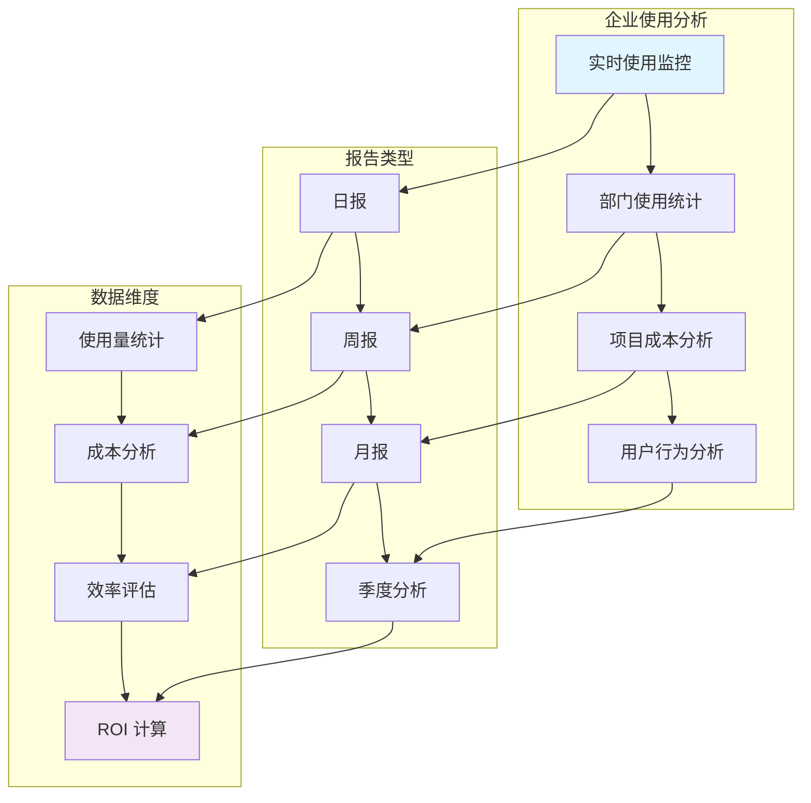

### 全公司部署策略

#### 分阶段部署计划

##### 阶段一：管理层和核心团队（1个月）

```markdown
👥 初始部署范围
├── 企业管理员账号设置
├── 核心开发团队（10-20人）
├── 技术负责人和架构师
└── 试点项目选择
```

##### 阶段二：部门级扩展（2-3个月）

```markdown
🏢 部门级部署
├── 研发部门全员覆盖
├── 产品和设计团队
├── 测试和运维团队
└── 跨部门协作流程建立
```

##### 阶段三：全公司推广（3-6个月）

```markdown
🌐 全公司部署
├── 所有技术相关部门
├── 业务部门技术人员
├── 外包团队和合作伙伴
└── 完整治理体系建立
```

#### 用户管理和权限分配

##### 自动化用户管理

```yaml
# SCIM 自动用户管理配置
user_provisioning:
  auto_create: true
  auto_update: true
  auto_deactivate: true

  default_assignments:
    - condition: "department == 'Engineering'"
      plan: "Pro+"
      permissions: ["specs:write", "autopilot:execute"]

    - condition: "role == 'Architect'"
      plan: "Power"
      permissions: ["all"]

    - condition: "employment_type == 'Contractor'"
      plan: "Pro"
      permissions: ["specs:read", "autopilot:limited"]
```

##### 权限管理矩阵

| 部门/角色        | 账号类型 | 月度积分 | 核心权限  | 管理权限 |
| ---------------- | -------- | -------- | --------- | -------- |
| **CTO/技术总监** | Power    | 10,000   | 全部      | 全局管理 |
| **架构师**       | Power    | 8,000    | 全部      | 部门管理 |
| **高级工程师**   | Pro+     | 2,000    | 开发+审批 | 项目管理 |
| **工程师**       | Pro      | 1,000    | 开发      | 无       |
| **实习生/外包**  | Free     | 50       | 基础      | 无       |

### 企业级安全和合规

#### 数据安全保障

```markdown
🔒 企业安全特性
├── 数据加密
│ ├── 传输加密（TLS 1.3）
│ ├── 存储加密（AES-256）
│ └── 端到端加密
├── 访问控制
│ ├── 多因素认证（MFA）
│ ├── IP 白名单
│ └── 设备管理
├── 审计日志
│ ├── 用户行为记录
│ ├── 代码访问日志
│ └── 管理操作审计
└── 合规认证
├── SOC 2 Type II
├── ISO 27001
└── GDPR 合规
```

#### 数据驻留和隐私

- **区域选择**：美国东部（弗吉尼亚）或欧洲（法兰克福）
- **数据隔离**：企业数据完全隔离，不用于模型训练
- **隐私保护**：符合 GDPR、CCPA 等隐私法规
- **数据删除**：支持数据完全删除和遗忘权

## 📞 支持服务

### 企业级支持体系

#### 支持层级

1. **标准支持**：工作时间内响应（8x5）
2. **优先支持**：4小时内响应（24x7）
3. **专属支持**：专属客户成功经理
4. **战略支持**：CTO 级别的战略咨询

#### 服务承诺（企业版）

- **响应时间**：1小时内响应（优先支持）
- **解决时间**：4小时内解决 P0 问题
- **可用性**：99.95% 系统可用性（SLA 保障）
- **培训支持**：无限制的培训和认证服务

### 联系方式

#### 企业销售

- **官网**：https://kiro.dev/enterprise/
- **邮箱**：enterprise-sales@kiro.dev
- **在线咨询**：官网 "Contact Sales" 按钮

#### 技术支持

- **企业支持门户**：https://support.kiro.dev/enterprise/
- **紧急支持热线**：+1-XXX-XXX-XXXX
- **客户成功经理**：专属联系人

#### 计费支持

- **计费咨询**：billing-support@kiro.dev
- **发票问题**：invoices@kiro.dev
- **合同相关**：contracts@kiro.dev

---

## 📄 附录

### A. 技术规格要求

### B. 成本预算模板

### C. 培训材料清单

### D. 集成配置示例

### E. 故障排除指南

---

**文档状态**: 已完成  
**审核状态**: 待审核  
**下次更新**: 2026-02-19  
**维护责任人**: 企业架构团队
