# 企业 Kiro 账号开通和使用指南

**文档版本**: v1.0  
**创建时间**: 2026-01-19  
**适用对象**: 企业管理员、IT 负责人、开发团队  
**指南类型**: 操作手册

## 📋 开通前准备

### 企业信息准备清单

#### 基础信息

```markdown
📊 企业基础信息
├── 企业名称和注册信息
├── 企业规模（员工数量）
├── 技术团队规模
├── 预期使用人数
├── 企业联系人信息
│ ├── 技术负责人
│ ├── 财务负责人
│ └── 采购负责人
└── 企业邮箱域名
```

#### 技术需求评估

```markdown
🔧 技术需求清单
├── 开发团队结构
│ ├── 前端开发人员数量
│ ├── 后端开发人员数量
│ ├── 全栈开发人员数量
│ └── 架构师和技术负责人
├── 项目类型和复杂度
├── 现有开发工具栈
├── CI/CD 流水线情况
└── 代码仓库管理方式
```

#### 集成需求确认

```markdown
🔗 集成需求评估
├── 身份认证系统
│ ├── 现有 SSO 提供商
│ ├── LDAP/Active Directory
│ └── AWS IAM Identity Center
├── 开发工具集成
│ ├── Git 仓库（GitHub/GitLab/Bitbucket）
│ ├── CI/CD 工具（Jenkins/GitHub Actions）
│ └── 项目管理工具（Jira/Azure DevOps）
├── 安全和合规要求
│ ├── 数据驻留要求
│ ├── 合规认证需求
│ └── 安全审计要求
└── 预算和计费偏好
├── 预付费 vs 后付费
├── 月度预算限制
└── 成本控制要求
```

## 🚀 企业账号开通流程

### 第一步：联系企业销售

#### 1.1 官方渠道联系

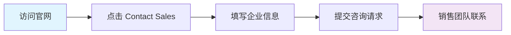

**具体操作步骤**：

1. 访问 [https://kiro.dev/enterprise/](https://kiro.dev/enterprise/)
2. 点击页面上的 "Contact Sales" 按钮
3. 填写企业咨询表单：
   ```markdown
   📝 咨询表单信息
   ├── 企业名称
   ├── 联系人姓名和职位
   ├── 企业邮箱
   ├── 电话号码
   ├── 预期用户数量
   ├── 使用场景描述
   └── 特殊需求说明
   ```

#### 1.2 申请响应时间和流程

**标准响应时间**：

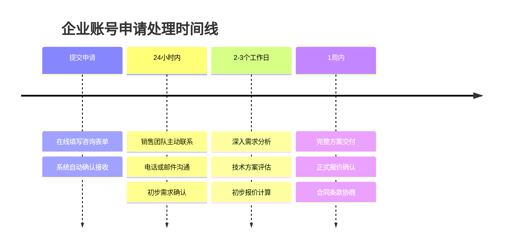

**详细时间节点**：

- **首次响应**：24小时内销售团队主动联系
- **需求分析**：2-3个工作日完成深入评估
- **方案设计**：3-5个工作日提供定制方案
- **正式报价**：1周内完成完整企业方案

**影响处理时间的因素**：

| 因素类型             | 处理时间 | 说明                   |
| -------------------- | -------- | ---------------------- |
| **企业规模**         |          |                        |
| 小型企业（<50人）    | 标准流程 | 使用标准模板，处理较快 |
| 中型企业（50-500人） | 3-5天    | 需要定制化方案设计     |
| 大型企业（500+人）   | 1-2周    | 复杂需求，多轮沟通     |
| **需求复杂度**       |          |                        |
| 标准需求             | 2-3天    | SSO集成、基础功能      |
| 定制需求             | 5-7天    | 特殊集成、定制开发     |
| 合规要求             | 1-2周    | 法务审查、安全评估     |

**加速申请的建议**：

```markdown
🚀 加速申请技巧
├── 准备完整信息
│ ├── 企业基础信息（规模、联系人）
│ ├── 技术需求清单（用户数、集成需求）
│ ├── 预算范围和决策时间表
│ └── 特殊需求和合规要求
├── 选择最佳联系方式
│ ├── 官网在线咨询（推荐，实时响应）
│ ├── 企业销售邮箱（24小时回复）
│ └── 电话咨询（工作时间内）
└── 紧急情况处理
├── 邮件主题标注"URGENT"
├── 说明紧急原因和时间要求
├── 提供完整决策人信息
└── 加急响应：4小时内初步回复
```

#### 1.3 销售沟通和需求确认

**销售团队会在 24 小时内联系您，进行以下确认**：

- 企业规模和技术团队结构
- 具体使用场景和需求
- 预算范围和付费偏好
- 技术集成要求
- 安全和合规需求

### 第二步：方案设计和报价

#### 2.1 定制化方案设计

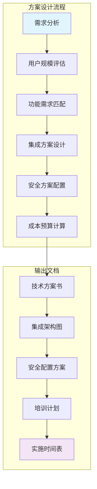

#### 2.2 企业报价构成

```markdown
💰 企业版报价构成
├── 基础平台费用
│ ├── 企业管理平台
│ ├── 安全和合规功能
│ └── 企业级支持服务
├── 用户许可费用
│ ├── 管理员账号
│ ├── 开发者账号
│ └── 只读账号
├── 积分包费用
│ ├── 基础积分包
│ ├── 扩展积分包
│ └── 超额使用费用
├── 集成服务费用
│ ├── SSO 集成配置
│ ├── API 集成开发
│ └── 定制化开发
└── 培训和支持费用
├── 管理员培训
├── 用户培训
└── 技术支持服务
```

### 第三步：合同签署和账号创建

#### 3.1 合同审核和签署

**合同包含的关键条款**：

```yaml
contract_terms:
  service_level:
    availability: "99.95%"
    response_time: "1小时内（P0问题）"
    resolution_time: "4小时内（P0问题）"

  data_protection:
    encryption: "AES-256 + TLS 1.3"
    data_residency: "用户选择区域"
    backup_retention: "30天"

  intellectual_property:
    code_ownership: "客户拥有"
    ip_indemnity: "Kiro 提供保护"
    confidentiality: "严格保密协议"

  billing_terms:
    payment_method: "月付/年付"
    overage_charges: "$0.04/积分"
    invoice_terms: "Net 30"
```

#### 3.2 企业主账号创建

**账号创建流程**：

1. **合同生效确认**：收到签署完成的合同
2. **企业组织创建**：在 Kiro 平台创建企业组织
3. **主管理员设置**：指定企业主管理员
4. **初始配置**：基础设置和权限配置

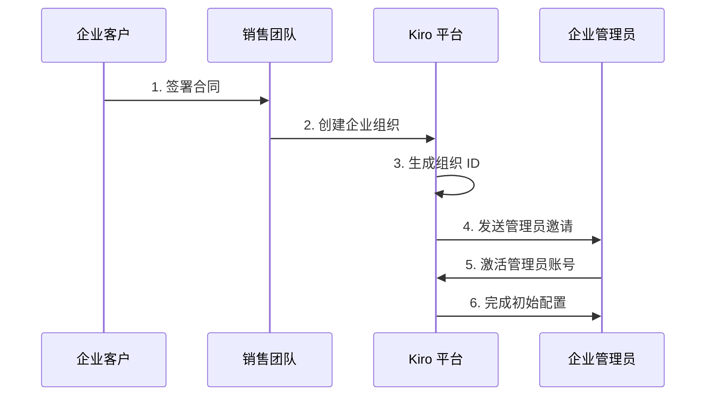

### 第四步：SSO 集成配置

#### 4.1 AWS IAM Identity Center 集成

**配置步骤**：

1. **在 AWS 中配置应用程序**：

```bash
# AWS CLI 配置示例
aws sso-admin create-application \
    --instance-arn arn:aws:sso:::instance/ssoins-xxxxxxxxx \
    --name "Kiro Enterprise" \
    --description "Kiro AI IDE Enterprise Access" \
    --application-provider-arn arn:aws:sso::aws:applicationProvider/custom
```

2. **配置 SAML 属性映射**：

```xml
<!-- SAML 属性映射配置 -->
<saml:AttributeStatement>
    <saml:Attribute Name="http://schemas.xmlsoap.org/ws/2005/05/identity/claims/emailaddress">
        <saml:AttributeValue>${user:email}</saml:AttributeValue>
    </saml:Attribute>
    <saml:Attribute Name="http://schemas.xmlsoap.org/ws/2005/05/identity/claims/name">
        <saml:AttributeValue>${user:displayName}</saml:AttributeValue>
    </saml:Attribute>
    <saml:Attribute Name="department">
        <saml:AttributeValue>${user:department}</saml:AttributeValue>
    </saml:Attribute>
</saml:AttributeStatement>
```

3. **在 Kiro 中配置 SSO**：

```json
{
  "sso_configuration": {
    "provider": "aws_iam_identity_center",
    "entity_id": "kiro-enterprise-{org-id}",
    "acs_url": "https://kiro.dev/saml/acs/{org-id}",
    "sso_url": "https://your-org.awsapps.com/start/#/custom/Kiro%20Enterprise/{app-id}",
    "certificate": "-----BEGIN CERTIFICATE-----\n...\n-----END CERTIFICATE-----",
    "attribute_mapping": {
      "email": "http://schemas.xmlsoap.org/ws/2005/05/identity/claims/emailaddress",
      "name": "http://schemas.xmlsoap.org/ws/2005/05/identity/claims/name",
      "department": "department"
    }
  }
}
```

#### 4.2 SCIM 自动用户管理配置

```yaml
scim_configuration:
  endpoint: "https://kiro.dev/scim/v2/{org-id}"
  authentication:
    type: "bearer_token"
    token: "scim-provisioning-token-xxxxx"

  user_provisioning:
    create_users: true
    update_users: true
    deactivate_users: true

  group_provisioning:
    sync_groups: true
    group_attribute: "department"

  attribute_mapping:
    userName: "email"
    displayName: "displayName"
    email: "email"
    department: "department"
    title: "title"
```

## 👥 用户管理和权限配置

### 用户角色和权限设置

#### 角色定义和权限矩阵

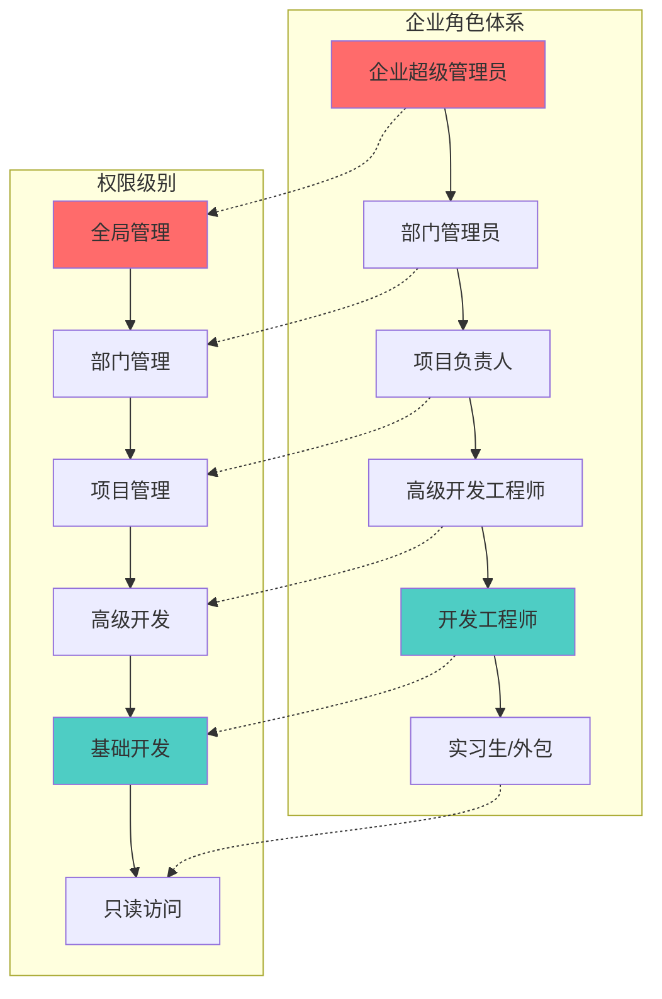

#### 详细权限配置

| 角色           | Kiro 计划 | 月积分 | Specs | Steering | Autopilot | Hooks | Powers | 管理权限 |
| -------------- | --------- | ------ | ----- | -------- | --------- | ----- | ------ | -------- |
| **企业超管**   | Power     | 10,000 | 读写  | 管理     | 全部      | 管理  | 开发   | 全局     |
| **部门管理员** | Power     | 8,000  | 读写  | 管理     | 审批      | 管理  | 配置   | 部门     |
| **项目负责人** | Pro+      | 3,000  | 读写  | 读写     | 审批      | 配置  | 使用   | 项目     |
| **高级工程师** | Pro+      | 2,000  | 读写  | 读写     | 执行      | 配置  | 使用   | 无       |
| **工程师**     | Pro       | 1,000  | 读写  | 读       | 执行      | 使用  | 使用   | 无       |
| **实习生**     | Free      | 50     | 读    | 读       | 限制      | 使用  | 使用   | 无       |

### 批量用户导入

#### CSV 批量导入模板

```csv
email,name,department,title,role,plan,monthly_credits
john.doe@company.com,John Doe,Engineering,Senior Developer,senior_developer,Pro+,2000
jane.smith@company.com,Jane Smith,Engineering,Tech Lead,project_manager,Pro+,3000
bob.wilson@company.com,Bob Wilson,Engineering,Developer,developer,Pro,1000
```

#### 批量导入操作步骤

1. **下载模板**：从企业管理后台下载 CSV 模板
2. **填写用户信息**：按模板格式填写用户数据
3. **验证数据**：使用平台验证功能检查数据格式
4. **执行导入**：上传 CSV 文件并执行批量导入
5. **发送邀请**：系统自动向用户发送激活邀请

## 💻 Kiro IDE 安装和配置

### 桌面应用安装

#### 系统要求

```markdown
💻 系统要求
├── 操作系统
│ ├── Windows 10/11 (64-bit)
│ ├── macOS 10.15+ (Intel/Apple Silicon)
│ └── Linux (Ubuntu 18.04+, CentOS 7+)
├── 硬件要求
│ ├── CPU: 4核心以上
│ ├── 内存: 8GB RAM (推荐 16GB)
│ ├── 存储: 2GB 可用空间
│ └── 网络: 稳定的互联网连接
└── 软件依赖
├── Node.js 16+ (可选)
├── Git 2.0+
└── Docker (可选)
```

#### 安装步骤

##### Windows 安装

```powershell
# 方法1: 直接下载安装包
# 访问 https://kiro.dev/download/windows
# 下载 KiroIDE-Setup-x64.exe

# 方法2: 使用 Chocolatey
choco install kiro-ide

# 方法3: 使用 Winget
winget install Kiro.IDE
```

##### macOS 安装

```bash
# 方法1: 直接下载安装包
# 访问 https://kiro.dev/download/macos
# 下载 KiroIDE-darwin-x64.dmg 或 KiroIDE-darwin-arm64.dmg

# 方法2: 使用 Homebrew
brew install --cask kiro-ide

# 方法3: 使用 Mac App Store
# 搜索 "Kiro IDE" 并安装
```

##### Linux 安装

```bash
# 方法1: 下载 AppImage
wget https://releases.kiro.dev/linux/KiroIDE-linux-x64.AppImage
chmod +x KiroIDE-linux-x64.AppImage
./KiroIDE-linux-x64.AppImage

# 方法2: 使用 Snap
sudo snap install kiro-ide

# 方法3: 使用 APT (Ubuntu/Debian)
curl -fsSL https://packages.kiro.dev/gpg | sudo apt-key add -
echo "deb https://packages.kiro.dev/apt stable main" | sudo tee /etc/apt/sources.list.d/kiro.list
sudo apt update
sudo apt install kiro-ide
```

### 企业配置和登录

#### 首次登录配置

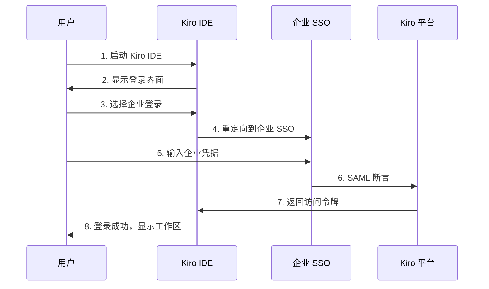

#### 企业登录步骤

1. **启动 Kiro IDE**：双击桌面图标或从开始菜单启动
2. **选择登录方式**：
   ```markdown
   🔐 登录选项
   ├── 企业 SSO 登录 (推荐)
   ├── GitHub 账号登录
   ├── Google 账号登录
   └── AWS Builder ID 登录
   ```
3. **企业域名输入**：输入企业域名（如：company.kiro.dev）
4. **SSO 认证**：重定向到企业 SSO 页面进行认证
5. **权限确认**：确认 Kiro IDE 访问权限
6. **工作区初始化**：首次登录会初始化个人工作区

#### 离线工作配置

```json
{
  "offline_settings": {
    "cache_duration": "7d",
    "sync_frequency": "15m",
    "offline_features": ["code_editing", "local_specs", "cached_completions"],
    "sync_on_reconnect": true
  }
}
```

## 🛠️ 团队协作配置

### 项目和工作区管理

#### 创建企业项目

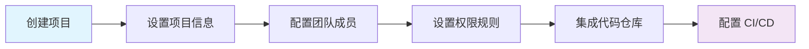

**项目创建步骤**：

1. **项目基础信息**：

   ```yaml
   project_config:
     name: "核心产品开发"
     description: "企业核心产品的主要开发项目"
     type: "web_application"
     tech_stack: ["Vue.js", "TypeScript", "Node.js"]
     repository: "https://github.com/company/core-product"
   ```

2. **团队成员配置**：

   ```yaml
   team_members:
     - email: "tech-lead@company.com"
       role: "project_manager"
       permissions: ["all"]
     - email: "senior-dev@company.com"
       role: "senior_developer"
       permissions: ["specs:write", "autopilot:execute"]
     - email: "developer@company.com"
       role: "developer"
       permissions: ["specs:read", "autopilot:limited"]
   ```

3. **Steering 规则配置**：

   ```yaml
   steering_rules:
     coding_standards:
       - "企业编码规范 v2.0"
       - "TypeScript 严格模式"
       - "Vue 3 Composition API"

     quality_gates:
       - test_coverage: ">= 80%"
       - code_complexity: "<= 10"
       - security_scan: "required"

     workflows:
       - name: "代码审查"
         trigger: "pull_request"
         reviewers: 2
         auto_merge: false
   ```

### 代码仓库集成

#### GitHub 集成配置

```yaml
# .kiro/config.yml
repository:
  provider: "github"
  url: "https://github.com/company/project"
  branch: "main"

  webhooks:
    - event: "push"
      action: "trigger_build"
    - event: "pull_request"
      action: "run_analysis"

  permissions:
    read: ["all_members"]
    write: ["developers", "senior_developers"]
    admin: ["project_managers"]
```

#### GitLab 集成配置

```yaml
# .kiro/config.yml
repository:
  provider: "gitlab"
  url: "https://gitlab.company.com/team/project"
  branch: "develop"

  ci_integration:
    pipeline_trigger: true
    status_checks: true
    merge_requests: true

  access_tokens:
    read_token: "${GITLAB_READ_TOKEN}"
    write_token: "${GITLAB_WRITE_TOKEN}"
```

### CI/CD 集成

#### GitHub Actions 集成

```yaml
# .github/workflows/kiro-integration.yml
name: Kiro AI 集成流水线

on:
  push:
    branches: [main, develop]
  pull_request:
    branches: [main]

jobs:
  kiro-analysis:
    runs-on: ubuntu-latest
    steps:
      - uses: actions/checkout@v3

      - name: Kiro Specs 验证
        uses: kiro-dev/specs-action@v1
        with:
          kiro-token: ${{ secrets.KIRO_API_TOKEN }}
          validate-specs: true

      - name: 代码质量检查
        uses: kiro-dev/quality-action@v1
        with:
          kiro-token: ${{ secrets.KIRO_API_TOKEN }}
          run-linting: true
          run-security-scan: true

      - name: 自动化测试
        uses: kiro-dev/test-action@v1
        with:
          kiro-token: ${{ secrets.KIRO_API_TOKEN }}
          coverage-threshold: 80
```

#### Jenkins 集成

```groovy
// Jenkinsfile
pipeline {
    agent any

    environment {
        KIRO_API_TOKEN = credentials('kiro-api-token')
    }

    stages {
        stage('Kiro 分析') {
            steps {
                script {
                    sh '''
                        curl -X POST https://api.kiro.dev/v1/analysis \
                        -H "Authorization: Bearer ${KIRO_API_TOKEN}" \
                        -H "Content-Type: application/json" \
                        -d '{"repository": "${GIT_URL}", "branch": "${GIT_BRANCH}"}'
                    '''
                }
            }
        }

        stage('质量检查') {
            steps {
                sh 'kiro lint --project-id=${PROJECT_ID} --fail-on-error'
            }
        }

        stage('自动化测试') {
            steps {
                sh 'kiro test --coverage --project-id=${PROJECT_ID}'
            }
        }
    }

    post {
        always {
            sh 'kiro report --generate --project-id=${PROJECT_ID}'
        }
    }
}
```

## 📊 使用监控和管理

### 企业管理后台

#### 管理后台功能概览

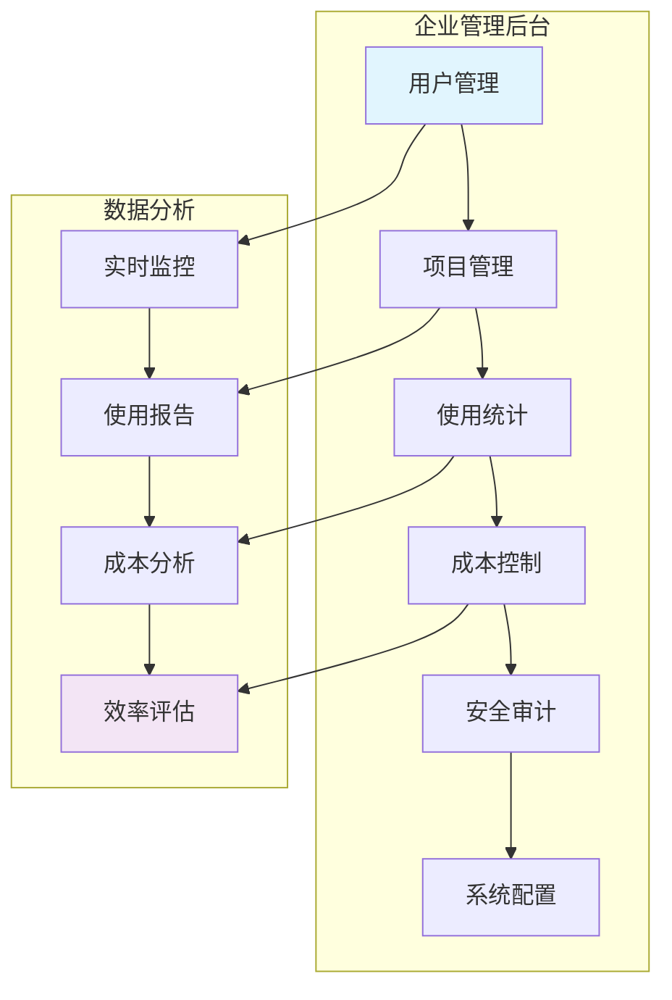

#### 访问管理后台

1. **登录地址**：https://admin.kiro.dev/enterprise/{org-id}
2. **管理员权限**：需要企业管理员或部门管理员权限
3. **多因素认证**：启用 MFA 增强安全性

### 使用统计和分析

#### 实时使用监控

```markdown
📊 实时监控指标
├── 在线用户数
├── 活跃项目数
├── 积分消耗速率
├── API 调用频次
├── 错误率统计
└── 系统响应时间
```

#### 使用报告生成

```yaml
# 报告配置示例
reports:
  daily_usage:
    schedule: "0 9 * * *" # 每天上午9点
    recipients: ["admin@company.com"]
    metrics: ["user_activity", "credit_consumption", "project_stats"]

  weekly_summary:
    schedule: "0 9 * * 1" # 每周一上午9点
    recipients: ["cto@company.com", "finance@company.com"]
    metrics: ["cost_analysis", "efficiency_metrics", "team_performance"]

  monthly_analysis:
    schedule: "0 9 1 * *" # 每月1号上午9点
    recipients: ["executives@company.com"]
    metrics: ["roi_analysis", "trend_analysis", "strategic_insights"]
```

### 成本控制和预算管理

#### 预算设置和监控

```yaml
# 预算控制配置
budget_controls:
  global_budget:
    monthly_limit: 50000 # 美元
    alert_thresholds: [50, 75, 90, 100] # 百分比

  department_budgets:
    - name: "研发部"
      monthly_limit: 30000
      alert_threshold: 80

    - name: "产品部"
      monthly_limit: 10000
      alert_threshold: 75

  user_limits:
    - role: "developer"
      daily_credit_limit: 100
      monthly_credit_limit: 2000

    - role: "senior_developer"
      daily_credit_limit: 200
      monthly_credit_limit: 4000
```

#### 成本优化建议

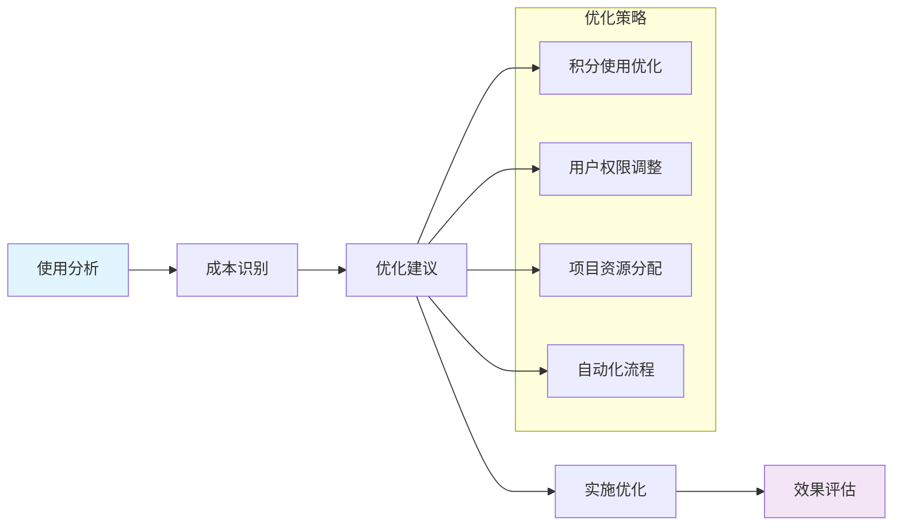

## 🎓 团队培训和支持

### 分层培训计划

#### 管理员培训（2天）

```markdown
📚 管理员培训内容
├── 第一天：平台管理
│ ├── 企业后台操作
│ ├── 用户和权限管理
│ ├── 项目配置和管理
│ └── 成本控制和监控
├── 第二天：高级配置
│ ├── SSO 集成配置
│ ├── API 集成开发
│ ├── 安全策略配置
│ └── 故障排除和支持
└── 认证考试
├── 理论考试（80分及格）
├── 实操考试（配置演示）
└── 管理员认证证书
```

#### 开发者培训（3天）

```markdown
👨‍💻 开发者培训内容
├── 第一天：基础使用
│ ├── Kiro IDE 安装和配置
│ ├── 基础功能介绍
│ ├── Specs 编写和使用
│ └── 基础 AI 辅助开发
├── 第二天：高级功能
│ ├── Autopilot 自动化开发
│ ├── Hooks 自动化配置
│ ├── Powers 扩展使用
│ └── 团队协作功能
├── 第三天：最佳实践
│ ├── 企业开发规范
│ ├── 代码质量控制
│ ├── 性能优化技巧
│ └── 故障排除方法
└── 实战项目
├── 小组项目开发
├── 代码审查实践
└── 成果展示和评估
```

### 持续支持服务

#### 技术支持渠道

```markdown
🆘 技术支持体系
├── 自助服务
│ ├── 在线文档中心
│ ├── 视频教程库
│ ├── 常见问题 FAQ
│ └── 社区论坛
├── 标准支持
│ ├── 工单系统（24小时响应）
│ ├── 邮件支持
│ └── 在线聊天支持
├── 优先支持
│ ├── 电话支持（4小时响应）
│ ├── 远程协助
│ └── 专属技术顾问
└── 专家服务
├── 现场技术支持
├── 定制化培训
└── 架构咨询服务
```

#### 客户成功管理

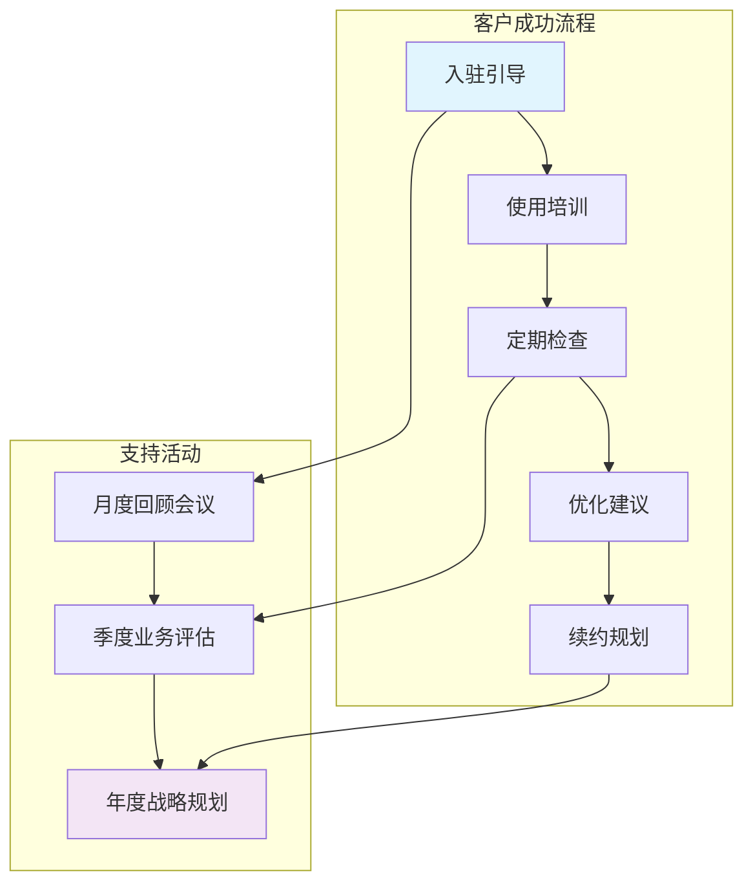

## 🔧 故障排除和维护

### 常见问题解决

#### 登录和认证问题

```markdown
🔐 登录问题排查
├── SSO 登录失败
│ ├── 检查企业域名配置
│ ├── 验证 SAML 证书有效性
│ ├── 确认用户权限状态
│ └── 联系 IT 管理员
├── 网络连接问题
│ ├── 检查防火墙设置
│ ├── 验证代理服务器配置
│ ├── 测试 DNS 解析
│ └── 检查 SSL 证书
└── 账号权限问题
├── 确认用户激活状态
├── 检查角色权限配置
├── 验证许可证状态
└── 联系企业管理员
```

#### 性能和稳定性问题

```markdown
⚡ 性能问题排查
├── IDE 响应缓慢
│ ├── 检查本地资源使用
│ ├── 清理缓存和临时文件
│ ├── 更新到最新版本
│ └── 调整性能设置
├── 网络延迟问题
│ ├── 测试网络连接速度
│ ├── 选择最近的服务区域
│ ├── 配置 CDN 加速
│ └── 优化网络设置
└── 同步问题
├── 检查同步状态
├── 手动触发同步
├── 解决冲突文件
└── 重置本地缓存
```

### 系统维护和更新

#### 定期维护计划

```yaml
maintenance_schedule:
  daily:
    - backup_verification: "02:00"
    - log_rotation: "03:00"
    - cache_cleanup: "04:00"

  weekly:
    - security_scan: "Sunday 01:00"
    - performance_analysis: "Sunday 02:00"
    - update_check: "Sunday 03:00"

  monthly:
    - full_backup: "First Sunday 00:00"
    - capacity_planning: "First Monday 09:00"
    - security_audit: "Second Monday 09:00"
```

#### 版本更新策略

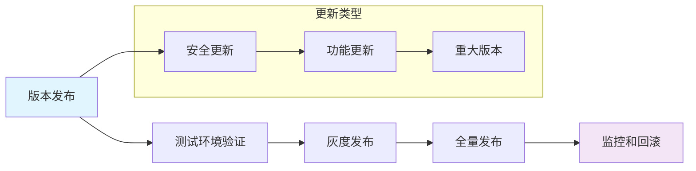

## 📈 成功指标和优化

### 关键绩效指标（KPI）

#### 效率指标

```markdown
📊 效率 KPI 监控
├── 开发效率
│ ├── 代码提交频率
│ ├── 功能交付速度
│ ├── Bug 修复时间
│ └── 代码审查周期
├── 团队协作
│ ├── 跨团队协作频次
│ ├── 知识共享活跃度
│ ├── 文档完整性
│ └── 沟通效率
└── 质量指标
├── 代码质量评分
├── 测试覆盖率
├── 生产环境缺陷率
└── 客户满意度
```

#### ROI 计算模型

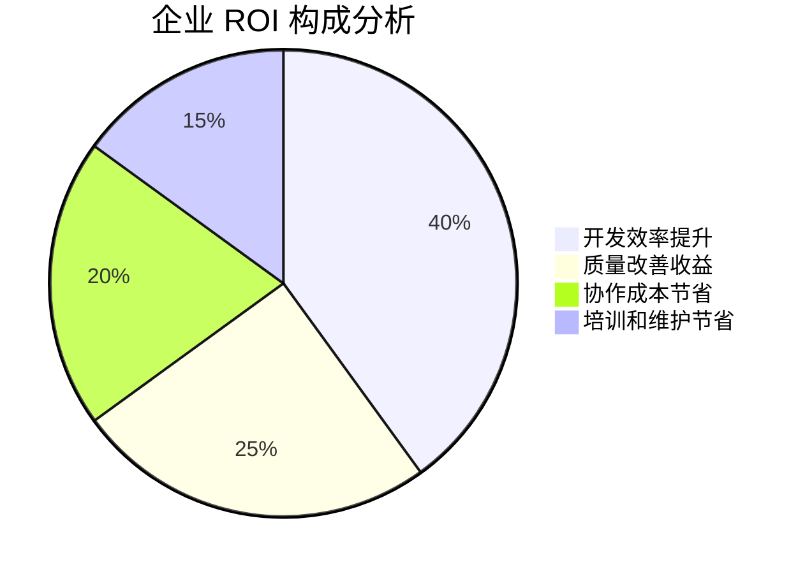

### 持续优化建议

#### 优化策略

```yaml
optimization_strategies:
  usage_optimization:
    - monitor_credit_consumption: "识别高消耗用户和项目"
    - optimize_workflows: "简化重复性任务"
    - improve_specs_quality: "提高 Specs 编写质量"

  cost_optimization:
    - right_size_plans: "根据实际使用调整计划"
    - eliminate_waste: "识别和消除浪费"
    - negotiate_volume_discounts: "协商批量折扣"

  performance_optimization:
    - cache_optimization: "优化缓存策略"
    - network_optimization: "优化网络配置"
    - resource_allocation: "合理分配资源"
```

---

## 📞 联系支持

### 紧急联系方式

- **技术紧急热线**：+1-XXX-XXX-XXXX
- **企业支持邮箱**：enterprise-support@kiro.dev
- **在线支持**：https://support.kiro.dev/enterprise/

### 文档和资源

- **官方文档**：https://docs.kiro.dev/
- **企业指南**：https://docs.kiro.dev/enterprise/
- **API 文档**：https://api.kiro.dev/docs/
- **社区论坛**：https://community.kiro.dev/

---

**文档状态**: 已完成  
**维护责任人**: 企业客户成功团队  
**下次更新**: 2026-02-19  
**版本历史**: v1.0 - 初始版本
