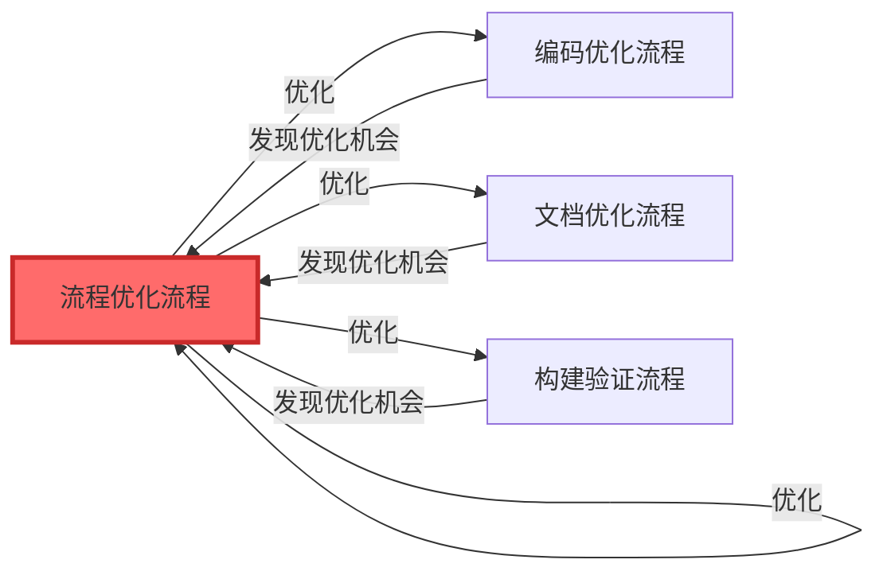
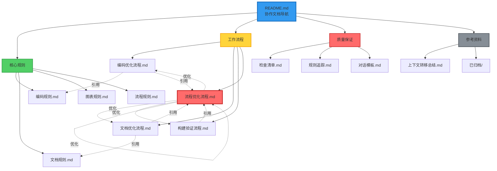

# 协作文档体系说明

**文档版本**: v2.1  
**创建时间**: 2026-01-15  
**更新时间**: 2026-01-16  
**适用项目**: SpacewareConops v3.0.1

## 📚 文档体系概述

本协作文档体系是一个**具有自我优化能力的活体系统**，按职能分类组织，提供完整的协作规则、工作流程和质量保证机制。

## 🎯 核心特性

### 1. 职能分类清晰

```
doc/collaboration/
├── README.md              # 📚 导航入口
├── 核心规则/              # 定义"做什么"和"怎么做"
├── 工作流程/              # 描述"具体步骤"
├── 质量保证/              # 提供"检查和追踪"
└── 参考资料/              # 存放"历史和归档"
```

### 2. 自我优化能力

**流程优化流程**作为元流程，可以优化所有流程（包括它自己）：



### 3. 完整的文档导航

**README.md** 提供：

- 文档结构说明
- 快速导航表格
- 快速开始指南
- 核心原则速览
- 文档关系图
- 学习路径（3条）
- 常见问题解答

### 4. 统一的命名规范

- ✅ 所有文档使用中文命名
- ✅ 目录名称清晰明确
- ✅ 文件名包含日期（如需要）
- ✅ 命名风格统一

## 📊 文档体系结构



## 📋 文档清单

### 核心规则文档（4个）

| 文档                               | 说明                             | 适用场景     |
| ---------------------------------- | -------------------------------- | ------------ |
| [编码规则](./核心规则/编码规则.md) | 代码生成、编码风格、类型安全规范 | 编写代码时   |
| [文档规则](./核心规则/文档规则.md) | 文档生成、命名、结构、内容规范   | 创建文档时   |
| [图表规则](./核心规则/图表规则.md) | Mermaid 图表生成、颜色、样式规范 | 绘制流程图时 |
| [流程规则](./核心规则/流程规则.md) | 工作流程、审批机制、状态流转规范 | 执行任务时   |

### 工作流程文档（4个）

| 文档                                       | 说明                                      | 适用场景 |
| ------------------------------------------ | ----------------------------------------- | -------- |
| [编码优化流程](./工作流程/编码优化流程.md) | 完整的编码工作流程（理解→分析→执行→验证） | 编码任务 |
| [文档优化流程](./工作流程/文档优化流程.md) | 文档创建和维护流程                        | 文档任务 |
| [构建验证流程](./工作流程/构建验证流程.md) | Turbo 增量构建规则和验证流程              | 构建验证 |
| [流程优化流程](./工作流程/流程优化流程.md) | 迭代优化自身流程的完整流程                | 流程改进 |

### 质量保证文档（3个）

| 文档                               | 说明                   | 适用场景   |
| ---------------------------------- | ---------------------- | ---------- |
| [检查清单](./质量保证/检查清单.md) | 对话前、中、后的检查项 | 每次对话   |
| [规则追踪](./质量保证/规则追踪.md) | 规则遵循状态追踪       | 质量审计   |
| [对话模板](./质量保证/对话模板.md) | 标准化对话流程模板     | 标准化交流 |

### 参考资料（1个 + 归档）

| 文档                                           | 说明               |
| ---------------------------------------------- | ------------------ |
| [上下文转移总结](./参考资料/上下文转移总结.md) | 上次对话的工作总结 |
| [已归档/](./参考资料/已归档/)                  | 旧版文档归档目录   |

## 🚀 快速开始

### 新成员入门（30分钟）

1. 阅读本文档（5分钟）
2. 阅读 [README.md](./README.md)（5分钟）
3. 阅读 [流程规则](./核心规则/流程规则.md)（10分钟）
4. 浏览 [编码规则](./核心规则/编码规则.md)（10分钟）

### AI 助手使用

**每次对话开始前**:

1. ✅ 阅读 [流程规则](./核心规则/流程规则.md)
2. ✅ 使用 [检查清单](./质量保证/检查清单.md) 自检
3. ✅ 参考 [对话模板](./质量保证/对话模板.md)

**编码任务时**:

1. ✅ 遵循 [编码规则](./核心规则/编码规则.md)
2. ✅ 按照 [编码优化流程](./工作流程/编码优化流程.md) 执行
3. ✅ 使用 [构建验证流程](./工作流程/构建验证流程.md) 验证

**创建文档时**:

1. ✅ 遵循 [文档规则](./核心规则/文档规则.md)
2. ✅ 按照 [文档优化流程](./工作流程/文档优化流程.md) 执行
3. ✅ 使用 [图表规则](./核心规则/图表规则.md) 绘制流程图

**发现流程问题时**:

1. ✅ 按照 [流程优化流程](./工作流程/流程优化流程.md) 执行
2. ✅ 记录优化建议
3. ✅ 评估优化价值
4. ✅ 创建优化方案
5. ✅ 实施并验证

## 💡 核心原则速览

### 🔴 用户审批机制（最重要）

**核心原则**: 在执行任何代码修改操作之前，必须等待用户明确同意。

**关键审批点**:

1. **方案审批**: 分析完成 → 等待用户同意 → 执行方案
2. **测试验证**: 执行完成 → 等待用户测试 → 输出总结

### 🟢 编码核心原则

1. **最小化修改**: 只改必要的代码
2. **保持一致性**: 遵循项目编码风格
3. **向后兼容**: 不破坏现有功能
4. **质量优先**: 先记录问题，统一优化

### 🟡 文档核心原则

1. **全程中文**: 所有文档使用中文
2. **流程可视化**: 必须使用 Mermaid 图表
3. **结构清晰**: 使用统一模板
4. **自动触发**: 分析活动自动创建文档

### 🔵 构建核心原则

1. **增量构建**: 使用 Turbo 缓存
2. **修改必建**: 每次修改后必须构建
3. **验证完整**: 检查构建输出和产物

## 📈 文档统计

### 文档数量

| 类型     | 数量   | 说明                         |
| -------- | ------ | ---------------------------- |
| 核心规则 | 4      | 编码、文档、图表、流程       |
| 工作流程 | 4      | 编码、文档、构建、流程优化   |
| 质量保证 | 3      | 检查清单、规则追踪、对话模板 |
| 参考资料 | 1      | 上下文转移总结               |
| 导航文档 | 2      | README、本文档               |
| **总计** | **14** | 活跃文档                     |

### 图表数量

| 文档            | 图表数量 | 类型                   |
| --------------- | -------- | ---------------------- |
| 流程规则.md     | 3        | 流程图、状态图         |
| 图表规则.md     | 6        | 各类示例图表           |
| 编码优化流程.md | 2        | 流程图、决策树         |
| 文档优化流程.md | 4        | 流程图、状态图         |
| 流程优化流程.md | 5        | 流程图、状态图、时序图 |
| README.md       | 1        | 文档关系图             |
| 本文档          | 2        | 文档关系图、优化闭环图 |
| **总计**        | **23+**  | 覆盖所有流程           |

## 🔄 持续改进机制

### 定期审查

**频率**:

- 每周：审查优化清单（P0/P1）
- 每月：审查所有文档，识别改进点
- 每季度：全面审查文档体系

**审查内容**:

- 文档是否需要更新
- 流程是否需要优化
- 是否有新的最佳实践
- 是否需要新增文档

### 反馈收集

**渠道**:

- 使用过程中的问题记录
- 团队成员的改进建议
- 实际案例的经验总结
- 定期的团队讨论

### 版本管理

**版本号规则**:

- 主版本号：重大结构调整（如 v1.0 → v2.0）
- 次版本号：新增重要内容（如 v2.0 → v2.1）
- 修订号：小修改和更新（如 v2.1.0 → v2.1.1）

## 🎓 最佳实践

### 文档创建

- ✅ 使用统一模板
- ✅ 包含完整的章节
- ✅ 添加 Mermaid 图表
- ✅ 提供具体示例
- ✅ 更新相关引用

### 流程执行

- ✅ 按步骤执行
- ✅ 记录执行过程
- ✅ 等待用户审批
- ✅ 验证执行效果
- ✅ 总结经验教训

### 流程优化

- ✅ 持续识别优化机会
- ✅ 评估优化价值
- ✅ 创建优化方案
- ✅ 实施并验证
- ✅ 更新文档和最佳实践

### 文档维护

- ✅ 定期审查更新
- ✅ 收集使用反馈
- ✅ 及时修正错误
- ✅ 补充缺失内容
- ✅ 优化文档结构

## 📞 常见问题

**Q: 不确定应该遵循哪个规则？**  
A: 查看 [README.md](./README.md) 的"适用场景"列，找到对应的规则文档。

**Q: 规则之间有冲突怎么办？**  
A: 优先级：流程规则 > 编码规则 > 文档规则 > 图表规则

**Q: 如何快速检查是否遵循了所有规则？**  
A: 使用 [检查清单](./质量保证/检查清单.md) 进行逐项检查。

**Q: 发现规则不合理怎么办？**  
A: 按照 [流程优化流程](./工作流程/流程优化流程.md) 提出改进建议。

## 📚 参考资料

- [Documentation Best Practices 2025](https://www.meistertask.com/blog/project-documentation-best-practices-12-essential-strategies-for-2025)
- [Software Engineering Best Practices](https://meetzest.com/blog/software-engineering-best-practices)
- [Mermaid 官方文档](https://mermaid.js.org/)

## 📝 版本历史

- **v2.1** (2026-01-16): 合并两个总结文档，优化结构，减少冗余
- **v2.0** (2026-01-15): 重构文档结构，按职能分类，创建导航文档
- **v1.0** (2026-01-14): 初始版本，创建基础协作规则文档

---

**文档状态**: ✅ 已完成  
**维护者**: 开发团队  
**最后更新**: 2026-01-16  
**下次审查**: 2026-02-16
