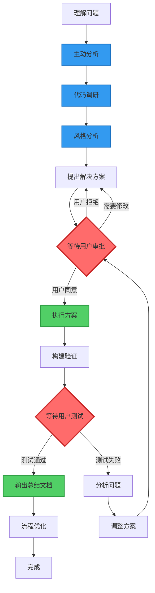
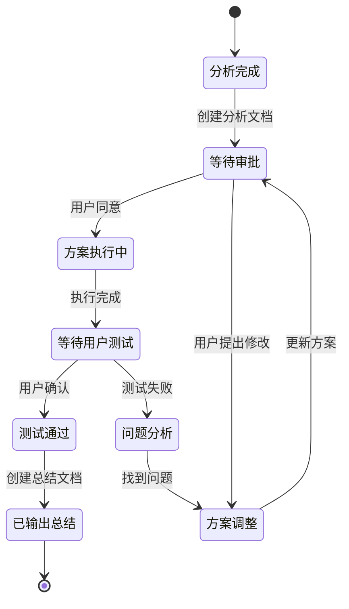
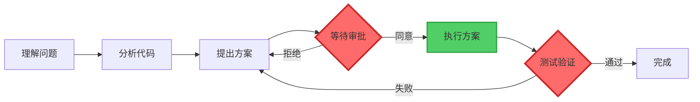

# 对话协作规则文档

## 基本对话规则

### 1. 语言使用规范

- **对话语言**: 统一使用中文进行所有对话交流
- **文档语言**: 所有生成的文档、注释、说明均使用中文
- **代码注释**: 优先使用中文注释，提高团队理解效率
- **变量命名**: 在不影响代码规范的前提下，适当使用中文拼音或英文

### 2. 文档创建规范

- **文档格式**: 统一使用 Markdown 格式
- **文档语言**: 所有技术文档、总结报告、问题分析均使用中文
- **文档结构**: 遵循清晰的层级结构，使用合适的标题层级
- **代码示例**: 在文档中的代码示例保持原有语言，但说明使用中文
- **流程可视化**: 所有涉及流程的部分，都必须使用 Mermaid 流程图表达

#### 2.5 流程可视化规范

**核心原则**: 文档中所有涉及流程、步骤、状态转换的内容，都必须配备 Mermaid 图表。

##### 适用范围

- ✅ 工作流程说明
- ✅ 问题分析流程
- ✅ 代码执行流程
- ✅ 审批流程
- ✅ 测试验证流程
- ✅ 状态转换流程
- ✅ 数据流向说明
- ✅ 系统交互流程
- ✅ 构建部署流程

##### 实施要求

1. **双重表达**: 流程既要有文字说明，也要有 Mermaid 图表

   - 文字说明：详细描述每个步骤的具体内容
   - 图表展示：直观展示流程的整体结构和关键路径

2. **图表优先**: 复杂流程优先使用图表展示，文字作为补充

   - 3步以上的流程：必须使用图表
   - 包含分支判断的流程：必须使用图表
   - 涉及多个角色/系统的流程：必须使用图表

3. **统一风格**: 使用统一的节点样式和颜色标记

   - 保持项目内所有文档的图表风格一致
   - 使用标准的颜色标记系统

4. **清晰标注**: 关键决策点、审批点、执行点要有明显标记
   - 使用颜色区分不同类型的节点
   - 使用图标或emoji增强可读性

##### 推荐的 Mermaid 图表类型

根据不同的流程类型，选择合适的图表：

1. **流程图 (graph/flowchart)**: 用于展示步骤流程

   ```mermaid
   graph TD
       A[开始] --> B[步骤1]
       B --> C{判断}
       C -->|是| D[步骤2]
       C -->|否| E[步骤3]
   ```

2. **状态图 (stateDiagram)**: 用于展示状态转换

   ```mermaid
   stateDiagram-v2
       [*] --> 待审批
       待审批 --> 执行中: 用户同意
       待审批 --> 已拒绝: 用户拒绝
       执行中 --> 待测试: 执行完成
       待测试 --> 已完成: 测试通过
       待测试 --> 执行中: 测试失败
   ```

3. **时序图 (sequenceDiagram)**: 用于展示交互流程

   ```mermaid
   sequenceDiagram
       participant U as 用户
       participant A as AI助手
       participant S as 系统
       U->>A: 提出问题
       A->>S: 分析代码
       S-->>A: 返回结果
       A->>U: 提供方案
       U->>A: 同意执行
       A->>S: 执行修改
   ```

4. **甘特图 (gantt)**: 用于展示时间线流程
   ```mermaid
   gantt
       title 项目实施时间线
       section 分析阶段
       需求分析: 2026-01-15, 1d
       代码调研: 2026-01-16, 1d
       section 执行阶段
       方案执行: 2026-01-17, 2d
       测试验证: 2026-01-19, 1d
   ```

##### 颜色标记规范

使用统一的颜色标记系统，增强图表可读性：

**标准颜色方案**:

- 🔴 **红色** (#ff6b6b): 审批点、等待点、关键决策点、阻塞状态
  - 示例: `style F fill:#ff6b6b,stroke:#c92a2a,stroke-width:3px`
- 🟢 **绿色** (#51cf66): 执行点、完成点、成功状态、正常流程
  - 示例: `style G fill:#51cf66,stroke:#2f9e44,stroke-width:2px`
- 🟡 **黄色** (#ffd43b): 警告点、注意事项、待处理状态
  - 示例: `style H fill:#ffd43b,stroke:#f59f00,stroke-width:2px`
- 🔵 **蓝色** (#339af0): 分析点、准备阶段、信息节点
  - 示例: `style I fill:#339af0,stroke:#1971c2,stroke-width:2px`
- ⚪ **灰色** (#868e96): 普通步骤、中间状态
  - 示例: `style J fill:#868e96,stroke:#495057,stroke-width:1px`

##### 图表示例

**示例1: 问题分析流程图**



**说明**:

- 红色节点表示必须等待用户审批的关键点
- 绿色节点表示用户同意后才能执行的操作
- 蓝色节点表示分析和准备阶段

**示例2: 文档状态转换图**



##### 实施检查清单

创建文档时，检查以下事项：

- [ ] 文档中是否有流程描述？
- [ ] 流程是否超过3个步骤？
- [ ] 流程是否包含分支判断？
- [ ] 是否已添加对应的 Mermaid 图表？
- [ ] 图表是否使用了标准颜色标记？
- [ ] 关键节点是否有明显标识？
- [ ] 图表和文字说明是否一致？
- [ ] 图表是否易于理解？

##### 常见错误和改进

❌ **错误示例**: 只有文字描述，没有图表

```markdown
## 工作流程

1. 理解问题
2. 分析代码
3. 提出方案
4. 等待审批
5. 执行方案
6. 测试验证
```

✅ **正确示例**: 文字 + 图表

````markdown
## 工作流程

### 流程说明

1. **理解问题**: 仔细分析用户描述的问题
2. **分析代码**: 查看相关代码文件
3. **提出方案**: 创建分析文档，说明解决方案
4. **等待审批**: ⚠️ 等待用户明确同意
5. **执行方案**: 用户同意后执行代码修改
6. **测试验证**: 等待用户测试通过

### 流程图


````

```

### 3. 编码风格分析要求

每次阅读和分析代码时，需要总结以下编码风格特点：

#### 3.1 项目架构风格

- **技术栈选择**: Vue 3 + TypeScript + Vite + pnpm monorepo
- **架构模式**: 微前端架构，主项目 + 远程组件
- **状态管理**: Pinia + 事件总线混合模式
- **构建系统**: Turbo + 分层构建策略

#### 3.2 代码组织风格

- **文件结构**: 按功能模块划分，清晰的目录层级
- **命名规范**:
  - 文件名使用 kebab-case (如: `BaseFooter.vue`)
  - 组件名使用 PascalCase (如: `BaseFooter`)
  - 变量名使用 camelCase (如: `mapLevel`)
  - 常量使用 UPPER_SNAKE_CASE

#### 3.3 Vue 组件风格

- **组合式 API**: 优先使用 `<script setup>` 语法
- **类型定义**: 严格的 TypeScript 类型约束
- **响应式数据**: 使用 `ref()` 和 `reactive()` 管理状态
- **组件通信**:
  - 父子组件: props/emit
  - 跨组件: 事件总线 (useEventBus)
  - 全局状态: Pinia stores

#### 3.4 TypeScript 使用风格

- **类型安全**: 严格的类型检查，避免 `any` 类型
- **接口定义**: 清晰的接口和类型定义
- **泛型使用**: 合理使用泛型提高代码复用性
- **类型导入**: 使用 `import type` 导入类型

#### 3.5 代码质量风格

- **错误处理**: 完善的错误捕获和处理机制
- **代码复用**: 通过 composables 和 utils 提高复用性
- **性能优化**: 合理使用缓存、懒加载等优化手段
- **调试友好**: 保留必要的调试信息，及时清理调试代码

## 当前项目编码风格总结

### 技术架构特点

1. **现代化技术栈**

   - Vue 3.4.38 + Composition API
   - TypeScript 4.8.4 严格模式
   - Vite 5.1.0 快速构建
   - pnpm 10.17.1 monorepo 管理

2. **微前端架构**
   - 主项目: `projects/combat-concepts_management`
   - 远程组件: `apps/*` (8个独立应用)
   - 核心包: `packages/*` (26个共享包)
   - 构建脚本: `scripts/*` 自动化工具

### 代码组织特点

1. **清晰的分层结构**

```

├── packages/ # 核心功能包
├── apps/ # 远程应用组件
├── projects/ # 主项目
├── scripts/ # 构建和工具脚本
└── doc/ # 项目文档

````

2. **模块化设计**
- 每个包都有独立的 `package.json`
- 清晰的依赖关系和构建配置
- 统一的代码规范和质量检查

### Vue 组件风格特点

1. **组合式 API 优先**

```vue
<script setup lang="ts">
import { ref } from 'vue';
import { useGetMapLevel } from '@spaceware/event-bus';

const mapLevel = ref<number>(0);
const getMapLevelEvent = useGetMapLevel();
</script>
````

2. **严格的类型定义**

   - 所有变量都有明确的类型声明
   - 接口和类型定义规范
   - 避免使用 `any` 类型

3. **事件驱动通信**
   - 使用自定义事件总线进行跨组件通信
   - Pinia 管理全局状态
   - 避免深层级的 props 传递

### 代码质量特点

1. **自动化质量保障**

   - ESLint + Prettier 代码格式化
   - Husky + lint-staged 提交前检查
   - Commitlint 提交信息规范

2. **完善的错误处理**

   - 构建失败自动恢复
   - 端口冲突自动处理
   - 详细的错误日志和调试信息

3. **性能优化意识**
   - Turbo 缓存策略
   - 组件懒加载
   - 智能构建顺序

## 协作工作流程

### 1. 问题分析流程

1. **理解问题**: 仔细分析用户描述的问题
2. **主动分析**:
   - **项目文档分析**: 主动查阅相关的项目文档（架构文档、功能文档、修复文档等），了解问题的历史背景和已有解决方案
   - **项目代码分析**: 主动阅读相关代码文件，理解当前实现、依赖关系和潜在影响范围
   - **综合分析**: 结合文档和代码，形成对问题的全面理解
3. **代码调研**: 查看相关代码文件，理解现有实现
4. **风格分析**: 总结当前代码的编程风格和架构特点
5. **解决方案**: 提供符合项目风格的解决方案
6. **等待用户审批**: ⚠️ 等待用户明确同意方案后才执行
7. **执行方案**: 用户同意后，按照方案执行代码修改
8. **构建验证**: 使用 Turbo 增量构建验证修改
9. **等待用户测试**: ⚠️ 通知用户进行实际测试验证
10. **用户确认**: 等待用户测试通过的明确反馈
11. **输出总结文档**: 用户确认后创建编码总结文档（包含架构图和数据流图）
12. **流程优化**: 在解决问题的同时，识别并优化相关流程（构建、测试、部署、开发等），及时更新相关文档和最佳实践

### 2. 代码修改原则

1. **保持一致性**: 遵循项目现有的编码风格
2. **最小化修改**: 只修改必要的部分，避免大范围重构
3. **向后兼容**: 确保修改不会破坏现有功能
4. **质量优先**: 提高代码质量，移除冗余代码
5. **持续优化**: 在问题解决过程中，边解决问题，边优化相关流程（构建、测试、部署等），及时更新相关文档

### 3. 文档输出规范

1. **问题描述**: 清晰描述遇到的问题
2. **原因分析**: 深入分析问题的根本原因
3. **解决方案**: 详细说明解决步骤和方法
4. **验证结果**: 确认修复效果和测试结果
5. **最佳实践**: 提供相关的最佳实践建议

### 4. 分析时自动输出文档规则

**核心原则**: 当交互过程中出现以下分析活动时，必须自动创建对应的分析文档，并**等待用户同意后再执行方案**。

**重要**: 这是一个"分析 → 文档 → 审批 → 执行"的工作流程，确保用户对解决方案有充分的了解和控制权。

#### 4.1 触发条件

以下情况必须输出分析文档：

- **代码分析**: 深入分析代码结构、逻辑、性能等
- **原因分析**: 分析问题的根本原因、影响范围等
- **综合分析**: 对多个方面进行综合性分析
- **架构分析**: 分析系统架构、模块关系等
- **性能分析**: 分析性能瓶颈、优化方向等
- **问题诊断**: 诊断错误、异常、故障等

#### 4.2 文档内容要求

分析文档必须包含：

1. **分析概述**

   - 分析的目标和范围
   - 分析的方法和工具
   - 分析的时间和背景

2. **详细分析**

   - 分析过程和步骤
   - 关键发现和数据
   - 图表和可视化（如适用）

3. **结论总结**

   - 主要结论和发现
   - 影响范围评估
   - 风险和注意事项

4. **解决方案**（如适用）

   - 推荐的解决方案
   - 实施步骤和优先级
   - 预期效果和验证方法

5. **后续建议**
   - 需要进一步分析的内容
   - 相关的优化建议
   - 预防措施和最佳实践

#### 4.3 文档命名规范

**核心原则**: 文档文件名统一使用中文，便于团队理解和查找

- **代码分析**: `代码分析-<模块名>-<日期>.md`（如：`代码分析-拖拽事件-2026-01-15.md`）
- **原因分析**: `原因分析-<问题名>-<日期>.md`（如：`原因分析-地球拖拽失败-2026-01-15.md`）
- **综合分析**: `综合分析-<主题>-<日期>.md`（如：`综合分析-事件总线架构-2026-01-15.md`）
- **架构分析**: `架构分析-<范围>-<日期>.md`（如：`架构分析-双总线系统-2026-01-15.md`）
- **性能分析**: `性能分析-<模块名>-<日期>.md`（如：`性能分析-渲染引擎-2026-01-15.md`）
- **问题诊断**: `问题诊断-<问题名>-<日期>.md`（如：`问题诊断-拖拽事件丢失-2026-01-15.md`）
- **修复总结**: `修复总结-<问题名>-<日期>.md`（如：`修复总结-拖拽事件-2026-01-15.md`）
- **构建验证**: `构建验证-<模块名>-<日期>.md`（如：`构建验证-对象浏览器-2026-01-15.md`）

**命名注意事项**:

- 使用简洁明了的中文描述
- 日期格式统一为 `YYYY-MM-DD`
- 避免使用特殊字符和空格
- 模块名和问题名使用中文或项目约定的中文术语

#### 4.4 文档存放位置

根据分析类型选择合适的目录：

- `doc/architecture/` - 架构分析文档
- `doc/features/` - 功能相关分析
- `doc/fixes/` - 问题诊断和原因分析
- `doc/optimization/` - 性能分析文档
- `doc/analysis/` - 综合分析和专项分析

#### 4.5 文档模板

```markdown
# [分析类型] 分析标题

**分析时间**: YYYY-MM-DD HH:mm
**分析人员**: AI Assistant
**相关模块**: 模块名称
**问题/需求**: 简要描述

## 📋 分析概述

### 分析目标

- 目标1
- 目标2

### 分析范围

- 范围1
- 范围2

### 分析方法

- 方法1
- 方法2

## 🔍 详细分析

### 1. [分析维度1]

详细分析内容...

### 2. [分析维度2]

详细分析内容...

## 📊 关键发现

### 发现1: 标题

- 详细描述
- 影响范围
- 严重程度

### 发现2: 标题

- 详细描述
- 影响范围
- 严重程度

## 💡 结论总结

### 主要结论

1. 结论1
2. 结论2

### 影响范围

- 影响的模块
- 影响的功能
- 影响的用户

### 风险评估

- 风险1: 描述和等级
- 风险2: 描述和等级

## 🎯 解决方案

### 推荐方案

1. **方案1**: 描述

   - 优点
   - 缺点
   - 实施难度

2. **方案2**: 描述
   - 优点
   - 缺点
   - 实施难度

### 实施步骤

1. 步骤1
2. 步骤2

### 验证方法

- 验证点1
- 验证点2

## 📈 后续建议

### 短期建议

- 建议1
- 建议2

### 长期建议

- 建议1
- 建议2

### 预防措施

- 措施1
- 措施2

## 📚 参考资料

- [相关文档1](链接)
- [相关文档2](链接)

---

**文档状态**: 待审核/已确认/执行中/已完成
**下次更新**: YYYY-MM-DD

---

## 📋 审批记录

### 方案审批

- [ ] 等待用户审批
- [ ] 用户已同意方案
- [ ] 方案执行中
- [ ] 方案执行完成
- [ ] 等待用户测试验证
- [ ] 用户测试通过
- [ ] 已输出总结文档

### 审批意见

- **审批时间**:
- **审批结果**:
- **修改意见**:

### 测试验证记录

- **测试时间**:
- **测试人员**:
- **测试结果**:
- **测试反馈**:
- **问题记录**:
```

#### 4.6 执行流程（重要）

**关键原则**: 分析 → 文档 → 审批 → 执行

1. **识别分析活动**: 在交互过程中识别是否触发分析文档输出条件
2. **创建分析文档**: 立即创建对应的分析文档
3. **填充分析内容**: 将分析过程和结果记录到文档中
4. **提出解决方案**: 在文档中详细说明推荐的解决方案
5. **通知用户**: 告知用户已创建分析文档及其位置
6. **等待审批**: ⚠️ **必须等待用户明确同意方案后才能执行**
7. **执行方案**: 用户同意后，按照文档中的方案执行
8. **更新文档**: 执行过程中持续更新文档状态

#### 4.7 方案审批机制

**禁止行为**:

- ❌ 分析后直接执行方案（未经用户同意）
- ❌ 假设用户同意而自动执行
- ❌ 在分析文档中包含已执行的代码修改

**正确流程**:

- ✅ 完成分析后创建文档
- ✅ 在文档中详细说明解决方案
- ✅ 明确告知用户"等待您的审批"
- ✅ 用户明确同意后才开始执行
- ✅ 执行过程中更新文档状态

**用户审批方式**:

- 用户明确回复"同意"、"执行"、"开始"等
- 用户提出修改意见后，更新方案并重新等待审批
- 用户拒绝方案，记录原因并探讨其他方案

#### 4.8 用户测试验证规则

**核心原则**: 方案执行完成后，必须由用户进行实际测试验证，确认无误后才输出总结文档。

**工作流程**:

1. **方案执行完成**

   - AI 完成所有代码修改
   - 完成构建验证
   - 更新分析文档状态为"执行完成，等待用户测试"

2. **通知用户测试**

   - 明确告知用户"方案已执行完成，请进行测试验证"
   - 提供测试要点和验证方法
   - 说明预期的测试结果

3. **等待用户反馈**

   - ⚠️ **禁止在用户测试前输出总结文档**
   - 等待用户明确反馈测试结果
   - 如果测试失败，分析原因并调整方案

4. **用户确认通过**

   - 用户明确回复"测试通过"、"验证成功"、"没问题"等
   - 用户提供测试结果截图或描述
   - 用户同意输出总结文档

5. **输出总结文档**
   - 创建编码总结文档（包含架构图和数据流图）
   - 更新分析文档状态为"已验证通过"
   - 记录用户测试反馈和验证结果

**禁止行为**:

- ❌ 方案执行后立即输出总结文档（未经用户测试）
- ❌ 假设测试通过而自动输出总结
- ❌ 在用户测试期间催促或假设结果

**正确流程**:

- ✅ 执行完成后明确告知用户需要测试
- ✅ 提供清晰的测试指南和验证要点
- ✅ 耐心等待用户测试反馈
- ✅ 用户确认通过后才输出总结文档
- ✅ 在总结文档中记录用户测试结果

**用户测试反馈方式**:

- 用户明确回复"测试通过"、"验证成功"、"可以输出总结"等
- 用户提供测试结果描述或截图
- 用户提出问题或发现新的bug，则继续调试修复

**文档状态流转**:

```
执行完成 → 等待用户测试 → 用户测试中 → 测试通过 → 输出总结文档 → 已完成
                                    ↓
                                测试失败 → 分析问题 → 调整方案 → 重新执行
```

**示例对话流程**:

```
AI: 方案已执行完成！我已完成以下修改：
    1. 修改了 xxx 文件
    2. 更新了 yyy 配置
    3. 构建验证通过

    请您进行实际测试验证：
    - 测试点1: 验证拖拽功能是否正常
    - 测试点2: 检查事件是否正确触发
    - 测试点3: 确认控制台无错误信息

    测试通过后，我将为您输出完整的总结文档。

用户: [进行测试...]

用户: 测试通过，拖拽功能正常了

AI: 太好了！我现在为您输出总结文档...
    [创建编码总结文档]
    总结文档已创建：doc/fixes/xxx-summary-2026-01-15.md
```

#### 4.9 文档状态标记

在分析文档中使用状态标记：

```markdown
**文档状态**:

- [ ] 分析完成，等待审批
- [ ] 方案已审批，准备执行
- [ ] 执行中
- [ ] 执行完成，等待用户测试
- [ ] 用户测试通过
- [ ] 已输出总结文档
```

**完整对话流程示例**:

```
AI: 我已完成问题分析，创建了分析文档：
    doc/fixes/xxx-analysis-2026-01-15.md

    文档中包含：
    - 问题根本原因分析
    - 3个可选解决方案
    - 推荐方案及实施步骤

    请您审阅文档，如果同意推荐方案，我将开始执行。

用户: 同意方案2

AI: 收到！我将按照方案2开始执行...
    [执行代码修改]
    已更新文档状态为"执行中"

    方案已执行完成！请您进行测试验证...
    [提供测试要点]

    测试通过后，我将为您输出总结文档。

用户: 测试通过

AI: 太好了！现在为您输出总结文档...
    [创建编码总结文档]
```

## 注意事项

### 1. 技术决策

- 优先使用项目现有的技术栈和工具
- 新增依赖需要考虑对整体架构的影响
- 保持与现有代码风格的一致性

### 2. 性能考虑

- 遇到性能问题，进行记录，暂且先不解决。等到你理解整个工程内容后，我同意了你才能去优化性能。
- 对话过程的编码要性能最优。

### 3. 可维护性

- 代码要易于理解和维护
- 提供充分的注释和文档
- 考虑团队其他成员的理解成本

### 4. 阅读代码

- 阅读代码过程中，整理类型错误，变量声明的错误，记录到文档中。等到你理解整个工程代码后，我同意了你才能去统一修改。

### 5. 构建验证

- 修改代码后必须构建对应的子包或子应用
- 构建成功后才能提交代码
- 构建失败必须记录并解决问题

### 5. 文档和脚本存放规范

#### 5.1 文档目录规范

- 按照 spec 编程风格，各个类型的文档存放在根目录下对应的文件夹中：
  - `doc/architecture/` - 架构相关文档
  - `doc/features/` - 功能开发文档
  - `doc/fixes/` - 问题修复文档
  - `doc/optimization/` - 性能优化文档
  - `doc/collaboration/` - 协作规则文档

#### 5.2 脚本文件存放规范

- **所有生成的脚本文件**（调试脚本、测试脚本、工具脚本等）统一存放在 `spec/scripts/` 目录下
- **脚本命名规范**:
  - 调试脚本: `debug-*.js`
  - 测试脚本: `test-*.js`
  - 工具脚本: `tool-*.js`
  - 诊断脚本: `diagnose-*.js`
- **脚本分类**:
  - `spec/scripts/debug/` - 调试相关脚本
  - `spec/scripts/test/` - 测试相关脚本
  - `spec/scripts/tools/` - 工具类脚本
  - `spec/scripts/diagnose/` - 诊断类脚本
- **脚本文档**:
  - 每个脚本应包含清晰的注释说明用途和使用方法
  - 复杂脚本应在 `spec/scripts/README.md` 中添加使用说明

### 6. 构建验证

- **构建规则**: 详见 #[[file:build-rules.md]]
- **核心原则**: 采用 **Turbo 增量构建**，充分利用缓存机制提高构建效率
- **修改后必须构建**: 每次修改子包或子应用后，必须构建对应的包以验证修改正确性
- **常用构建命令**:
  - 增量构建所有包: `pnpm build:all`
  - 单个包构建: `pnpm --filter <package-name> build`
  - 子应用构建: `pnpm --filter <app-name> build`
  - 示例: `pnpm --filter @spaceware/stores build`
  - 示例: `pnpm --filter concept-object-browser build`
- **构建验证流程**:
  1. 修改代码
  2. 运行构建命令验证（优先使用增量构建）
  3. 检查构建输出是否成功
  4. 确认 dist 目录生成正确
  5. 记录构建结果到文档
- **构建失败处理**:
  - 记录错误信息
  - 分析失败原因
  - 修复问题后重新构建
  - 在文档中记录解决过程
- **详细规则**: 参考 [构建规则文档](build-rules.md) 了解完整的构建规范和最佳实践

### 7. 提交规范

- 每次编辑完成后，都将成果增量检查后提交到仓库中。提交信息中附加提交时间
- **提交前检查清单**:
  - [ ] 代码修改已完成
  - [ ] 相关包已成功构建
  - [ ] 文档已更新
  - [ ] 构建结果已验证
  - [ ] 提交信息清晰明确

## 已解决问题经验库

### 问题解决后的文档更新规则

当一个问题得到完整解决后，应该：

1. **更新问题分析文档**

   - 在原问题分析文档中添加"✅ 已解决"标记
   - 记录解决方案和实施步骤
   - 记录验证结果和测试情况

2. **提取经验教训**

   - 分析问题的根本原因
   - 总结解决方案的关键点
   - 提炼可复用的最佳实践

3. **更新协作规则**

   - 将经验教训添加到本文档的"已解决问题经验库"章节
   - 更新相关的编码规范和注意事项
   - 如果涉及新的工具或流程，更新对应章节

4. **创建参考文档**
   - 如果解决方案具有通用性，创建独立的最佳实践文档
   - 在 `doc/best-practices/` 目录下存放
   - 在本文档中添加引用链接

### 经验教训记录模板

```markdown
#### [问题类型] 问题简述

**发现时间**: YYYY-MM-DD
**解决时间**: YYYY-MM-DD
**相关文档**: [链接到详细分析文档]

**问题描述**:
简要描述问题的表现和影响

**根本原因**:
分析问题的根本原因

**解决方案**:

- 关键步骤1
- 关键步骤2
- ...

**经验教训**:

- 教训1: 具体说明
- 教训2: 具体说明
- ...

**最佳实践**:

- 实践1: 具体说明
- 实践2: 具体说明
- ...

**相关规则更新**:

- 更新了哪些编码规范
- 新增了哪些检查项
- ...
```

### 已记录的经验教训

#### [数据管理] 场景动画工具数据一致性问题

**发现时间**: 2026-01-15
**解决时间**: 待解决
**相关文档**: [场景动画工具问题分析](../features/scene-animation-tool-issues-analysis.md)

**问题描述**:
Store中animations同时维护Map和Array两种数据结构，导致频繁转换和潜在的数据不一致问题。

**根本原因**:

- 数据结构设计不合理，双重维护增加复杂度
- 缺少统一的数据访问层
- 响应式更新机制不完善

**待实施解决方案**:

- 重构为单一数据源（Map）
- 使用computed提供Array视图
- 统一状态更新机制

**经验教训**:

- 教训1: 避免同时维护多种数据结构，应该只维护一种，其他按需生成
- 教训2: 在设计Store时要考虑响应式更新的性能影响
- 教训3: 大量数据操作时，Map比Array性能更好（O(1) vs O(n)）

**最佳实践**:

- 实践1: Store中优先使用Map存储需要频繁查找的数据
- 实践2: 使用computed提供不同格式的数据视图
- 实践3: 避免在每个函数中重复初始化数据结构

**相关规则更新**:

- 新增: Store数据结构设计规范（待补充）
- 新增: 响应式数据性能优化指南（待补充）

---

**文档版本**: v1.3  
**创建时间**: 2026-01-14  
**更新时间**: 2026-01-15  
**适用项目**: SpacewareConops v3.0.1  
**更新说明**:

- v1.3: 新增"流程可视化规范"，要求所有流程必须使用 Mermaid 图表表达
- v1.2: 新增"主动分析项目文档和代码"规则，强调交互时的主动分析要求
- v1.1: 新增"已解决问题经验库"章节，用于记录问题解决后的经验教训
- v1.0: 初始版本，定义基本协作规则
