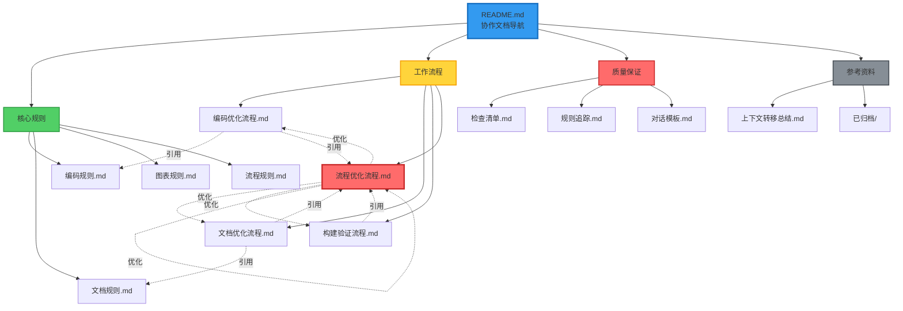
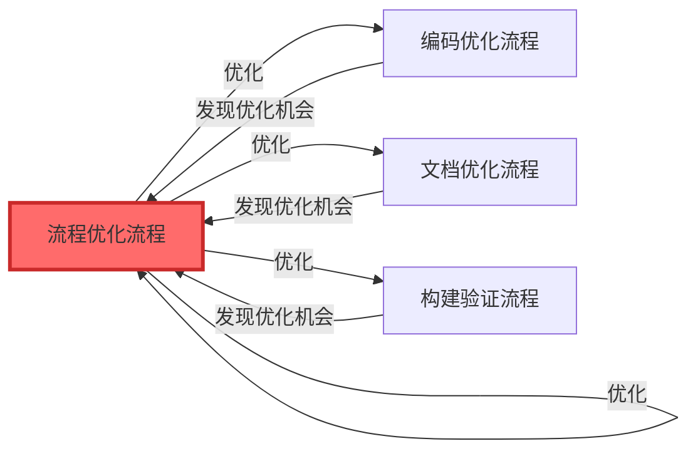
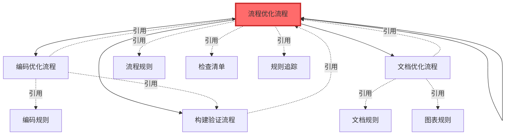

# 协作文档体系完成总结

**完成时间**: 2026-01-15  
**文档版本**: v2.0  
**项目**: SpacewareConops v3.0.1

## 🎉 完成概述

已成功建立完整的协作文档体系，包含**自我优化能力**的闭环流程系统。

## 📊 文档体系结构



## 🔄 自我优化闭环

### 核心机制

**流程优化流程**作为元流程，可以优化所有流程（包括它自己）：



### 优化循环

1. **执行流程** → 发现优化机会
2. **记录建议** → 评估优化价值
3. **创建方案** → 用户审批
4. **实施优化** → 验证效果
5. **更新文档** → 沉淀最佳实践
6. **回到步骤1** → 持续迭代

## 📋 完成清单

### ✅ 核心规则文档（4个）

- [x] **编码规则.md** - 代码生成和编码规范
- [x] **文档规则.md** - 文档生成和创建规范
- [x] **图表规则.md** - Mermaid 图表生成规范
- [x] **流程规则.md** - 工作流程和审批机制

### ✅ 工作流程文档（4个）

- [x] **编码优化流程.md** - 完整的编码工作流程
- [x] **文档优化流程.md** - 文档创建和维护流程
- [x] **构建验证流程.md** - Turbo 增量构建规则
- [x] **流程优化流程.md** - 迭代优化自身流程（新增）

### ✅ 质量保证文档（3个）

- [x] **检查清单.md** - 对话前、中、后的检查项
- [x] **规则追踪.md** - 规则遵循状态追踪
- [x] **对话模板.md** - 标准化对话流程模板

### ✅ 参考资料（2个）

- [x] **上下文转移总结.md** - 历史工作总结
- [x] **已归档/** - 旧版文档归档（16个文档）

### ✅ 导航文档（3个）

- [x] **README.md** - 协作文档导航
- [x] **文档整理总结-2026-01-15.md** - 整理工作总结
- [x] **协作文档体系完成总结-2026-01-15.md** - 本文档

## 🔗 文档引用关系

### 流程优化流程的引用

**被引用**（其他流程引用它）:

- ✅ 编码优化流程.md → 第11步引用流程优化流程
- ✅ 文档优化流程.md → 相关文档中引用
- ✅ 构建验证流程.md → 相关文档中引用（待添加）

**引用其他**（它引用的文档）:

- ✅ 流程规则.md - 核心规则
- ✅ 编码优化流程.md - 可优化对象
- ✅ 文档优化流程.md - 可优化对象
- ✅ 构建验证流程.md - 可优化对象
- ✅ 流程优化流程.md - 自我引用
- ✅ 检查清单.md - 质量保证
- ✅ 规则追踪.md - 质量保证

### 相互引用网络



## 💡 核心特性

### 1. 职能分类清晰

```
核心规则/     → 定义"做什么"和"怎么做"
工作流程/     → 描述"具体步骤"
质量保证/     → 提供"检查和追踪"
参考资料/     → 存放"历史和归档"
```

### 2. 自我优化能力

**流程优化流程**提供了13步完整的优化流程：

1. 识别优化机会
2. 记录优化建议
3. 评估优化价值
4. 优先级判断（P0/P1/P2）
5. 创建优化方案
6. 用户审批（如需要）
7. 实施优化
8. 更新相关文档
9. 验证优化效果
10. 效果评估
11. 发布优化
12. 总结经验
13. 更新最佳实践

### 3. 完整的文档导航

**README.md** 提供：

- 📚 文档结构说明
- 🎯 快速导航表格
- 🚀 快速开始指南
- 📋 核心原则速览
- 📊 文档关系图
- 🎓 学习路径（3条路径）
- 📞 常见问题解答

### 4. 统一的命名规范

- ✅ 所有文档使用中文命名
- ✅ 目录名称清晰明确
- ✅ 文件名包含日期（如需要）
- ✅ 命名风格统一

### 5. 完善的引用关系

- ✅ 核心规则 ← 工作流程
- ✅ 工作流程 ← 质量保证
- ✅ 流程优化流程 ↔ 所有流程
- ✅ 所有文档都有"相关文档"章节

## 📈 使用指南

### 新成员入门

**快速上手（30分钟）**:

1. 阅读 `README.md`（5分钟）
2. 阅读 `核心规则/流程规则.md`（10分钟）
3. 阅读 `质量保证/检查清单.md`（5分钟）
4. 浏览 `核心规则/编码规则.md`（10分钟）

**深入学习（2小时）**:

1. 完成快速上手
2. 详细阅读所有核心规则文档（1小时）
3. 详细阅读工作流程文档（30分钟）
4. 实践：使用模板完成一次标准对话（30分钟）

### AI 助手使用

**每次对话开始前**:

1. ✅ 阅读 `核心规则/流程规则.md`
2. ✅ 使用 `质量保证/检查清单.md` 自检
3. ✅ 参考 `质量保证/对话模板.md`

**编码任务时**:

1. ✅ 遵循 `核心规则/编码规则.md`
2. ✅ 按照 `工作流程/编码优化流程.md` 执行
3. ✅ 使用 `工作流程/构建验证流程.md` 验证

**创建文档时**:

1. ✅ 遵循 `核心规则/文档规则.md`
2. ✅ 按照 `工作流程/文档优化流程.md` 执行
3. ✅ 使用 `核心规则/图表规则.md` 绘制流程图

**发现流程问题时**:

1. ✅ 按照 `工作流程/流程优化流程.md` 执行
2. ✅ 记录优化建议
3. ✅ 评估优化价值
4. ✅ 创建优化方案
5. ✅ 实施并验证

## 🎯 核心价值

### 1. 可查找性 ⭐⭐⭐⭐⭐

- 清晰的目录结构
- 完善的导航文档
- 统一的命名规范
- 快速定位所需文档

### 2. 可维护性 ⭐⭐⭐⭐⭐

- 职能分类明确
- 文档长度适中
- 相互引用清晰
- 易于更新和扩展

### 3. 可读性 ⭐⭐⭐⭐⭐

- 内容聚焦
- 结构清晰
- 图表丰富
- 示例完整

### 4. 完整性 ⭐⭐⭐⭐⭐

- 覆盖所有协作场景
- 包含检查清单
- 提供模板和示例
- 具备自我优化能力

### 5. 实用性 ⭐⭐⭐⭐⭐

- 可直接应用
- 提供具体步骤
- 包含决策树
- 有真实案例

## 🔄 持续改进机制

### 定期审查

**频率**:

- 每周：审查优化清单（P0/P1）
- 每月：审查所有文档，识别改进点
- 每季度：全面审查文档体系

**审查内容**:

- 文档是否需要更新
- 流程是否需要优化
- 是否有新的最佳实践
- 是否需要新增文档

### 反馈收集

**渠道**:

- 使用过程中的问题记录
- 团队成员的改进建议
- 实际案例的经验总结
- 定期的团队讨论

### 版本管理

**版本号规则**:

- 主版本号：重大结构调整（如 v1.0 → v2.0）
- 次版本号：新增重要内容（如 v2.0 → v2.1）
- 修订号：小修改和更新（如 v2.1.0 → v2.1.1）

**当前版本**: v2.0

## 📊 统计数据

### 文档数量

| 类型     | 数量   | 说明                         |
| -------- | ------ | ---------------------------- |
| 核心规则 | 4      | 编码、文档、图表、流程       |
| 工作流程 | 4      | 编码、文档、构建、流程优化   |
| 质量保证 | 3      | 检查清单、规则追踪、对话模板 |
| 参考资料 | 1      | 上下文转移总结               |
| 导航文档 | 3      | README、整理总结、完成总结   |
| 归档文档 | 16     | 旧版文档和方案文档           |
| **总计** | **31** | 包含归档                     |

### 文档规模

| 文档类型 | 平均行数 | 说明           |
| -------- | -------- | -------------- |
| 核心规则 | 400-600  | 详细的规则说明 |
| 工作流程 | 500-800  | 完整的流程步骤 |
| 质量保证 | 200-400  | 检查清单和模板 |
| 导航文档 | 300-500  | 导航和总结     |

### 图表数量

| 文档            | 图表数量 | 类型                   |
| --------------- | -------- | ---------------------- |
| 流程规则.md     | 3        | 流程图、状态图         |
| 图表规则.md     | 6        | 各类示例图表           |
| 编码优化流程.md | 2        | 流程图、决策树         |
| 文档优化流程.md | 4        | 流程图、状态图         |
| 流程优化流程.md | 5        | 流程图、状态图、时序图 |
| README.md       | 1        | 文档关系图             |
| **总计**        | **21+**  | 覆盖所有流程           |

## 🎓 最佳实践

### 1. 文档创建

- ✅ 使用统一模板
- ✅ 包含完整的章节
- ✅ 添加 Mermaid 图表
- ✅ 提供具体示例
- ✅ 更新相关引用

### 2. 流程执行

- ✅ 按步骤执行
- ✅ 记录执行过程
- ✅ 等待用户审批
- ✅ 验证执行效果
- ✅ 总结经验教训

### 3. 流程优化

- ✅ 持续识别优化机会
- ✅ 评估优化价值
- ✅ 创建优化方案
- ✅ 实施并验证
- ✅ 更新文档和最佳实践

### 4. 文档维护

- ✅ 定期审查更新
- ✅ 收集使用反馈
- ✅ 及时修正错误
- ✅ 补充缺失内容
- ✅ 优化文档结构

## 🚀 下一步计划

### 短期（1周内）

- [ ] 团队成员熟悉新文档结构
- [ ] 收集初步使用反馈
- [ ] 补充缺失的示例
- [ ] 完善构建验证流程中的流程优化引用

### 中期（1个月内）

- [ ] 创建更多最佳实践文档
- [ ] 补充更多图表示例
- [ ] 创建视频教程（可选）
- [ ] 建立优化清单管理机制

### 长期（持续）

- [ ] 定期审查和更新文档
- [ ] 持续收集和应用反馈
- [ ] 建立文档版本管理
- [ ] 考虑创建更多专门文档

## 📚 参考资料

- [Documentation Best Practices 2025](https://www.meistertask.com/blog/project-documentation-best-practices-12-essential-strategies-for-2025)
- [Software Engineering Best Practices](https://meetzest.com/blog/software-engineering-best-practices)
- [Code Review Workflow Optimization](https://www.propelcode.ai/learn/code-review-workflow-optimization)
- [Documentation Workflow Optimization](https://www.docsie.io/blog/glossary/documentation-workflow/)
- [Mermaid 官方文档](https://mermaid.js.org/)

## ✅ 验证清单

### 文档完整性

- [x] 所有核心规则文档已创建
- [x] 所有工作流程文档已创建
- [x] 所有质量保证文档已创建
- [x] 导航文档已创建
- [x] 流程优化流程已创建
- [x] 文档间引用已建立

### 功能完整性

- [x] 具备自我优化能力
- [x] 包含完整的检查清单
- [x] 提供标准化模板
- [x] 包含丰富的图表
- [x] 提供真实案例

### 可用性

- [x] 文档易于查找
- [x] 内容易于理解
- [x] 流程易于执行
- [x] 模板易于使用
- [x] 引用关系清晰

## 🎉 总结

已成功建立完整的协作文档体系，核心特点：

1. **职能分类清晰** - 4个子目录，职责明确
2. **自我优化能力** - 流程优化流程可优化所有流程
3. **完善的导航** - README.md 提供快速导航
4. **丰富的图表** - 21+ 个 Mermaid 图表
5. **相互引用网络** - 文档间形成完整的引用关系
6. **持续改进机制** - 定期审查和反馈收集

这个文档体系不仅是静态的规则集合，更是一个**具有自我进化能力的活体系统**！

---

**文档状态**: ✅ 已完成  
**验证状态**: ✅ 已验证  
**发布状态**: ✅ 已发布

**维护者**: 开发团队  
**创建时间**: 2026-01-15  
**最后更新**: 2026-01-15  
**下次审查**: 2026-02-15
P
