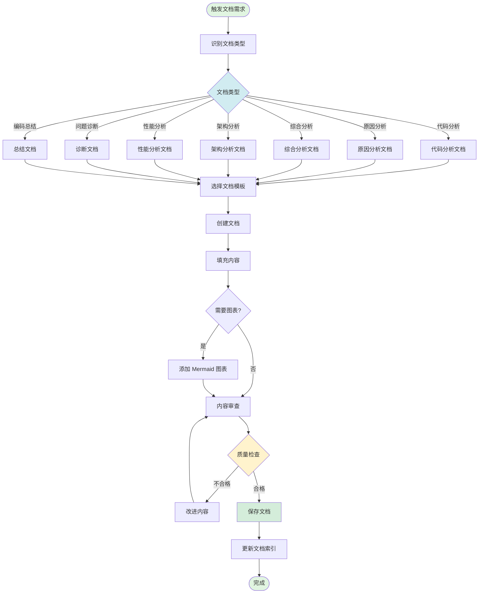
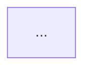
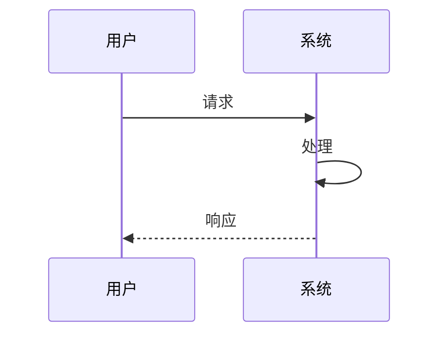
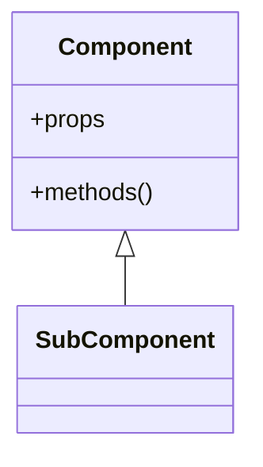
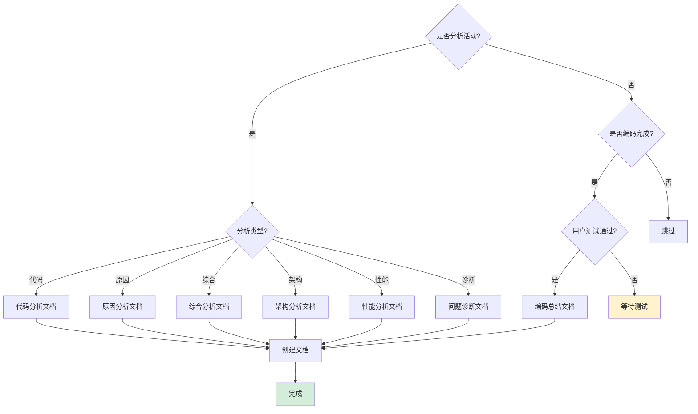
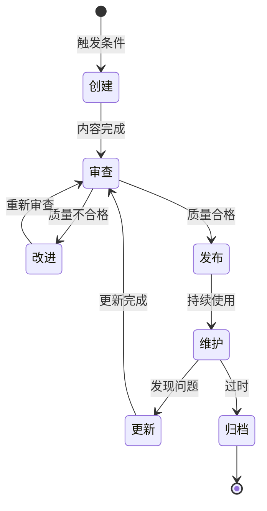

# 文档优化流程规则

## 📋 文档信息

- **文档版本**: v1.0
- **创建时间**: 2026-01-15
- **适用项目**: SpacewareConops v3.0.1
- **参考标准**: [Documentation Workflow Best Practices 2025](https://www.meistertask.com/blog/project-documentation-best-practices-12-essential-strategies-for-2025)

## 🎯 核心原则

1. **自动输出**: 分析活动自动创建对应文档
2. **简洁高效**: 只写必要内容，避免冗余
3. **结构清晰**: 统一模板，易于查找
4. **持续更新**: 边解决边优化，保持文档时效性

## 🔄 完整流程



## 📚 文档类型与模板

### 1. 代码分析文档

**触发条件**: 进行代码调研、代码审查时

**模板结构**:

````markdown
# 代码分析-模块名称-日期

## 📋 分析概述

- 分析目标
- 分析范围
- 分析时间

## 🔍 代码结构

- 文件组织
- 模块划分
- 依赖关系

## 📊 架构图


````

## 💡 关键发现

- 优点
- 问题
- 改进建议

## 📝 结论

````

**存放位置**: `doc/analysis/`

### 2. 原因分析文档

**触发条件**: 分析问题根本原因时

**模板结构**:
```markdown
# 原因分析-问题名称-日期

## 🐛 问题描述
## 🔍 现象分析
## 🎯 根本原因
## 📊 因果关系图
```mermaid
flowchart TD
    ...
````

## 💡 解决方向

## 📝 结论

````

**存放位置**: `doc/analysis/`

### 3. 综合分析文档

**触发条件**: 进行多维度综合分析时

**模板结构**:
```markdown
# 综合分析-主题-日期

## 📋 分析背景
## 🔍 多维度分析
### 技术维度
### 业务维度
### 性能维度
## 📊 关系图
```mermaid
graph LR
    ...
````

## 💡 综合结论

## 📝 行动建议

````

**存放位置**: `doc/analysis/`

### 4. 架构分析文档

**触发条件**: 分析系统架构时

**模板结构**:
```markdown
# 架构分析-模块名称-日期

## 📋 架构概述
## 🏗️ 架构图
```mermaid
graph TB
    ...
````

## 🔄 数据流图

```mermaid
sequenceDiagram
    ...
```

## 💡 架构评估

## 📝 优化建议

````

**存放位置**: `doc/architecture/`

### 5. 性能分析文档

**触发条件**: 分析性能问题时

**模板结构**:
```markdown
# 性能分析-功能名称-日期

## 📋 性能概述
## 📊 性能指标
## 🔍 瓶颈分析
## 📈 性能趋势图
```mermaid
graph LR
    ...
````

## 💡 优化方案

## 📝 预期效果

````

**存放位置**: `doc/optimization/`

### 6. 问题诊断文档

**触发条件**: 诊断具体问题时

**模板结构**:
```markdown
# 问题诊断-问题名称-日期

## 🐛 问题描述
## 🔍 诊断过程
## 📊 诊断流程图
```mermaid
flowchart TD
    ...
````

## 🎯 诊断结论

## 💡 解决方案

## 📝 验证计划

````

**存放位置**: `doc/fixes/`

### 7. 编码总结文档

**触发条件**: 编码任务完成且用户测试通过后

**模板结构**:
```markdown
# 编码总结-任务名称-日期

## 📝 修改概述
## 📂 文件清单
## 📊 架构图
```mermaid
graph TD
    ...
````

## 🔄 数据流图

```mermaid
sequenceDiagram
    ...
```

## ✅ 构建验证结果

## 📈 影响范围分析

## 💡 后续建议

```

**存放位置**:
- `doc/features/` - 功能开发
- `doc/fixes/` - 问题修复
- `doc/optimization/` - 性能优化

## 📁 文档组织结构

```

doc/
├── analysis/ # 分析文档
│ ├── 代码分析-_.md
│ ├── 原因分析-_.md
│ └── 综合分析-_.md
├── architecture/ # 架构文档
│ ├── 架构分析-_.md
│ └── 编码总结-_.md
├── features/ # 功能开发文档
│ └── 编码总结-_.md
├── fixes/ # 问题修复文档
│ ├── 问题诊断-_.md
│ └── 编码总结-_.md
├── optimization/ # 性能优化文档
│ ├── 性能分析-_.md
│ └── 编码总结-_.md
└── collaboration/ # 协作规则文档
├── 编码优化流程规则.md
├── 文档优化流程规则.md
└── ...

````

## ✅ 文档质量检查清单

### 内容完整性
- ✅ 标题清晰（包含日期）
- ✅ 目标明确
- ✅ 分析过程完整
- ✅ 结论清晰
- ✅ 行动建议具体

### 结构规范性
- ✅ 使用统一模板
- ✅ 章节层次清晰
- ✅ 格式一致
- ✅ 代码块正确标注

### 图表质量
- ✅ Mermaid 语法正确
- ✅ 图表清晰易懂
- ✅ 节点命名规范
- ✅ 关系表达准确

### 可读性
- ✅ 语言简洁
- ✅ 逻辑清晰
- ✅ 避免冗余
- ✅ 重点突出

## 🎨 Mermaid 图表规范

### 架构图（graph）

```mermaid
graph TD
    A[组件A] -->|调用| B[组件B]
    B -->|返回| A

    style A fill:#e1f5e1
    style B fill:#d1ecf1
````

**使用场景**: 展示组件关系、模块结构

### 流程图（flowchart）

```mermaid
flowchart TD
    Start([开始]) --> Process[处理]
    Process --> Decision{判断}
    Decision -->|是| End([结束])
    Decision -->|否| Process

    style Start fill:#e1f5e1
    style End fill:#e1f5e1
    style Decision fill:#fff3cd
```

**使用场景**: 展示业务流程、决策逻辑

### 时序图（sequenceDiagram）



**使用场景**: 展示交互流程、数据流

### 类图（classDiagram）



**使用场景**: 展示类结构、继承关系

## ⚡ 快速决策树



## 🚫 禁止事项

1. ❌ **过度详细**: 避免冗长的描述，保持简洁
2. ❌ **缺少图表**: 复杂关系必须用图表展示
3. ❌ **模板不一致**: 必须使用统一模板
4. ❌ **文件名混乱**: 必须包含日期和清晰描述
5. ❌ **提前输出总结**: 编码总结必须等待用户测试通过
6. ❌ **忽略更新**: 发现问题时必须更新相关文档
7. ❌ **缺少索引**: 新文档必须更新文档索引

## 📊 效率指标

| 文档类型 | 预期时间 | 必须包含          |
| -------- | -------- | ----------------- |
| 代码分析 | 10 分钟  | 架构图            |
| 原因分析 | 10 分钟  | 因果图            |
| 综合分析 | 15 分钟  | 关系图            |
| 架构分析 | 15 分钟  | 架构图 + 数据流图 |
| 性能分析 | 10 分钟  | 性能趋势图        |
| 问题诊断 | 10 分钟  | 诊断流程图        |
| 编码总结 | 15 分钟  | 架构图 + 数据流图 |

## 🔄 文档生命周期



## 🔗 相关文档

- [编码优化流程规则](./编码优化流程规则.md)
- [协作规则](./conversation-rules.md)
- [检查清单](./conversation-checklist.md)

## 📌 版本历史

- **v1.0** (2026-01-15): 初始版本，基于互联网最佳实践和项目实际情况

---

**内容来源**: 参考 [Documentation Workflow Best Practices](https://www.meistertask.com/blog/project-documentation-best-practices-12-essential-strategies-for-2025) 和 [Documentation Workflow Optimization](https://www.docsie.io/blog/glossary/documentation-workflow/) 进行改编，符合许可要求。
