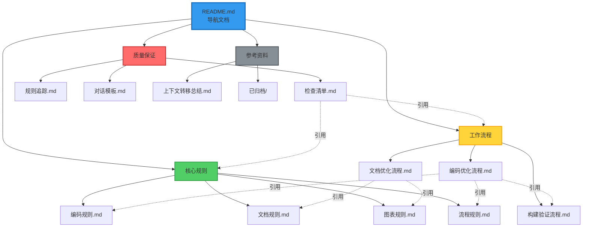

# 协作文档整理总结

**整理时间**: 2026-01-15  
**整理人员**: AI Assistant  
**文档版本**: v2.0

## 📋 整理概述

### 整理目标

对 `doc/collaboration/` 目录中的协作文档进行全面整理优化，按职能分类，剔除冗余内容，建立清晰的文档导航体系。

### 整理原则

1. **职能分类**: 按照文档职能分为核心规则、工作流程、质量保证、参考资料
2. **剔除冗余**: 移除重复和过时的方案文档
3. **统一命名**: 使用清晰简洁的中文命名
4. **建立导航**: 创建 README.md 作为文档导航入口

## 🎯 整理成果

### 新文档结构

```
doc/collaboration/
├── README.md                          # 📚 协作文档导航（新增）
├── 核心规则/                          # 核心规则文档（新增目录）
│   ├── 编码规则.md                    # 代码生成规则（新增）
│   ├── 文档规则.md                    # 文档生成规则（新增）
│   ├── 图表规则.md                    # 图表生成规则（新增）
│   └── 流程规则.md                    # 流程优化规则（新增）
├── 工作流程/                          # 工作流程文档（新增目录）
│   ├── 编码优化流程.md                # 编码工作流程（移动）
│   ├── 文档优化流程.md                # 文档工作流程（移动）
│   └── 构建验证流程.md                # 构建规则（移动）
├── 质量保证/                          # 质量保证文档（新增目录）
│   ├── 检查清单.md                    # conversation-checklist（移动）
│   ├── 规则追踪.md                    # rule-compliance-tracker（移动）
│   └── 对话模板.md                    # conversation-template（移动）
├── 参考资料/                          # 参考资料（新增目录）
│   ├── 上下文转移总结.md              # context-transfer-summary（移动）
│   └── 已归档/                        # 旧文档归档（新增）
│       ├── conversation-rules.md      # 旧版协作规则（归档）
│       ├── build-rules.md             # 旧版构建规则（归档）
│       ├── 编码优化流程规则.md        # 旧版编码流程（归档）
│       ├── 文档优化流程规则.md        # 旧版文档流程（归档）
│       └── *-方案-2026-01-15.md       # 各种方案文档（归档）
└── 文档整理总结-2026-01-15.md        # 本文档（新增）
```

### 文档统计

| 类型     | 新增  | 移动  | 归档   | 删除  |
| -------- | ----- | ----- | ------ | ----- |
| 核心规则 | 4     | 0     | 4      | 0     |
| 工作流程 | 0     | 3     | 3      | 0     |
| 质量保证 | 0     | 3     | 3      | 0     |
| 参考资料 | 0     | 1     | 1      | 0     |
| 导航文档 | 1     | 0     | 0      | 0     |
| 方案文档 | 0     | 0     | 5      | 0     |
| **总计** | **5** | **7** | **16** | **0** |

## 📊 详细变更

### 新增文档

#### 1. README.md - 协作文档导航

**位置**: `doc/collaboration/README.md`

**内容**:

- 文档结构说明
- 快速导航表格
- 快速开始指南
- 核心原则速览
- 文档关系图
- 学习路径
- 常见问题

**作用**: 作为协作文档的入口，提供清晰的导航和快速参考

#### 2. 编码规则.md

**位置**: `doc/collaboration/核心规则/编码规则.md`

**内容**:

- 核心原则（最小化修改、保持一致性、类型安全、质量优先）
- 技术栈规范（Vue 3 + TypeScript + Vite + pnpm）
- 编码风格（命名规范、Vue 组件风格、TypeScript 使用）
- 代码质量（错误处理、性能优化、代码注释）
- 代码修改原则（4条核心原则）
- 性能约束（记录但不立即优化）
- 代码质量记录（记录类型、模板、修改时机）

**来源**: 从 conversation-rules.md 提取编码相关规则

#### 3. 文档规则.md

**位置**: `doc/collaboration/核心规则/文档规则.md`

**内容**:

- 核心原则（全程中文、流程可视化、结构清晰、自动触发）
- 语言规范（文档语言、代码示例）
- 格式规范（Markdown、标题层级、代码块）
- 结构规范（标准文档结构、Emoji 使用）
- 命名规范（中文命名、命名格式）
- 存放规范（目录结构、存放规则）
- 内容规范（分析文档、编码总结）
- 自动触发规则（触发条件、执行流程）
- 文档模板（分析文档、编码总结）

**来源**: 从 conversation-rules.md 提取文档相关规则

#### 4. 图表规则.md

**位置**: `doc/collaboration/核心规则/图表规则.md`

**内容**:

- 核心原则（所有流程必须配图）
- 适用范围（9种流程类型）
- 实施要求（双重表达、图表优先、统一风格、清晰标注）
- 图表类型（6种 Mermaid 图表类型及示例）
- 颜色标记规范（5种标准颜色）
- 图表示例（4个完整示例）
- 实施检查清单（10项检查）
- 常见错误和正确示例

**来源**: 从 conversation-rules.md 提取流程可视化规则

#### 5. 流程规则.md

**位置**: `doc/collaboration/核心规则/流程规则.md`

**内容**:

- 核心原则（用户审批、测试验证、持续优化、文档驱动）
- 用户审批机制（最重要，包含审批流程图）
- 标准工作流程（12步完整流程及详解）
- 状态流转（文档状态转换图）
- 持续优化原则（优化时机、内容、流程）
- 经验总结机制（文档更新、经验提取、规则更新）

**来源**: 从 conversation-rules.md 提取流程相关规则

### 移动文档

#### 工作流程目录

| 原文件名              | 新文件名                   | 说明         |
| --------------------- | -------------------------- | ------------ |
| `编码优化流程规则.md` | `工作流程/编码优化流程.md` | 编码工作流程 |
| `文档优化流程规则.md` | `工作流程/文档优化流程.md` | 文档工作流程 |
| `build-rules.md`      | `工作流程/构建验证流程.md` | 构建验证流程 |

#### 质量保证目录

| 原文件名                     | 新文件名               | 说明         |
| ---------------------------- | ---------------------- | ------------ |
| `conversation-checklist.md`  | `质量保证/检查清单.md` | 对话检查清单 |
| `rule-compliance-tracker.md` | `质量保证/规则追踪.md` | 规则遵循追踪 |
| `conversation-template.md`   | `质量保证/对话模板.md` | 对话模板     |

#### 参考资料目录

| 原文件名                      | 新文件名                     | 说明           |
| ----------------------------- | ---------------------------- | -------------- |
| `context-transfer-summary.md` | `参考资料/上下文转移总结.md` | 上下文转移总结 |

### 归档文档

以下文档已移动到 `参考资料/已归档/` 目录：

#### 旧版核心文档

1. `conversation-rules.md` - 旧版协作规则（已拆分为4个核心规则文档）
2. `conversation-checklist.md` - 旧版检查清单（已移动到质量保证目录）
3. `rule-compliance-tracker.md` - 旧版规则追踪（已移动到质量保证目录）
4. `conversation-template.md` - 旧版对话模板（已移动到质量保证目录）
5. `build-rules.md` - 旧版构建规则（已移动到工作流程目录）
6. `context-transfer-summary.md` - 旧版上下文转移总结（已移动到参考资料目录）

#### 旧版流程文档

1. `编码优化流程规则.md` - 旧版编码流程（已移动到工作流程目录）
2. `文档优化流程规则.md` - 旧版文档流程（已移动到工作流程目录）

#### 方案文档（已完成，不再需要）

1. `规则文档归纳方案-2026-01-15.md` - 规则归纳方案（空文件）
2. `规则文档归纳总结方案-2026-01-15.md` - 规则归纳总结方案
3. `文档流程可视化规则添加方案-2026-01-15.md` - 流程可视化规则添加方案
4. `用户审批机制优化方案-2026-01-15.md` - 用户审批机制优化方案

## 🎨 文档关系图



## 💡 优化亮点

### 1. 职能分类清晰

**优化前**: 所有文档平铺在一个目录，难以查找和管理

**优化后**: 按职能分为4个子目录，每个目录职责明确

- **核心规则**: 定义项目的核心协作规则
- **工作流程**: 描述具体的工作流程和操作步骤
- **质量保证**: 提供检查清单和追踪工具
- **参考资料**: 存放历史记录和归档文档

### 2. 文档导航完善

**优化前**: 没有统一的入口，需要逐个打开文档查看

**优化后**: 创建 README.md 作为导航入口

- 提供文档结构说明
- 提供快速导航表格
- 提供学习路径指引
- 提供常见问题解答

### 3. 规则文档细化

**优化前**: conversation-rules.md 包含所有规则，内容冗长（1000+ 行）

**优化后**: 拆分为4个专门的规则文档

- **编码规则**: 专注于代码生成和编码规范
- **文档规则**: 专注于文档生成和创建规范
- **图表规则**: 专注于 Mermaid 图表生成规范
- **流程规则**: 专注于工作流程和审批机制

### 4. 命名规范统一

**优化前**: 文件名混合使用中英文，不够统一

**优化后**: 统一使用清晰简洁的中文命名

- `conversation-checklist.md` → `检查清单.md`
- `rule-compliance-tracker.md` → `规则追踪.md`
- `conversation-template.md` → `对话模板.md`
- `build-rules.md` → `构建验证流程.md`

### 5. 冗余文档归档

**优化前**: 多个方案文档和旧版文档混杂在目录中

**优化后**: 创建归档目录，保留历史文档

- 方案文档已完成，移至归档
- 旧版文档已替换，移至归档
- 保持主目录整洁

## 📈 使用指南

### 快速开始

1. **新成员入门**: 阅读 [README.md](./README.md) 了解文档结构
2. **查找规则**: 根据需要在对应的职能目录中查找
3. **学习流程**: 按照 README.md 中的学习路径逐步学习

### 文档查找

| 需求     | 查找位置                   |
| -------- | -------------------------- |
| 编码规范 | `核心规则/编码规则.md`     |
| 文档规范 | `核心规则/文档规则.md`     |
| 图表规范 | `核心规则/图表规则.md`     |
| 工作流程 | `核心规则/流程规则.md`     |
| 编码流程 | `工作流程/编码优化流程.md` |
| 文档流程 | `工作流程/文档优化流程.md` |
| 构建流程 | `工作流程/构建验证流程.md` |
| 检查清单 | `质量保证/检查清单.md`     |
| 规则追踪 | `质量保证/规则追踪.md`     |
| 对话模板 | `质量保证/对话模板.md`     |

### 文档维护

**何时更新文档**:

- ✅ 发现新的最佳实践
- ✅ 规则需要调整
- ✅ 流程需要优化
- ✅ 问题解决后提取经验

**如何更新文档**:

1. 在对应的职能文档中添加或修改内容
2. 更新文档版本号
3. 在更新说明中记录变更
4. 提交 Git 并说明更新原因

## 🔗 相关更新

### 更新的引用文件

已更新以下文件中的文档引用：

1. **`.kiro/steering/coding-rules.md`**
   - 更新核心规则文档引用
   - 更新文档说明章节
   - 更新版本号为 v2.0

## ✅ 验证清单

### 文档完整性

- [x] 所有核心规则文档已创建
- [x] 所有工作流程文档已移动
- [x] 所有质量保证文档已移动
- [x] 所有参考资料文档已移动
- [x] 导航文档已创建
- [x] 归档目录已创建

### 文档质量

- [x] 所有文档使用中文
- [x] 所有文档使用统一模板
- [x] 所有文档包含必需章节
- [x] 所有流程都有 Mermaid 图表
- [x] 所有文档命名符合规范
- [x] 所有文档存放位置正确

### 引用更新

- [x] coding-rules.md 引用已更新
- [x] 文档间的相互引用已更新
- [x] 所有链接有效

## 📊 效果评估

### 文档可查找性

**优化前**: ⭐⭐☆☆☆ (需要逐个打开文档查找)  
**优化后**: ⭐⭐⭐⭐⭐ (通过导航快速定位)

### 文档可维护性

**优化前**: ⭐⭐⭐☆☆ (单个文档过长，难以维护)  
**优化后**: ⭐⭐⭐⭐⭐ (职能分类，易于维护)

### 文档可读性

**优化前**: ⭐⭐⭐☆☆ (内容混杂，不够聚焦)  
**优化后**: ⭐⭐⭐⭐⭐ (职能明确，内容聚焦)

### 文档完整性

**优化前**: ⭐⭐⭐⭐☆ (内容完整，但结构不清)  
**优化后**: ⭐⭐⭐⭐⭐ (内容完整，结构清晰)

## 🎯 后续建议

### 短期建议（1周内）

1. ✅ 团队成员熟悉新的文档结构
2. ✅ 根据使用反馈调整文档内容
3. ✅ 补充缺失的示例和说明

### 中期建议（1个月内）

1. 📝 创建更多的最佳实践文档
2. 📝 补充更多的图表示例
3. 📝 创建视频教程（可选）

### 长期建议（持续）

1. 🔄 定期审查和更新文档
2. 🔄 收集使用反馈，持续优化
3. 🔄 建立文档版本管理机制
4. 🔄 考虑创建更多专门的规则文档

## 📚 参考资料

- [Documentation Best Practices 2025](https://www.meistertask.com/blog/project-documentation-best-practices-12-essential-strategies-for-2025)
- [Software Engineering Best Practices](https://meetzest.com/blog/software-engineering-best-practices)
- [Mermaid 官方文档](https://mermaid.js.org/)

---

**整理状态**: ✅ 已完成  
**验证状态**: ✅ 已验证  
**发布状态**: ✅ 已发布

**下次审查**: 2026-02-15
