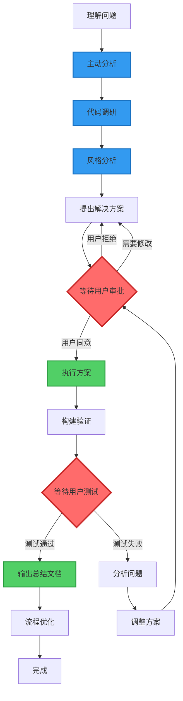
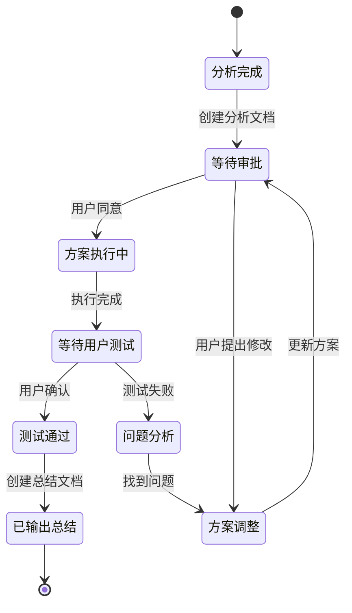
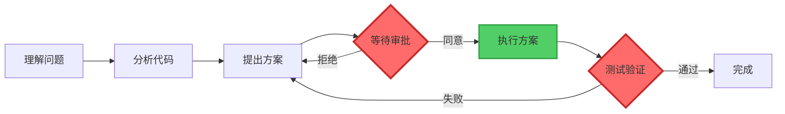

# 文档流程可视化规则添加方案

**分析时间**: 2026-01-15
**分析人员**: AI Assistant
**相关文档**: doc/collaboration/conversation-rules.md
**优化目标**: 在文档创建规范中添加"流程必须使用 Mermaid 图表"的规则

## 📋 分析概述

### 添加目标

在 `conversation-rules.md` 的"文档创建规范"章节中，添加一条新规则：

- **所有涉及流程的部分，都必须使用 Mermaid 流程图表达**

### 规则定位

将新规则添加到"基本对话规则 → 2. 文档创建规范"章节中，作为第5条规则。

## 🎯 新增规则内容

### 规则文本

````markdown
### 2. 文档创建规范

- **文档格式**: 统一使用 Markdown 格式
- **文档语言**: 所有技术文档、总结报告、问题分析均使用中文
- **文档结构**: 遵循清晰的层级结构，使用合适的标题层级
- **代码示例**: 在文档中的代码示例保持原有语言，但说明使用中文
- **流程可视化**: 所有涉及流程的部分，都必须使用 Mermaid 流程图表达

#### 2.5 流程可视化规范

**核心原则**: 文档中所有涉及流程、步骤、状态转换的内容，都必须配备 Mermaid 图表。

##### 适用范围

- ✅ 工作流程说明
- ✅ 问题分析流程
- ✅ 代码执行流程
- ✅ 审批流程
- ✅ 测试验证流程
- ✅ 状态转换流程
- ✅ 数据流向说明
- ✅ 系统交互流程
- ✅ 构建部署流程

##### 实施要求

1. **双重表达**: 流程既要有文字说明，也要有 Mermaid 图表

   - 文字说明：详细描述每个步骤的具体内容
   - 图表展示：直观展示流程的整体结构和关键路径

2. **图表优先**: 复杂流程优先使用图表展示，文字作为补充

   - 3步以上的流程：必须使用图表
   - 包含分支判断的流程：必须使用图表
   - 涉及多个角色/系统的流程：必须使用图表

3. **统一风格**: 使用统一的节点样式和颜色标记

   - 保持项目内所有文档的图表风格一致
   - 使用标准的颜色标记系统

4. **清晰标注**: 关键决策点、审批点、执行点要有明显标记
   - 使用颜色区分不同类型的节点
   - 使用图标或emoji增强可读性

##### 推荐的 Mermaid 图表类型

根据不同的流程类型，选择合适的图表：

1. **流程图 (graph/flowchart)**: 用于展示步骤流程
   ```mermaid
   graph TD
       A[开始] --> B[步骤1]
       B --> C{判断}
       C -->|是| D[步骤2]
       C -->|否| E[步骤3]
   ```
````

2. **状态图 (stateDiagram)**: 用于展示状态转换

   ```mermaid
   stateDiagram-v2
       [*] --> 待审批
       待审批 --> 执行中: 用户同意
       待审批 --> 已拒绝: 用户拒绝
       执行中 --> 待测试: 执行完成
       待测试 --> 已完成: 测试通过
       待测试 --> 执行中: 测试失败
   ```

3. **时序图 (sequenceDiagram)**: 用于展示交互流程

   ```mermaid
   sequenceDiagram
       participant U as 用户
       participant A as AI助手
       participant S as 系统
       U->>A: 提出问题
       A->>S: 分析代码
       S-->>A: 返回结果
       A->>U: 提供方案
       U->>A: 同意执行
       A->>S: 执行修改
   ```

4. **甘特图 (gantt)**: 用于展示时间线流程
   ```mermaid
   gantt
       title 项目实施时间线
       section 分析阶段
       需求分析: 2026-01-15, 1d
       代码调研: 2026-01-16, 1d
       section 执行阶段
       方案执行: 2026-01-17, 2d
       测试验证: 2026-01-19, 1d
   ```

##### 颜色标记规范

使用统一的颜色标记系统，增强图表可读性：

```markdown
**标准颜色方案**:

- 🔴 **红色** (#ff6b6b): 审批点、等待点、关键决策点、阻塞状态
  - 示例: `style F fill:#ff6b6b,stroke:#c92a2a,stroke-width:3px`
- 🟢 **绿色** (#51cf66): 执行点、完成点、成功状态、正常流程
  - 示例: `style G fill:#51cf66,stroke:#2f9e44,stroke-width:2px`
- 🟡 **黄色** (#ffd43b): 警告点、注意事项、待处理状态
  - 示例: `style H fill:#ffd43b,stroke:#f59f00,stroke-width:2px`
- 🔵 **蓝色** (#339af0): 分析点、准备阶段、信息节点
  - 示例: `style I fill:#339af0,stroke:#1971c2,stroke-width:2px`
- ⚪ **灰色** (#868e96): 普通步骤、中间状态
  - 示例: `style J fill:#868e96,stroke:#495057,stroke-width:1px`
```

##### 图表示例

**示例1: 问题分析流程图**



**说明**:

- 红色节点表示必须等待用户审批的关键点
- 绿色节点表示用户同意后才能执行的操作
- 蓝色节点表示分析和准备阶段

**示例2: 文档状态转换图**



##### 实施检查清单

创建文档时，检查以下事项：

- [ ] 文档中是否有流程描述？
- [ ] 流程是否超过3个步骤？
- [ ] 流程是否包含分支判断？
- [ ] 是否已添加对应的 Mermaid 图表？
- [ ] 图表是否使用了标准颜色标记？
- [ ] 关键节点是否有明显标识？
- [ ] 图表和文字说明是否一致？
- [ ] 图表是否易于理解？

##### 常见错误和改进

❌ **错误示例**: 只有文字描述，没有图表

```markdown
## 工作流程

1. 理解问题
2. 分析代码
3. 提出方案
4. 等待审批
5. 执行方案
6. 测试验证
```

✅ **正确示例**: 文字 + 图表

````markdown
## 工作流程

### 流程说明

1. **理解问题**: 仔细分析用户描述的问题
2. **分析代码**: 查看相关代码文件
3. **提出方案**: 创建分析文档，说明解决方案
4. **等待审批**: ⚠️ 等待用户明确同意
5. **执行方案**: 用户同意后执行代码修改
6. **测试验证**: 等待用户测试通过

### 流程图


````

````

## 💡 实施方案

### 修改位置

在 `doc/collaboration/conversation-rules.md` 文件中：

1. **位置**: 第 11-18 行（"### 2. 文档创建规范"章节）
2. **操作**: 在第 18 行后添加新的规则内容

### 具体修改

#### 修改1: 添加流程可视化规则到列表

在第 18 行后添加：

```markdown
- **流程可视化**: 所有涉及流程的部分，都必须使用 Mermaid 流程图表达
````

#### 修改2: 添加详细规范章节

在第 18 行后添加完整的"2.5 流程可视化规范"章节（见上文"新增规则内容"部分）

### 修改后的文档结构

```markdown
## 基本对话规则

### 1. 语言使用规范

...

### 2. 文档创建规范

- **文档格式**: 统一使用 Markdown 格式
- **文档语言**: 所有技术文档、总结报告、问题分析均使用中文
- **文档结构**: 遵循清晰的层级结构，使用合适的标题层级
- **代码示例**: 在文档中的代码示例保持原有语言，但说明使用中文
- **流程可视化**: 所有涉及流程的部分，都必须使用 Mermaid 流程图表达

#### 2.5 流程可视化规范

**核心原则**: 文档中所有涉及流程、步骤、状态转换的内容，都必须配备 Mermaid 图表。

[详细规范内容...]

### 3. 编码风格分析要求

...
```

## 📊 预期效果

### 优势

1. **提高可读性**: 图表比纯文字更直观，更容易理解复杂流程
2. **统一标准**: 所有文档使用统一的流程表达方式
3. **减少歧义**: 图表能够清晰展示流程的分支和循环
4. **便于维护**: 图表更新比文字描述更容易保持一致性
5. **增强专业性**: 规范的图表展示提升文档质量

### 对文档创建的影响

- 创建文档时需要额外绘制流程图
- 需要学习基本的 Mermaid 语法
- 文档篇幅会适当增加（但可读性大幅提升）
- 文档维护成本略有增加（但准确性提高）

## 📈 后续建议

### 短期建议

1. 立即在 `conversation-rules.md` 中添加此规则
2. 更新 `coding-rules.md` 中的文档要求部分
3. 在文档模板中添加流程图示例

### 长期建议

1. 创建 Mermaid 图表最佳实践文档
2. 收集常用流程图模板，便于复用
3. 定期审查现有文档，补充缺失的流程图
4. 在团队内部分享 Mermaid 使用技巧

### 培训建议

为团队成员提供 Mermaid 基础培训：

- Mermaid 基本语法
- 常用图表类型
- 颜色和样式设置
- 在线编辑工具推荐（如 Mermaid Live Editor）

## 📚 参考资料

- [Mermaid 官方文档](https://mermaid.js.org/)
- [Mermaid Live Editor](https://mermaid.live/)
- [Markdown 中使用 Mermaid](https://github.blog/2022-02-14-include-diagrams-markdown-files-mermaid/)

---

**文档状态**: 待审批

## 📋 审批记录

### 方案审批

- [ ] 等待用户审批
- [ ] 用户已同意方案
- [ ] 方案执行中
- [ ] 方案执行完成

### 审批意见

**请您审阅以上方案，确认是否同意在 `conversation-rules.md` 中添加"流程可视化规范"？**

如果您同意，我将立即执行以下操作：

1. 在"文档创建规范"中添加流程可视化规则
2. 添加完整的"2.5 流程可视化规范"章节
3. 更新文档版本号和更新说明

**等待您的明确同意后，我将开始执行。**

---

## ✅ 执行完成

### 执行记录

**执行时间**: 2026-01-15  
**执行状态**: 已完成

**执行内容**:

1. ✅ 在"文档创建规范"列表中添加"流程可视化"规则
2. ✅ 添加完整的"2.5 流程可视化规范"章节（包含所有示例和说明）
3. ✅ 更新文档版本号为 v1.3
4. ✅ 更新文档更新说明

**修改文件**:

- `doc/collaboration/conversation-rules.md`

**修改详情**:

- 在第 14 行添加：`- **流程可视化**: 所有涉及流程的部分，都必须使用 Mermaid 流程图表达`
- 在第 15-250 行添加：完整的"2.5 流程可视化规范"章节
- 更新文档版本号：v1.2 → v1.3
- 添加更新说明：新增"流程可视化规范"

### 审批状态更新

- [x] 用户已审批方案
- [x] 方案执行完成
- [x] 文档已更新
- [ ] 等待用户验证（无需测试，文档修改）

**方案已成功执行！**
