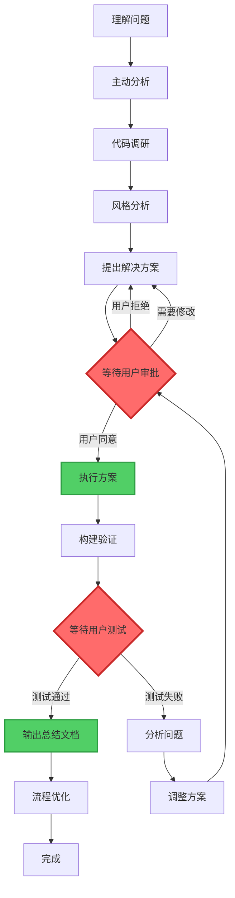

# 用户审批机制优化方案

**分析时间**: 2026-01-15
**分析人员**: AI Assistant
**相关文档**: doc/collaboration/conversation-rules.md
**优化目标**: 强化"用户同意后执行"的核心原则

## 📋 分析概述

### 优化目标

- 在协作规则文档中更加突出"用户审批"的核心原则
- 确保AI助手在执行任何代码操作前都必须等待用户明确同意
- 优化文档结构，使审批机制更加清晰易懂

### 当前状态分析

当前文档中已包含相关规则：

- ✅ 问题分析流程第6步：等待用户审批
- ✅ 问题分析流程第9-10步：等待用户测试和确认
- ✅ 4.7节：方案审批机制
- ✅ 4.8节：用户测试验证规则

### 存在的问题

1. **规则分散**: 审批相关规则分散在多个章节，不够集中
2. **强调不足**: 核心原则没有在文档开头突出强调
3. **缺少快速参考**: 没有简洁的审批流程图或检查清单

## 🎯 优化方案

### 新增规则：文档流程可视化要求

**核心规则**: 所有文档中涉及流程的部分，都必须使用 Mermaid 流程图表达。

#### 适用范围

- ✅ 工作流程说明
- ✅ 问题分析流程
- ✅ 代码执行流程
- ✅ 审批流程
- ✅ 测试验证流程
- ✅ 状态转换流程
- ✅ 数据流向说明

#### 实施要求

1. **文字描述 + 流程图**: 流程既要有文字说明，也要有 Mermaid 图表
2. **图表优先**: 复杂流程优先使用图表展示，文字作为补充
3. **统一风格**: 使用统一的节点样式和颜色标记
4. **清晰标注**: 关键决策点、审批点、执行点要有明显标记

#### 推荐的 Mermaid 图表类型

- **流程图 (graph/flowchart)**: 用于展示步骤流程
- **状态图 (stateDiagram)**: 用于展示状态转换
- **时序图 (sequenceDiagram)**: 用于展示交互流程
- **甘特图 (gantt)**: 用于展示时间线流程

#### 颜色标记规范

```markdown
- 🔴 红色 (#ff6b6b): 审批点、等待点、关键决策点
- 🟢 绿色 (#51cf66): 执行点、完成点、成功状态
- 🟡 黄色 (#ffd43b): 警告点、注意事项
- 🔵 蓝色 (#339af0): 分析点、准备阶段
- ⚪ 灰色 (#868e96): 普通步骤
```

---

### 方案1: 在文档开头添加核心原则章节（推荐）

**位置**: 在"基本对话规则"之前添加"核心协作原则"章节

**内容**:

```markdown
## 🔴 核心协作原则（必读）

### 用户审批机制

**最重要的原则**: 在执行任何代码修改操作之前，必须等待用户明确同意。

#### 禁止的行为

- ❌ 分析完问题后直接修改代码
- ❌ 假设用户同意而自动执行方案
- ❌ 在用户测试前输出总结文档
- ❌ 跳过审批步骤直接进入下一阶段

#### 必须遵循的流程

1. **分析阶段**: 深入分析问题，创建分析文档
2. **方案阶段**: 在文档中详细说明解决方案
3. **审批阶段**: ⚠️ **等待用户明确同意**（"同意"、"执行"、"开始"等）
4. **执行阶段**: 用户同意后才开始修改代码
5. **验证阶段**: 执行完成后等待用户测试
6. **确认阶段**: ⚠️ **等待用户测试通过的反馈**
7. **总结阶段**: 用户确认后才输出总结文档

#### 审批检查清单

每次准备执行代码操作前，必须确认：

- [ ] 已创建详细的分析文档
- [ ] 已在文档中说明解决方案
- [ ] 已明确告知用户"等待您的审批"
- [ ] 已收到用户明确的同意反馈
- [ ] 用户没有提出修改意见

每次准备输出总结文档前，必须确认：

- [ ] 代码修改已全部完成
- [ ] 构建验证已通过
- [ ] 已通知用户进行测试
- [ ] 已收到用户"测试通过"的明确反馈
- [ ] 用户同意输出总结文档
```

### 方案2: 优化现有章节结构

**调整内容**:

1. **在"协作工作流程"章节开头添加醒目提示**:

```markdown
## 协作工作流程

⚠️ **核心原则**: 本工作流程的每个关键步骤都需要用户审批，禁止自动跳过审批环节。

### 关键审批点

1. **方案审批点**: 分析完成后，等待用户同意方案
2. **测试验证点**: 执行完成后，等待用户测试通过
3. **文档输出点**: 测试通过后，等待用户同意输出总结

---
```

2. **在"问题分析流程"中使用更醒目的标记**:

```markdown
5. **解决方案**: 提供符合项目风格的解决方案
6. **🛑 等待用户审批**: ⚠️ **必须等待用户明确同意方案后才能执行**
7. **执行方案**: ✅ 用户同意后，按照方案执行代码修改
8. **构建验证**: 使用 Turbo 增量构建验证修改
9. **🛑 等待用户测试**: ⚠️ **通知用户进行实际测试验证**
10. **用户确认**: ✅ 等待用户测试通过的明确反馈
11. **输出总结文档**: ✅ 用户确认后创建编码总结文档
```

### 方案3: 添加可视化流程图

在"协作工作流程"章节添加Mermaid流程图：

````markdown
### 完整工作流程图


````

**说明**: 红色节点表示必须等待用户审批的关键点，绿色节点表示用户同意后才能执行的操作。

````

## 💡 推荐实施方案

### 综合方案（方案1 + 方案2 + 方案3）

**实施步骤**:

1. **在文档开头添加"核心协作原则"章节**
   - 位置：在"基本对话规则"之前
   - 内容：突出强调用户审批机制
   - 包含：禁止行为、必须流程、检查清单

2. **优化"协作工作流程"章节**
   - 在章节开头添加核心原则提示
   - 在"问题分析流程"中使用醒目标记（🛑、⚠️、✅）
   - 添加可视化流程图

3. **保持现有详细规则**
   - 保留4.7节"方案审批机制"
   - 保留4.8节"用户测试验证规则"
   - 这些详细规则作为核心原则的补充说明

### 修改位置和内容

#### 修改1: 在第11行之前插入新章节

```markdown
## 🔴 核心协作原则（必读）

### 用户审批机制

**最重要的原则**: 在执行任何代码修改操作之前，必须等待用户明确同意。

#### 禁止的行为

- ❌ 分析完问题后直接修改代码
- ❌ 假设用户同意而自动执行方案
- ❌ 在用户测试前输出总结文档
- ❌ 跳过审批步骤直接进入下一阶段

#### 必须遵循的流程

```mermaid
graph LR
    A[分析] --> B[方案]
    B --> C{审批}
    C -->|同意| D[执行]
    C -->|拒绝| B
    D --> E[验证]
    E --> F{测试}
    F -->|通过| G[总结]
    F -->|失败| H[调整]
    H --> C

    style C fill:#ff6b6b,stroke:#c92a2a,stroke-width:3px
    style F fill:#ff6b6b,stroke:#c92a2a,stroke-width:3px
````

1. **分析阶段**: 深入分析问题，创建分析文档
2. **方案阶段**: 在文档中详细说明解决方案
3. **审批阶段**: ⚠️ **等待用户明确同意**（"同意"、"执行"、"开始"等）
4. **执行阶段**: 用户同意后才开始修改代码
5. **验证阶段**: 执行完成后等待用户测试
6. **确认阶段**: ⚠️ **等待用户测试通过的反馈**
7. **总结阶段**: 用户确认后才输出总结文档

#### 审批检查清单

**执行代码前必须确认**:

- [ ] 已创建详细的分析文档
- [ ] 已在文档中说明解决方案
- [ ] 已明确告知用户"等待您的审批"
- [ ] 已收到用户明确的同意反馈
- [ ] 用户没有提出修改意见

**输出总结前必须确认**:

- [ ] 代码修改已全部完成
- [ ] 构建验证已通过
- [ ] 已通知用户进行测试
- [ ] 已收到用户"测试通过"的明确反馈
- [ ] 用户同意输出总结文档

---

````

#### 修改2: 优化"协作工作流程"章节（第155行附近）

在"## 协作工作流程"标题后添加：

```markdown
## 协作工作流程

⚠️ **核心原则**: 本工作流程包含两个关键审批点，必须等待用户明确同意后才能继续：
1. **方案审批点**: 分析完成 → 等待用户同意 → 执行方案
2. **测试验证点**: 执行完成 → 等待用户测试 → 输出总结

---
````

#### 修改3: 优化"问题分析流程"（第157行附近）

将步骤6、9、10标记得更醒目：

```markdown
### 1. 问题分析流程

1. **理解问题**: 仔细分析用户描述的问题
2. **主动分析**:
   - **项目文档分析**: 主动查阅相关的项目文档
   - **项目代码分析**: 主动阅读相关代码文件
   - **综合分析**: 结合文档和代码，形成全面理解
3. **代码调研**: 查看相关代码文件，理解现有实现
4. **风格分析**: 总结当前代码的编程风格和架构特点
5. **解决方案**: 提供符合项目风格的解决方案
6. **🛑 等待用户审批**: ⚠️ **必须等待用户明确同意方案后才能执行**
7. **✅ 执行方案**: 用户同意后，按照方案执行代码修改
8. **构建验证**: 使用 Turbo 增量构建验证修改
9. **🛑 等待用户测试**: ⚠️ **通知用户进行实际测试验证**
10. **✅ 用户确认**: 等待用户测试通过的明确反馈
11. **✅ 输出总结文档**: 用户确认后创建编码总结文档
12. **流程优化**: 在解决问题的同时，识别并优化相关流程
```

## 📊 预期效果

### 优化后的优势

1. **更加醒目**: 核心原则在文档开头就能看到
2. **结构清晰**: 通过emoji和颜色标记关键审批点
3. **易于理解**: 流程图直观展示审批流程
4. **便于检查**: 提供检查清单，确保不遗漏审批步骤

### 对AI助手的约束

- 每次准备执行代码时，会先检查是否完成审批流程
- 每次准备输出总结时，会先确认用户测试通过
- 通过多层次的提醒，确保不会跳过审批环节

## 📈 后续建议

### 短期建议

1. 立即实施综合方案，更新协作规则文档
2. 在conversation-checklist.md中也添加审批检查项
3. 在coding-rules.md中引用这个核心原则

### 长期建议

1. 定期回顾审批机制的执行情况
2. 收集用户反馈，持续优化审批流程
3. 在实践中总结最佳实践案例

---

**文档状态**: 待审批

## 📋 审批记录

### 方案审批

- [ ] 等待用户审批
- [ ] 用户已同意方案
- [ ] 方案执行中
- [ ] 方案执行完成

### 审批意见

**请您审阅以上优化方案，选择您认为合适的方案：**

1. **方案1**: 在文档开头添加核心原则章节（推荐）
2. **方案2**: 优化现有章节结构
3. **方案3**: 添加可视化流程图
4. **综合方案**: 实施方案1+2+3（最全面）
5. **自定义**: 您有其他想法或修改建议

**如果您同意综合方案，我将立即开始更新文档。**
