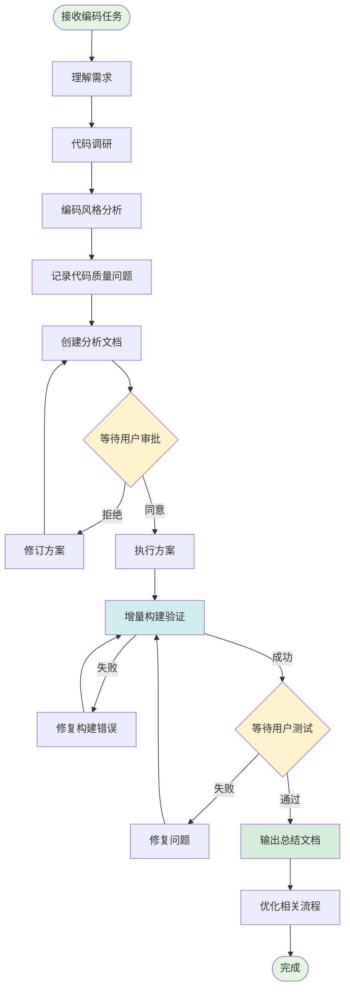
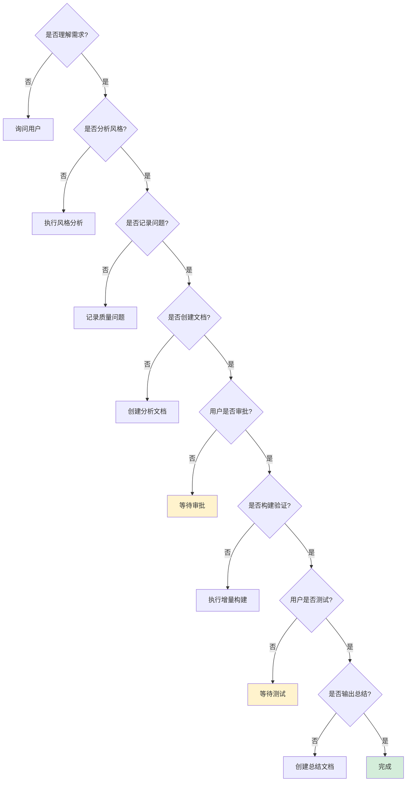

# 编码优化流程规则

## 📋 文档信息

- **文档版本**: v1.0
- **创建时间**: 2026-01-15
- **适用项目**: SpacewareConops v3.0.1
- **参考标准**: [Software Engineering Best Practices 2025](https://meetzest.com/blog/software-engineering-best-practices)

## 🎯 核心原则

1. **最小化修改**: 只改必要的代码，保持向后兼容
2. **质量优先**: 先记录问题，统一优化
3. **增量构建**: 使用 Turbo 缓存，提升构建效率
4. **用户审批**: 方案执行前必须获得用户同意

## 🔄 完整流程



## 📝 各阶段详细说明

### 1. 理解需求（5 分钟）

**目标**: 明确任务目标和范围

**检查清单**:

- ✅ 任务目标清晰
- ✅ 影响范围明确
- ✅ 技术约束了解
- ✅ 优先级确定

### 2. 代码调研（10-15 分钟）

**目标**: 全面了解相关代码

**操作步骤**:

1. 查阅项目文档（`doc/` 目录）
2. 阅读相关代码文件
3. 理解数据流和依赖关系
4. 识别潜在影响点

**输出**: 代码调研笔记（可选）

### 3. 编码风格分析（5 分钟）

**目标**: 保持代码一致性

**分析维度**:

- 命名规范（变量、函数、类）
- 代码组织结构
- 注释风格
- TypeScript 类型使用
- Vue Composition API 模式

**参考**: 项目现有代码风格

### 4. 记录代码质量问题（持续）

**目标**: 发现但不立即修复

**记录类型**:

- 🔴 类型错误
- 🟡 变量声明问题
- 🟠 逻辑缺陷
- 🟢 性能问题（标记待优化）

**原则**: 只记录，等待用户授权后统一处理

### 5. 创建分析文档（10 分钟）

**目标**: 输出完整的解决方案

**文档结构**:

```markdown
# 问题标题-日期

## 问题描述

## 原因分析

## 解决方案

## 影响范围

## 风险评估

## 实施步骤
```

**存放位置**:

- `doc/fixes/` - 问题修复
- `doc/features/` - 功能开发
- `doc/optimization/` - 性能优化

### 6. 等待用户审批（关键）

**目标**: 确保方案正确性

**审批内容**:

- 解决方案是否合理
- 影响范围是否可接受
- 实施步骤是否清晰

**结果**:

- ✅ 同意 → 执行方案
- ❌ 拒绝 → 修订方案

### 7. 执行方案（30-60 分钟）

**目标**: 实施代码修改

**执行原则**:

- 最小化修改范围
- 保持代码风格一致
- 添加必要注释
- 遵循 TypeScript 严格模式

**工具使用**:

- `strReplace` - 精确替换
- `fsWrite` - 创建新文件
- `fsAppend` - 追加内容

### 8. 增量构建验证（5-10 分钟）

**目标**: 确保代码可运行

**构建命令**:

```bash
# 推荐：增量构建（利用缓存）
pnpm build:all

# 单包构建
pnpm --filter <package-name> build

# 强制全量构建（仅在必要时）
pnpm build:all:force
```

**验证内容**:

- ✅ 构建成功
- ✅ 无 TypeScript 错误
- ✅ 无 ESLint 警告
- ✅ 依赖包正常

**失败处理**:

- 分析错误日志
- 修复构建问题
- 重新构建验证

### 9. 等待用户测试（关键）

**目标**: 确保功能正常

**测试内容**:

- 核心功能验证
- 边界情况测试
- 性能表现检查
- 兼容性确认

**结果**:

- ✅ 通过 → 输出总结文档
- ❌ 失败 → 修复问题并重新构建

### 10. 输出总结文档（15 分钟）

**目标**: 记录完整的修改过程

**文档结构**:

```markdown
# 编码总结-任务名称-日期

## 📝 修改概述

## 📂 文件清单

## 📊 架构图（Mermaid）

## 🔄 数据流图（Mermaid）

## ✅ 构建验证结果

## 📈 影响范围分析

## 💡 后续建议
```

**必须包含**:

- Mermaid 架构图
- Mermaid 数据流图
- 构建验证截图/日志

### 11. 优化相关流程（持续）

**目标**: 边解决边优化

**优化内容**:

- 更新流程文档
- 补充最佳实践
- 记录经验教训
- 改进工作流程

## ⚡ 快速决策树



## 🚫 禁止事项

1. ❌ **未经授权的性能优化**: 发现性能问题只记录，不立即优化
2. ❌ **未经审批的方案执行**: 必须等待用户明确同意
3. ❌ **跳过构建验证**: 每次修改后必须构建验证
4. ❌ **过度修改**: 避免修改无关代码
5. ❌ **破坏向后兼容**: 不能影响现有功能
6. ❌ **忽略编码风格**: 必须保持一致性
7. ❌ **提前输出总结**: 必须等待用户测试通过

## 📊 效率指标

| 阶段     | 预期时间   | 关键产出 |
| -------- | ---------- | -------- |
| 理解需求 | 5 分钟     | 任务清单 |
| 代码调研 | 10-15 分钟 | 调研笔记 |
| 风格分析 | 5 分钟     | 风格规范 |
| 创建文档 | 10 分钟    | 分析文档 |
| 执行方案 | 30-60 分钟 | 代码修改 |
| 构建验证 | 5-10 分钟  | 构建日志 |
| 输出总结 | 15 分钟    | 总结文档 |

**总计**: 约 80-120 分钟（不含等待时间）

## 🔗 相关文档

- [协作规则](./conversation-rules.md)
- [检查清单](./conversation-checklist.md)
- [构建规则](./build-rules.md)
- [规则遵循追踪](./rule-compliance-tracker.md)

## 📌 版本历史

- **v1.0** (2026-01-15): 初始版本，基于互联网最佳实践和项目实际情况

---

**内容来源**: 参考 [Software Engineering Best Practices](https://meetzest.com/blog/software-engineering-best-practices) 和 [Code Review Workflow Optimization](https://www.propelcode.ai/learn/code-review-workflow-optimization) 进行改编，符合许可要求。
