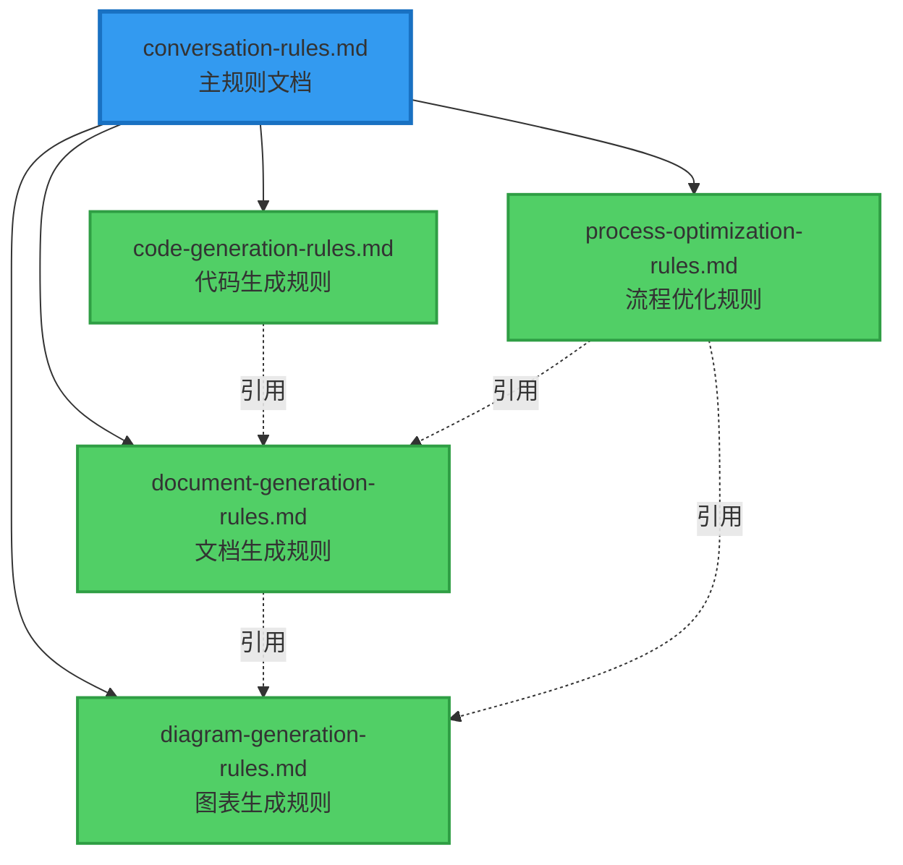

<!--
 * @Author: wangfuyuan 995333824@qq.com
 * @Date: 2026-01-15 18:45:22
 * @LastEditors: wangfuyuan 995333824@qq.com
 * @LastEditTime: 2026-01-15 18:48:07
 * @FilePath: \SpacewareConops-v3.0.1\doc\collaboration\规则文档归纳总结方案-2026-01-15.md
 * @Description: 这是默认设置,请设置`customMade`, 打开koroFileHeader查看配置 进行设置: https://github.com/OBKoro1/koro1FileHeader/wiki/%E9%85%8D%E7%BD%AE
-->

# 规则文档归纳总结方案

**分析时间**: 2026-01-15
**分析人员**: AI Assistant
**相关文档**: doc/collaboration/conversation-rules.md
**目标**: 从现有规则文档中提取四个专门的规则文档

## 📋 分析概述

### 归纳目标

从 `conversation-rules.md` 中提取并创建以下四个专门的规则文档：

1. **文档生成规则文档** (`document-generation-rules.md`)
2. **代码生成规则文档** (`code-generation-rules.md`)
3. **图表生成规则文档** (`diagram-generation-rules.md`)
4. **流程优化规则文档** (`process-optimization-rules.md`)

### 分析方法

1. 逐条分析现有规则
2. 按照功能分类归纳
3. 提取核心规则和最佳实践
4. 创建独立的专门文档

## 🔍 规则分类分析

### 1. 文档生成规则（来源分析）

从 `conversation-rules.md` 中提取以下内容：

#### 来源章节

- **1. 语言使用规范** → 文档语言要求
- **2. 文档创建规范** → 文档格式、结构、流程可视化
- **2.5 流程可视化规范** → 完整的流程图表规范
- **3. 文档输出规范** → 文档内容要求
- **4. 分析时自动输出文档规则** → 文档触发条件、命名、模板
- **4.2 文档内容要求** → 分析文档结构
- **4.3 文档命名规范** → 中文命名规则
- **4.4 文档存放位置** → 目录结构
- **4.5 文档模板** → 标准模板
- **5.1 文档目录规范** → 文档分类存放

#### 核心规则提取

1. **语言规范**: 全程使用中文
2. **格式规范**: Markdown 格式
3. **结构规范**: 清晰的层级结构
4. **流程可视化**: 必须使用 Mermaid 图表
5. **命名规范**: 中文命名，日期格式 YYYY-MM-DD
6. **存放规范**: 按类型分目录存放
7. **内容规范**: 包含分析概述、详细分析、结论、方案、建议
8. **模板规范**: 使用标准模板

### 2. 代码生成规则（来源分析）

#### 来源章节

- **1. 语言使用规范** → 代码注释、变量命名
- **3. 编码风格分析要求** → 完整的编码风格规范
- **3.1-3.5** → 项目架构、代码组织、Vue组件、TypeScript、代码质量
- **当前项目编码风格总结** → 具体的技术栈和风格
- **2. 代码修改原则** → 代码修改的核心原则
- **注意事项 1-4** → 技术决策、性能考虑、可维护性、代码质量
- **6. 构建验证** → 构建规则和验证流程

#### 核心规则提取

1. **编码风格**: Vue 3 + TypeScript + Composition API
2. **命名规范**: kebab-case, PascalCase, camelCase, UPPER_SNAKE_CASE
3. **类型安全**: 严格的 TypeScript 类型约束
4. **组件通信**: props/emit, 事件总线, Pinia
5. **代码质量**: ESLint + Prettier, 错误处理, 性能优化
6. **修改原则**: 保持一致性、最小化修改、向后兼容、质量优先
7. **构建验证**: Turbo 增量构建，修改后必须构建
8. **性能约束**: 性能问题需授权后优化

### 3. 图表生成规则（来源分析）

#### 来源章节

- **2.5 流程可视化规范** → 完整的 Mermaid 图表规范
- **适用范围** → 9种流程类型
- **实施要求** → 双重表达、图表优先、统一风格、清晰标注
- **推荐的 Mermaid 图表类型** → 4种图表类型及示例
- **颜色标记规范** → 5种标准颜色
- **图表示例** → 问题分析流程图、状态转换图
- **实施检查清单** → 8项检查事项
- **常见错误和改进** → 错误示例和正确示例

#### 核心规则提取

1. **核心原则**: 所有流程必须配备 Mermaid 图表
2. **适用范围**: 工作流程、分析流程、审批流程、状态转换等
3. **实施要求**: 双重表达（文字+图表）、3步以上必须配图
4. **图表类型**: 流程图、状态图、时序图、甘特图
5. **颜色规范**: 红色(审批)、绿色(执行)、黄色(警告)、蓝色(分析)、灰色(普通)
6. **统一风格**: 保持项目内所有图表风格一致
7. **清晰标注**: 关键节点使用颜色和emoji标记
8. **检查清单**: 8项检查事项确保图表质量

### 4. 流程优化规则（来源分析）

#### 来源章节

- **协作工作流程** → 完整的问题分析流程
- **1. 问题分析流程** → 12步工作流程
- **4.6 执行流程** → 分析→文档→审批→执行
- **4.7 方案审批机制** → 审批流程和规则
- **4.8 用户测试验证规则** → 测试验证流程
- **4.9 文档状态标记** → 状态流转
- **2. 代码修改原则** → 持续优化原则
- **已解决问题经验库** → 问题解决后的流程优化

#### 核心规则提取

1. **核心流程**: 理解→分析→方案→审批→执行→测试→总结→优化
2. **审批机制**: 必须等待用户明确同意后才执行
3. **测试验证**: 执行完成后必须等待用户测试通过
4. **状态流转**: 清晰的文档状态转换流程
5. **持续优化**: 在解决问题的同时优化相关流程
6. **经验总结**: 问题解决后提取经验教训
7. **规则更新**: 及时更新协作规则和最佳实践
8. **流程监控**: 记录和追踪流程执行情况

## 💡 文档结构设计

### 1. 文档生成规则文档

```markdown
# 文档生成规则

## 核心原则

## 语言规范

## 格式规范

## 结构规范

## 流程可视化要求

## 命名规范

## 存放规范

## 内容规范

## 模板规范

## 自动触发规则

## 审批机制

## 检查清单
```

### 2. 代码生成规则文档

```markdown
# 代码生成规则

## 核心原则

## 技术栈规范

## 编码风格

## 命名规范

## 类型安全

## 组件规范

## 代码质量

## 修改原则

## 构建验证

## 性能约束

## 检查清单
```

### 3. 图表生成规则文档

```markdown
# 图表生成规则

## 核心原则

## 适用范围

## 实施要求

## 图表类型

## 颜色规范

## 样式规范

## 图表示例

## 检查清单

## 常见错误

## 最佳实践
```

### 4. 流程优化规则文档

```markdown
# 流程优化规则

## 核心原则

## 标准工作流程

## 审批机制

## 测试验证流程

## 状态流转

## 持续优化原则

## 经验总结机制

## 规则更新流程

## 流程监控

## 检查清单
```

## 🎯 实施方案

### 方案概述

创建四个独立的规则文档，每个文档专注于一个特定领域，便于查阅和维护。

### 文档关系



### 实施步骤

1. **创建文档生成规则文档**

   - 提取文档相关的所有规则
   - 整理成独立的规则文档
   - 添加完整的示例和检查清单

2. **创建代码生成规则文档**

   - 提取代码相关的所有规则
   - 整理编码风格和最佳实践
   - 添加具体的代码示例

3. **创建图表生成规则文档**

   - 提取流程可视化的所有规则
   - 整理 Mermaid 图表规范
   - 添加丰富的图表示例

4. **创建流程优化规则文档**

   - 提取工作流程的所有规则
   - 整理审批和验证机制
   - 添加流程图和状态图

5. **更新主规则文档**
   - 在 `conversation-rules.md` 中添加对四个专门文档的引用
   - 保留核心规则概述
   - 详细规则指向专门文档

### 文档存放位置

所有规则文档统一存放在 `doc/collaboration/` 目录下：

```
doc/collaboration/
├── conversation-rules.md              # 主规则文档（概述+引用）
├── document-generation-rules.md       # 文档生成规则
├── code-generation-rules.md           # 代码生成规则
├── diagram-generation-rules.md        # 图表生成规则
└── process-optimization-rules.md      # 流程优化规则
```

## 📊 预期效果

### 优势

1. **专注性**: 每个文档专注于一个领域，便于深入学习
2. **可维护性**: 规则分类清晰，更新和维护更容易
3. **可查阅性**: 需要特定规则时，直接查阅对应文档
4. **可扩展性**: 未来可以继续添加新的专门规则文档
5. **减少冗余**: 避免在主文档中重复相同的规则

### 对工作流程的影响

- 新成员可以根据需要选择性学习特定领域的规则
- AI 助手可以更精准地引用特定领域的规则
- 规则更新时影响范围更明确
- 便于进行规则遵循检查和审计

## 📈 后续建议

### 短期建议

1. 立即创建四个专门的规则文档
2. 更新 `coding-rules.md` 中的文档引用
3. 在 `conversation-checklist.md` 中添加对专门文档的检查项

### 长期建议

1. 定期审查和更新各个专门文档
2. 收集使用反馈，持续优化文档结构
3. 考虑创建更多专门的规则文档（如测试规则、部署规则等）
4. 建立规则文档的版本管理机制

---

**文档状态**: 待审批

## 📋 审批记录

### 方案审批

- [ ] 等待用户审批
- [ ] 用户已同意方案
- [ ] 方案执行中
- [ ] 方案执行完成

### 审批意见

**请您审阅以上归纳总结方案，确认是否同意创建四个专门的规则文档？**

如果您同意，我将立即执行以下操作：

1. 创建 `document-generation-rules.md` - 文档生成规则
2. 创建 `code-generation-rules.md` - 代码生成规则
3. 创建 `diagram-generation-rules.md` - 图表生成规则
4. 创建 `process-optimization-rules.md` - 流程优化规则
5. 更新 `conversation-rules.md` 添加对专门文档的引用

**等待您的明确同意后，我将开始创建文档。**
