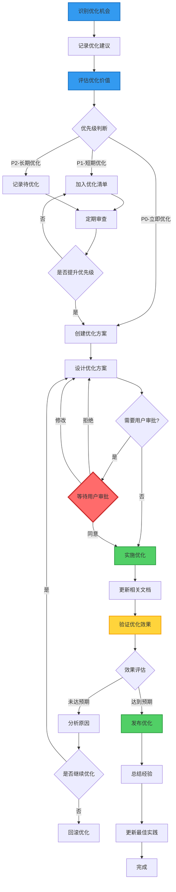
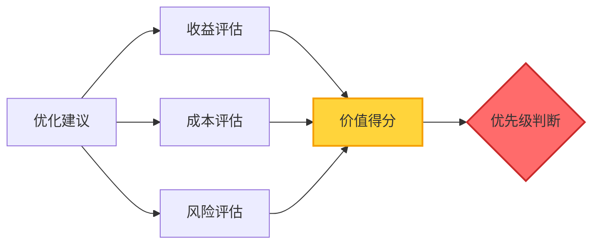
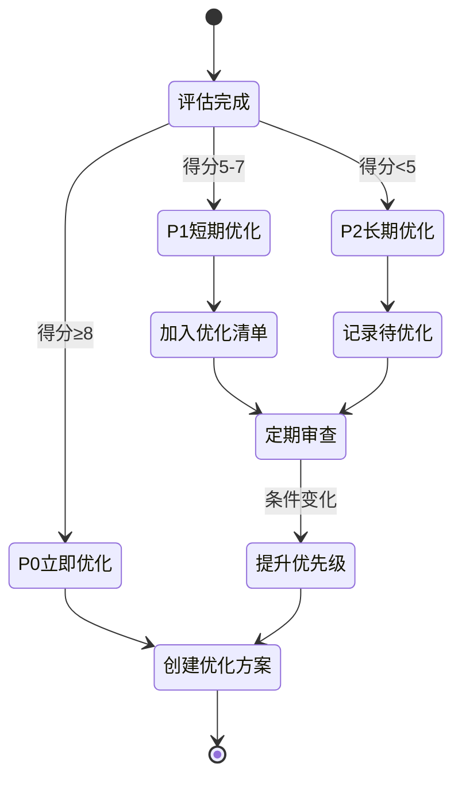
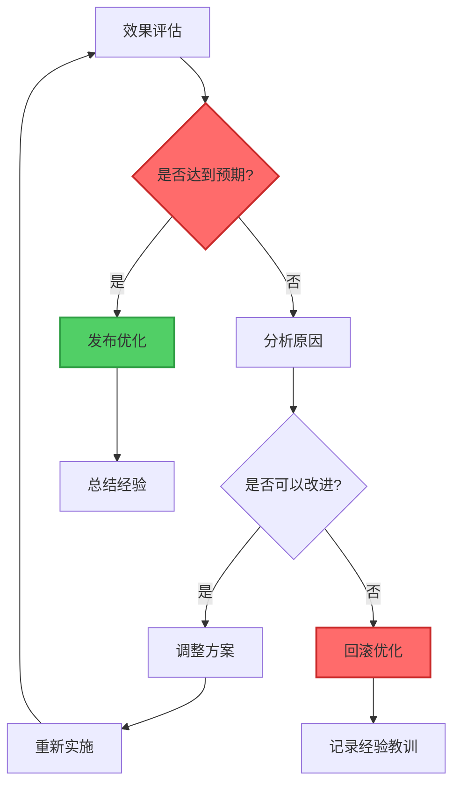

# 流程优化流程

**文档版本**: v1.0  
**创建时间**: 2026-01-15  
**适用项目**: SpacewareConops v3.0.1

## 📋 核心原则

1. **边做边优化**: 在解决问题的过程中识别优化机会
2. **文档驱动**: 所有流程优化都要更新文档
3. **持续迭代**: 流程优化本身也需要持续优化
4. **经验沉淀**: 将优化经验转化为最佳实践

## 🎯 优化目标

### 提升效率

- 减少重复性工作
- 自动化可自动化的环节
- 简化复杂流程

### 提高质量

- 减少人为错误
- 增强检查机制
- 完善文档体系

### 改善体验

- 降低学习成本
- 提供清晰指引
- 优化工具支持

## 🔄 完整优化流程



## 📝 详细步骤

### 1. 识别优化机会（持续）

**触发时机**:

- ✅ 在执行任何工作流程时
- ✅ 发现流程瓶颈时
- ✅ 遇到重复性工作时
- ✅ 收到用户反馈时
- ✅ 定期流程审查时

**识别维度**:

| 维度 | 识别问题           | 示例                         |
| ---- | ------------------ | ---------------------------- |
| 效率 | 是否有重复性工作？ | 每次都要手动执行相同的命令   |
| 质量 | 是否容易出错？     | 经常忘记某个检查步骤         |
| 体验 | 是否难以理解？     | 文档说明不清晰，新人难以上手 |
| 工具 | 是否缺少工具支持？ | 需要手动检查多个文件         |
| 文档 | 文档是否完善？     | 缺少某个流程的详细说明       |

**输出**: 优化机会清单

### 2. 记录优化建议（立即）

**记录位置**:

- 临时记录: 在当前工作文档中记录
- 正式记录: 在 `doc/collaboration/参考资料/流程优化建议.md` 中记录

**记录模板**:

```markdown
### 优化建议 #[编号]

**发现时间**: YYYY-MM-DD  
**发现人员**: [姓名/AI]  
**相关流程**: [流程名称]  
**优化类型**: 效率提升/质量改进/体验优化/工具支持/文档完善

#### 问题描述

[详细描述当前存在的问题]

#### 影响范围

- 影响的流程: [列出]
- 影响的人员: [列出]
- 影响的频率: [每天/每周/每月]

#### 优化建议

[详细说明优化建议]

#### 预期收益

- 效率提升: [具体说明]
- 质量改进: [具体说明]
- 体验优化: [具体说明]

#### 实施难度

- 技术难度: 低/中/高
- 时间成本: [预估时间]
- 风险评估: [潜在风险]

#### 优先级

- [ ] P0 - 立即优化（严重影响工作效率）
- [ ] P1 - 短期优化（1周内）
- [ ] P2 - 长期优化（1个月内）
```

**输出**: 优化建议记录

### 3. 评估优化价值（10分钟）

**评估维度**:



**评估公式**:

```
优先级得分 = (收益得分 × 2) - 成本得分 - 风险得分

收益得分 (0-10):
- 效率提升: 0-3分
- 质量改进: 0-3分
- 体验优化: 0-2分
- 影响范围: 0-2分

成本得分 (0-10):
- 技术难度: 0-3分
- 时间成本: 0-4分
- 资源需求: 0-3分

风险得分 (0-10):
- 破坏性风险: 0-5分
- 回滚难度: 0-3分
- 依赖复杂度: 0-2分
```

**优先级判断**:

- **P0 (立即优化)**: 得分 ≥ 8，或严重影响工作效率
- **P1 (短期优化)**: 得分 5-7，1周内完成
- **P2 (长期优化)**: 得分 < 5，1个月内完成

**输出**: 优先级评估结果

### 4. 优先级判断（决策点）

根据评估结果，决定优化路径：



### 5. 创建优化方案（30-60分钟）

**方案内容**:

````markdown
# 流程优化方案 - [优化主题]

**创建时间**: YYYY-MM-DD  
**优化类型**: 效率提升/质量改进/体验优化  
**优先级**: P0/P1/P2

## 📋 优化概述

### 当前问题

[详细描述当前流程存在的问题]

### 优化目标

[明确的优化目标和预期效果]

### 影响范围

- 影响的流程: [列出]
- 影响的文档: [列出]
- 影响的工具: [列出]

## 🎯 优化方案

### 方案设计

#### 方案1: [方案名称]（推荐）

- **描述**: [详细说明]
- **优点**: [列出优点]
- **缺点**: [列出缺点]
- **实施步骤**: [详细步骤]

#### 方案2: [方案名称]（备选）

- **描述**: [详细说明]
- **优点**: [列出优点]
- **缺点**: [列出缺点]
- **实施步骤**: [详细步骤]

### 推荐方案

[说明推荐方案1的原因]

## 📊 优化流程图

```mermaid
[优化后的流程图]
```
````

## 🔧 实施计划

### 实施步骤

1. [步骤1]
2. [步骤2]
3. [步骤3]

### 时间安排

- 准备阶段: [时间]
- 实施阶段: [时间]
- 验证阶段: [时间]

### 资源需求

- 人力: [需求]
- 工具: [需求]
- 时间: [需求]

## ✅ 验证方案

### 验证指标

- 指标1: [具体指标和目标值]
- 指标2: [具体指标和目标值]

### 验证方法

- 方法1: [具体方法]
- 方法2: [具体方法]

### 回滚方案

[如果优化失败，如何回滚]

## 📈 预期收益

### 效率提升

- [具体说明]

### 质量改进

- [具体说明]

### 体验优化

- [具体说明]

## ⚠️ 风险评估

### 潜在风险

- 风险1: [描述和缓解措施]
- 风险2: [描述和缓解措施]

### 依赖关系

- 依赖1: [说明]
- 依赖2: [说明]

---

**方案状态**: 待审批/已批准/实施中/已完成

````

**输出**: 优化方案文档

### 6. 用户审批（如需要）

**需要审批的情况**:
- ✅ 影响核心工作流程
- ✅ 需要修改多个文档
- ✅ 涉及工具或脚本开发
- ✅ 可能影响团队其他成员

**不需要审批的情况**:
- ✅ 仅优化个人工作流程
- ✅ 仅修改文档格式或措辞
- ✅ 修复明显的文档错误
- ✅ 补充缺失的说明

**审批流程**:

```mermaid
sequenceDiagram
    participant A as AI助手
    participant U as 用户

    A->>U: 提交优化方案
    U->>U: 审阅方案

    alt 同意方案
        U->>A: 同意执行
        A->>A: 实施优化
    else 拒绝方案
        U->>A: 拒绝并说明原因
        A->>A: 记录反馈
    else 需要修改
        U->>A: 提出修改意见
        A->>A: 调整方案
        A->>U: 重新提交
    end
````

### 7. 实施优化（根据方案）

**实施原则**:

- ✅ 按照方案步骤执行
- ✅ 记录实施过程
- ✅ 保留原有版本（便于回滚）
- ✅ 逐步实施，分阶段验证

**实施检查清单**:

- [ ] 备份原有文档/代码
- [ ] 按步骤执行优化
- [ ] 记录每个步骤的结果
- [ ] 遇到问题及时记录
- [ ] 完成后自检

### 8. 更新相关文档（必须）

**需要更新的文档**:

| 文档类型 | 更新内容             | 示例            |
| -------- | -------------------- | --------------- |
| 流程文档 | 更新优化后的流程说明 | 编码优化流程.md |
| 规则文档 | 更新相关规则         | 编码规则.md     |
| 检查清单 | 添加新的检查项       | 检查清单.md     |
| 模板文档 | 更新文档模板         | 对话模板.md     |
| 最佳实践 | 添加新的最佳实践     | 创建新文档      |

**文档更新流程**:

```mermaid
graph LR
    A[识别需要更新的文档] --> B[更新文档内容]
    B --> C[添加更新说明]
    C --> D[更新版本号]
    D --> E[提交Git]

    style E fill:#51cf66,stroke:#2f9e44,stroke-width:2px
```

### 9. 验证优化效果（重要）

**验证方法**:

1. **功能验证**: 确认优化后的流程可以正常执行
2. **效率验证**: 对比优化前后的时间成本
3. **质量验证**: 检查是否减少了错误
4. **体验验证**: 收集使用反馈

**验证记录**:

```markdown
## 优化效果验证

**验证时间**: YYYY-MM-DD  
**验证人员**: [姓名]

### 功能验证

- [ ] 流程可以正常执行
- [ ] 所有步骤都清晰明确
- [ ] 文档更新完整

### 效率验证

- 优化前: [时间/步骤数]
- 优化后: [时间/步骤数]
- 提升幅度: [百分比]

### 质量验证

- 优化前错误率: [数据]
- 优化后错误率: [数据]
- 改进幅度: [百分比]

### 体验验证

- 易用性: ⭐⭐⭐⭐⭐
- 清晰度: ⭐⭐⭐⭐⭐
- 完整性: ⭐⭐⭐⭐⭐

### 用户反馈

[收集的用户反馈]
```

### 10. 效果评估（决策点）

**评估标准**:

```
达到预期:
- ✅ 所有验证指标达标
- ✅ 没有引入新问题
- ✅ 用户反馈积极

未达预期:
- ❌ 部分指标未达标
- ❌ 引入了新问题
- ❌ 用户反馈消极
```

**决策路径**:



### 11. 发布优化（成功）

**发布步骤**:

1. **通知团队**: 告知团队成员优化内容
2. **更新文档**: 确保所有文档已更新
3. **提供指引**: 提供新流程的使用指引
4. **收集反馈**: 持续收集使用反馈

**发布清单**:

- [ ] 所有相关文档已更新
- [ ] 版本号已更新
- [ ] Git 已提交
- [ ] 团队已通知
- [ ] 使用指引已提供

### 12. 总结经验（必须）

**经验总结内容**:

```markdown
## 流程优化经验总结

**优化主题**: [主题]  
**完成时间**: YYYY-MM-DD

### 优化成果

- 优化的流程: [列出]
- 更新的文档: [列出]
- 创建的工具: [列出]

### 关键收益

- 效率提升: [具体数据]
- 质量改进: [具体数据]
- 体验优化: [具体反馈]

### 经验教训

- 成功经验: [列出]
- 遇到的问题: [列出]
- 解决方法: [列出]

### 最佳实践

- 实践1: [详细说明]
- 实践2: [详细说明]

### 后续建议

- 建议1: [说明]
- 建议2: [说明]
```

### 13. 更新最佳实践（沉淀）

**更新位置**:

- 在对应的规则文档中添加最佳实践章节
- 创建独立的最佳实践文档（如果内容较多）

**最佳实践模板**:

```markdown
### 最佳实践: [实践名称]

**适用场景**: [说明]  
**来源**: [优化项目/经验总结]

#### 实践说明

[详细说明这个最佳实践]

#### 实施方法

1. [步骤1]
2. [步骤2]

#### 预期效果

- [效果1]
- [效果2]

#### 注意事项

- [注意事项1]
- [注意事项2]

#### 相关案例

- [案例1]: [链接]
- [案例2]: [链接]
```

## 📊 优化清单管理

### 优化清单结构

```markdown
# 流程优化清单

**更新时间**: YYYY-MM-DD

## P0 - 立即优化

| 编号 | 优化主题 | 发现时间   | 预期收益 | 负责人 | 状态   |
| ---- | -------- | ---------- | -------- | ------ | ------ |
| #001 | [主题]   | YYYY-MM-DD | [收益]   | [姓名] | 进行中 |

## P1 - 短期优化（1周内）

| 编号 | 优化主题 | 发现时间   | 预期收益 | 计划时间   | 状态   |
| ---- | -------- | ---------- | -------- | ---------- | ------ |
| #002 | [主题]   | YYYY-MM-DD | [收益]   | YYYY-MM-DD | 待开始 |

## P2 - 长期优化（1个月内）

| 编号 | 优化主题 | 发现时间   | 预期收益 | 计划时间   | 状态   |
| ---- | -------- | ---------- | -------- | ---------- | ------ |
| #003 | [主题]   | YYYY-MM-DD | [收益]   | YYYY-MM-DD | 待开始 |

## 已完成

| 编号 | 优化主题 | 完成时间   | 实际收益 | 文档链接 |
| ---- | -------- | ---------- | -------- | -------- |
| #000 | [主题]   | YYYY-MM-DD | [收益]   | [链接]   |
```

### 定期审查机制

**审查频率**:

- **P0清单**: 每天审查
- **P1清单**: 每周审查
- **P2清单**: 每月审查

**审查内容**:

- 检查优化进度
- 评估优先级是否需要调整
- 识别新的优化机会
- 清理已完成的项目

## ✅ 检查清单

### 优化开始前

- [ ] 已识别优化机会
- [ ] 已记录优化建议
- [ ] 已评估优化价值
- [ ] 已确定优先级
- [ ] 已创建优化方案

### 优化实施中

- [ ] 已获得用户审批（如需要）
- [ ] 已备份原有版本
- [ ] 按步骤执行优化
- [ ] 记录实施过程
- [ ] 遇到问题及时处理

### 优化完成后

- [ ] 已更新相关文档
- [ ] 已验证优化效果
- [ ] 效果达到预期
- [ ] 已发布优化
- [ ] 已总结经验
- [ ] 已更新最佳实践

## 🔗 相关文档

### 核心规则

- [流程规则](../核心规则/流程规则.md) - 标准工作流程和审批机制

### 可优化的流程（应用对象）

- [编码优化流程](./编码优化流程.md) - 编码工作流程（可被本流程优化）
- [文档优化流程](./文档优化流程.md) - 文档工作流程（可被本流程优化）
- [构建验证流程](./构建验证流程.md) - 构建验证流程（可被本流程优化）
- [流程优化流程](./流程优化流程.md) - 本流程自身（可自我优化）

### 质量保证

- [检查清单](../质量保证/检查清单.md) - 详细的检查项
- [规则追踪](../质量保证/规则追踪.md) - 规则遵循状态追踪

## 📚 优化案例

### 案例1: 文档结构优化

**优化时间**: 2026-01-15  
**优化类型**: 体验优化

**问题**: 协作文档平铺在一个目录，难以查找和管理

**方案**: 按职能分类，创建导航文档

**效果**:

- 文档可查找性: ⭐⭐☆☆☆ → ⭐⭐⭐⭐⭐
- 文档可维护性: ⭐⭐⭐☆☆ → ⭐⭐⭐⭐⭐
- 文档可读性: ⭐⭐⭐☆☆ → ⭐⭐⭐⭐⭐

**经验**: 职能分类 + 导航文档 = 清晰的文档体系

**详细文档**: [文档整理总结-2026-01-15.md](../文档整理总结-2026-01-15.md)

---

**维护者**: 开发团队  
**最后更新**: 2026-01-15
