# 图表规则

**文档版本**: v1.0  
**创建时间**: 2026-01-15  
**适用项目**: SpacewareConops v3.0.1

## 📋 核心原则

**所有涉及流程的部分，都必须使用 Mermaid 图表表达**

1. **双重表达**: 流程既要有文字说明，也要有图表
2. **图表优先**: 复杂流程优先使用图表展示
3. **统一风格**: 使用统一的节点样式和颜色标记
4. **清晰标注**: 关键节点要有明显标记

## 🎯 适用范围

以下场景必须使用 Mermaid 图表：

- ✅ 工作流程说明
- ✅ 问题分析流程
- ✅ 代码执行流程
- ✅ 审批流程
- ✅ 测试验证流程
- ✅ 状态转换流程
- ✅ 数据流向说明
- ✅ 系统交互流程
- ✅ 构建部署流程

## 📊 实施要求

### 1. 双重表达

流程既要有文字说明，也要有 Mermaid 图表

**文字说明**: 详细描述每个步骤的具体内容  
**图表展示**: 直观展示流程的整体结构和关键路径

### 2. 图表优先

复杂流程优先使用图表展示，文字作为补充

**必须使用图表的情况**:

- 3步以上的流程
- 包含分支判断的流程
- 涉及多个角色/系统的流程

### 3. 统一风格

使用统一的节点样式和颜色标记

- 保持项目内所有文档的图表风格一致
- 使用标准的颜色标记系统

### 4. 清晰标注

关键决策点、审批点、执行点要有明显标记

- 使用颜色区分不同类型的节点
- 使用图标或 emoji 增强可读性

## 🎨 图表类型

### 1. 流程图 (flowchart)

**用途**: 展示步骤流程、决策逻辑

**语法**:

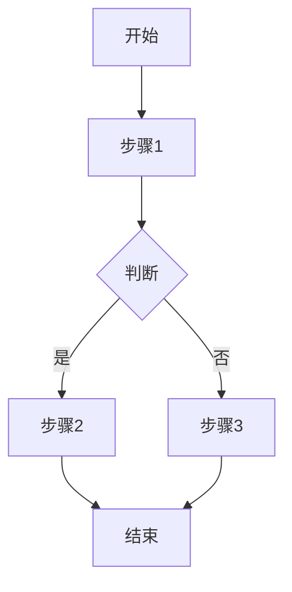

**适用场景**:

- 工作流程
- 问题分析流程
- 代码执行流程
- 审批流程

### 2. 状态图 (stateDiagram)

**用途**: 展示状态转换、生命周期

**语法**:

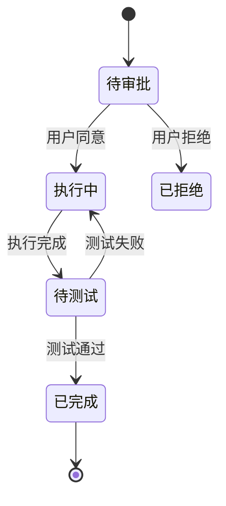

**适用场景**:

- 文档状态流转
- 任务状态管理
- 组件生命周期
- 数据状态变化

### 3. 时序图 (sequenceDiagram)

**用途**: 展示交互流程、消息传递

**语法**:

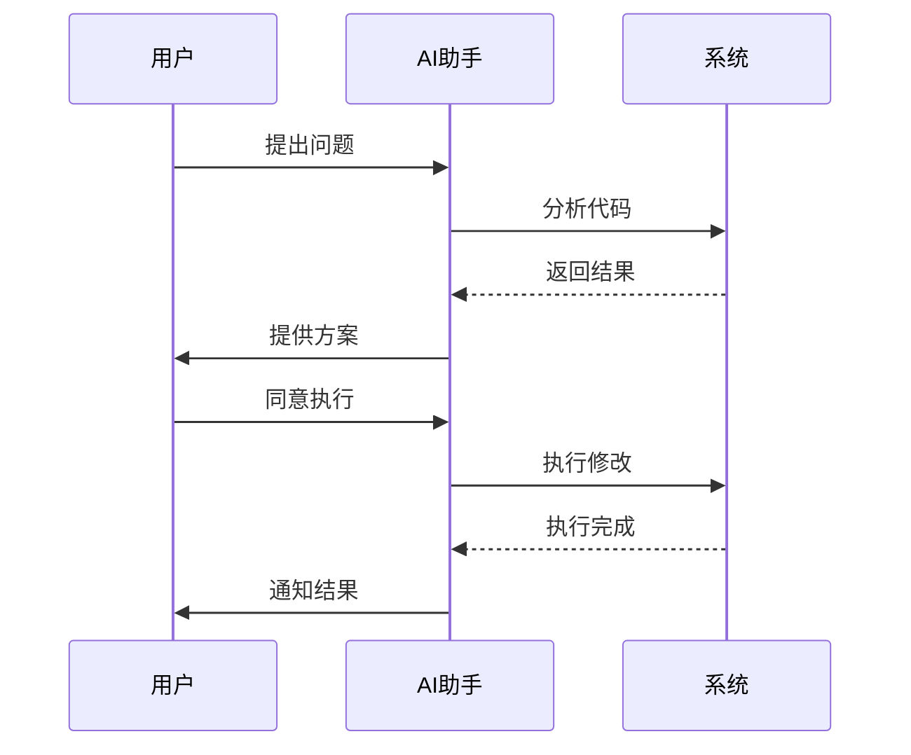

**适用场景**:

- 系统交互流程
- API 调用流程
- 组件通信流程
- 数据流向说明

### 4. 甘特图 (gantt)

**用途**: 展示时间线、任务计划

**语法**:

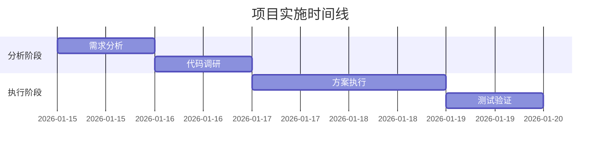

**适用场景**:

- 项目时间线
- 任务计划
- 里程碑展示
- 进度跟踪

### 5. 类图 (classDiagram)

**用途**: 展示类结构、继承关系

**语法**:

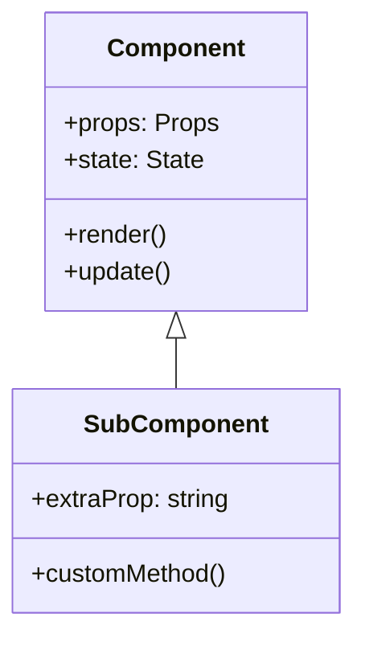

**适用场景**:

- 类结构设计
- 组件继承关系
- 接口定义
- 架构设计

### 6. 关系图 (graph)

**用途**: 展示模块关系、依赖关系

**语法**:

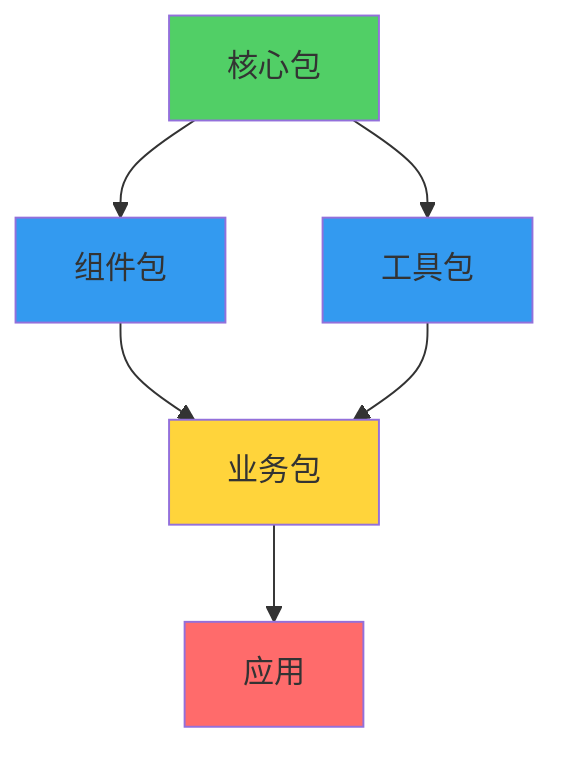

**适用场景**:

- 模块依赖关系
- 架构层次结构
- 数据流向
- 系统组成

## 🎨 颜色标记规范

### 标准颜色方案

使用统一的颜色标记系统，增强图表可读性：

| 颜色    | 色值      | 含义                                 | 使用场景           |
| ------- | --------- | ------------------------------------ | ------------------ |
| 🔴 红色 | `#ff6b6b` | 审批点、等待点、关键决策点、阻塞状态 | 用户审批、测试验证 |
| 🟢 绿色 | `#51cf66` | 执行点、完成点、成功状态、正常流程   | 方案执行、任务完成 |
| 🟡 黄色 | `#ffd43b` | 警告点、注意事项、待处理状态         | 风险提示、待优化   |
| 🔵 蓝色 | `#339af0` | 分析点、准备阶段、信息节点           | 代码分析、数据准备 |
| ⚪ 灰色 | `#868e96` | 普通步骤、中间状态                   | 常规流程步骤       |

### 颜色使用示例

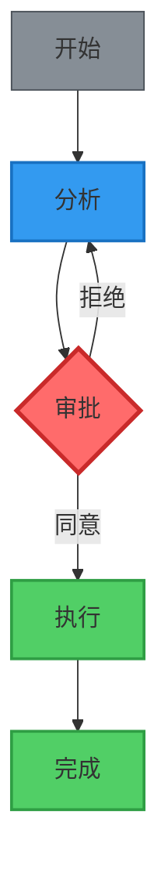

### 样式语法

```
style 节点ID fill:填充色,stroke:边框色,stroke-width:边框宽度
```

**示例**:

- 审批点: `style F fill:#ff6b6b,stroke:#c92a2a,stroke-width:3px`
- 执行点: `style G fill:#51cf66,stroke:#2f9e44,stroke-width:2px`
- 警告点: `style H fill:#ffd43b,stroke:#f59f00,stroke-width:2px`
- 分析点: `style I fill:#339af0,stroke:#1971c2,stroke-width:2px`
- 普通点: `style J fill:#868e96,stroke:#495057,stroke-width:1px`

## 📝 图表示例

### 示例 1: 问题分析流程图

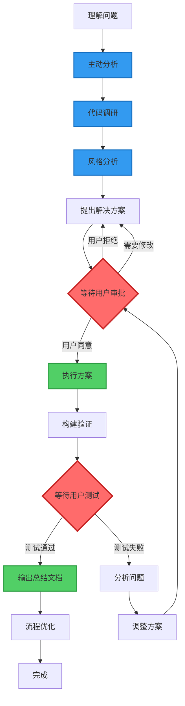

**说明**:

- 红色节点: 必须等待用户审批的关键点
- 绿色节点: 用户同意后才能执行的操作
- 蓝色节点: 分析和准备阶段

### 示例 2: 文档状态转换图

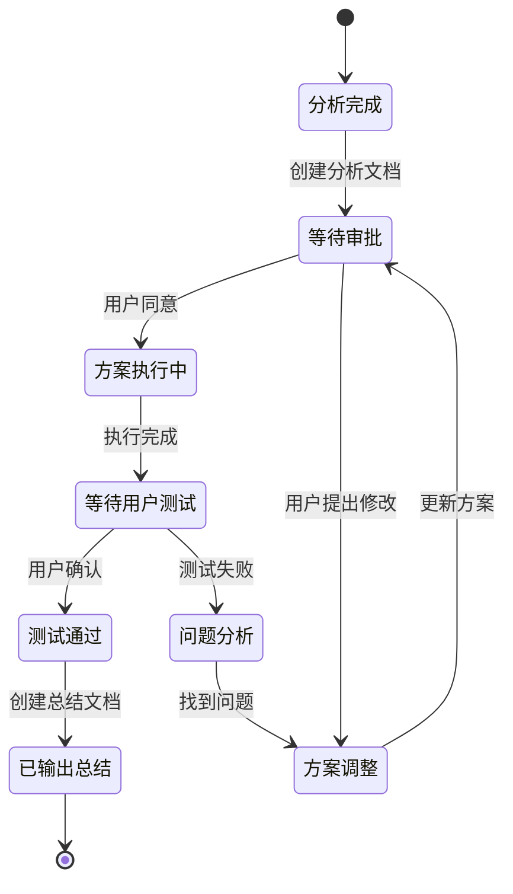

### 示例 3: 系统交互时序图

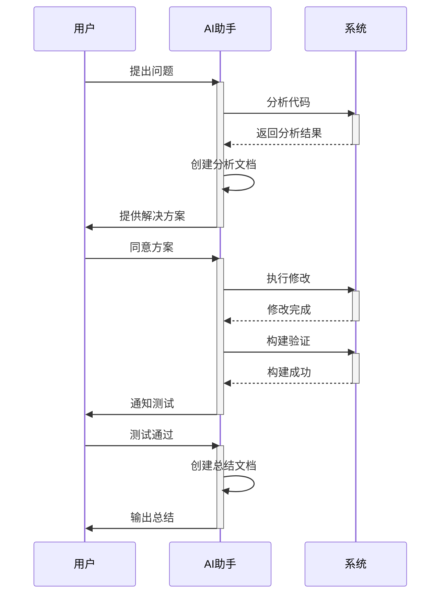

### 示例 4: 模块依赖关系图

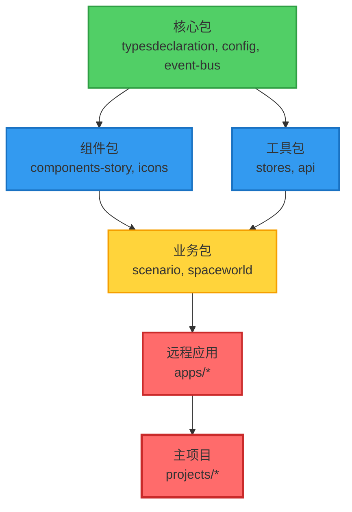

## ✅ 实施检查清单

创建文档时，检查以下事项：

- [ ] 文档中是否有流程描述？
- [ ] 流程是否超过 3 个步骤？
- [ ] 流程是否包含分支判断？
- [ ] 是否已添加对应的 Mermaid 图表？
- [ ] 图表是否使用了标准颜色标记？
- [ ] 关键节点是否有明显标识？
- [ ] 图表和文字说明是否一致？
- [ ] 图表是否易于理解？
- [ ] 图表类型选择是否合适？
- [ ] 节点命名是否清晰？

## ❌ 常见错误

### 错误 1: 只有文字描述，没有图表

```markdown
## 工作流程

1. 理解问题
2. 分析代码
3. 提出方案
4. 等待审批
5. 执行方案
6. 测试验证
```

**问题**: 缺少可视化展示，难以理解流程结构

### 错误 2: 图表没有颜色标记

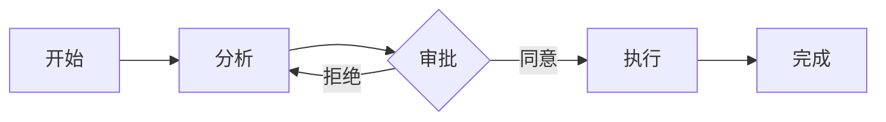

**问题**: 关键节点不突出，无法快速识别审批点

### 错误 3: 图表类型选择不当

使用流程图展示状态转换：

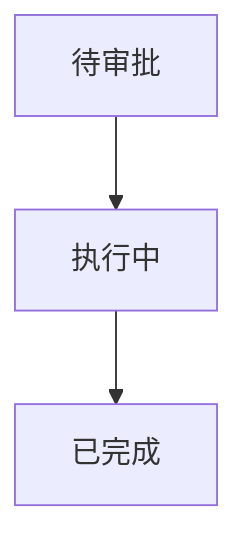

**问题**: 应该使用状态图 (stateDiagram) 而不是流程图

## ✅ 正确示例

### 正确示例 1: 文字 + 图表

````markdown
## 工作流程

### 流程说明

1. **理解问题**: 仔细分析用户描述的问题
2. **分析代码**: 查看相关代码文件
3. **提出方案**: 创建分析文档，说明解决方案
4. **等待审批**: ⚠️ 等待用户明确同意
5. **执行方案**: 用户同意后执行代码修改
6. **测试验证**: 等待用户测试通过

### 流程图

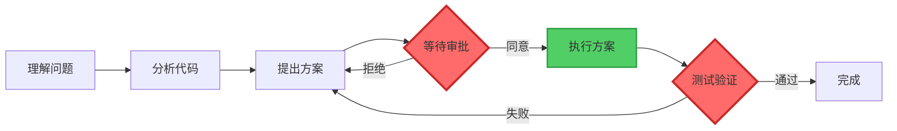
````

### 正确示例 2: 使用合适的图表类型

**状态转换使用状态图**:


## 🔗 相关文档

- [文档规则](./文档规则.md) - 文档创建规范
- [流程规则](./流程规则.md) - 工作流程规范
- [文档优化流程](../工作流程/文档优化流程.md) - 文档创建流程

## 📚 参考资料

- [Mermaid 官方文档](https://mermaid.js.org/)
- [Mermaid Live Editor](https://mermaid.live/)
- [Markdown 中使用 Mermaid](https://github.blog/2022-02-14-include-diagrams-markdown-files-mermaid/)

---

**维护者**: 开发团队  
**最后更新**: 2026-01-15
