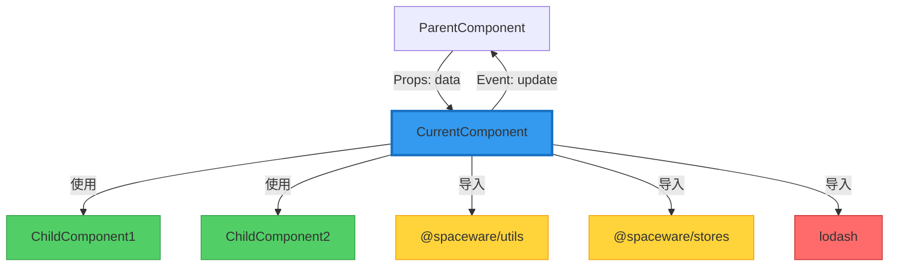
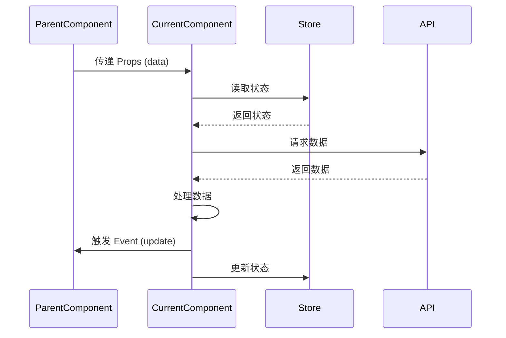
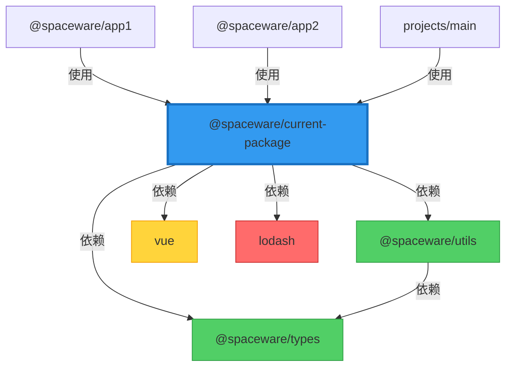
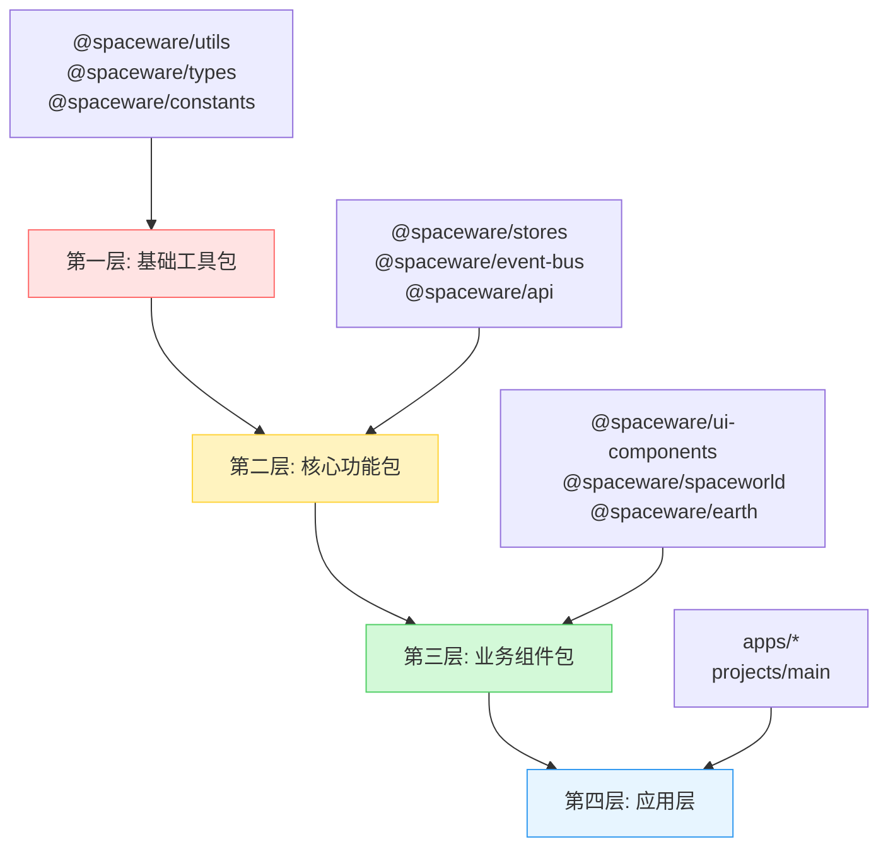

# 子组件和子包分析规则

**文档版本**: v2.0  
**创建时间**: 2026-01-16  
**更新时间**: 2026-01-16  
**适用项目**: SpacewareConops v3.0.1  
**理论基础**: SOLID 原则、组件化软件工程 (CBSE)、Monorepo 最佳实践

## 📋 核心原则

### 软件工程基础原则

1. **高内聚低耦合** (High Cohesion, Low Coupling)

   - 组件内部元素紧密相关（高内聚）
   - 组件之间依赖最小化（低耦合）
   - 目标：提高可维护性和可复用性

2. **单一职责原则** (Single Responsibility Principle)

   - 每个组件/包只有一个变化的理由
   - 职责边界清晰，功能聚焦
   - 避免"上帝组件"和"万能包"

3. **依赖倒置原则** (Dependency Inversion Principle)

   - 依赖抽象而非具体实现
   - 通过接口定义契约
   - 便于测试和替换

4. **开闭原则** (Open-Closed Principle)
   - 对扩展开放，对修改封闭
   - 通过组合和插槽实现扩展
   - 保持 API 稳定性

### 分析方法论

1. **自底向上分析**: 从基础组件/包开始，逐步理解整体架构
2. **依赖图优先**: 构建依赖关系图，识别关键路径
3. **接口契约分析**: 理解组件/包的输入输出接口
4. **质量度量**: 使用可量化的指标评估组件质量

## 🎯 分析目标

### 子组件分析目标

- ✅ 理解组件的功能职责和边界
- ✅ 掌握组件的接口契约（Props、Events、Slots）
- ✅ 评估组件的内聚性和耦合度
- ✅ 识别组件的依赖关系和复用性
- ✅ 度量组件的复杂度和质量

### 子包分析目标

- ✅ 理解包的功能定位和职责范围
- ✅ 掌握包的导出接口（Public API）
- ✅ 分析包的依赖关系和依赖深度
- ✅ 评估包的独立性和可测试性
- ✅ 识别包的使用场景和影响范围

## 🔍 子组件分析流程

### 第一步：组件基本信息采集

```markdown
## 组件基本信息

**组件名称**: `ComponentName`
**文件路径**: `packages/xxx/src/components/ComponentName.vue`
**组件类型**:

- [ ] 展示型组件 (Presentational Component)
- [ ] 容器型组件 (Container Component)
- [ ] 布局组件 (Layout Component)
- [ ] 高阶组件 (Higher-Order Component)

**代码规模**:

- 代码行数: XXX 行
- 模板行数: XXX 行
- 脚本行数: XXX 行
- 样式行数: XXX 行

**维护状态**: 活跃 / 稳定 / 待重构 / 已废弃
**创建时间**: YYYY-MM-DD
**最后修改**: YYYY-MM-DD
```

### 第二步：职责与边界分析

```markdown
## 职责分析

**核心职责**: 一句话描述组件的核心功能

**功能清单**:

1. 功能点 1 - 详细描述
2. 功能点 2 - 详细描述
3. 功能点 3 - 详细描述

**职责边界**:

- ✅ 应该做的事情
- ❌ 不应该做的事情

**单一职责评估**:

- [ ] 组件只有一个变化的理由
- [ ] 功能高度相关
- [ ] 职责边界清晰

**使用场景**:

- 场景 1: 具体描述使用上下文
- 场景 2: 具体描述使用上下文
```

### 第三步：接口契约分析

#### Props 接口分析

```markdown
## Props 接口

| 属性名  | 类型                           | 必填 | 默认值   | 说明     | 验证规则 |
| ------- | ------------------------------ | ---- | -------- | -------- | -------- |
| data    | Object                         | 是   | -        | 数据对象 | -        |
| visible | Boolean                        | 否   | false    | 是否显示 | -        |
| size    | 'small' \| 'medium' \| 'large' | 否   | 'medium' | 尺寸     | 枚举值   |

**Props 设计评估**:

- [ ] Props 数量合理（建议 ≤ 10 个）
- [ ] 类型定义完整
- [ ] 必填项合理
- [ ] 默认值合理
- [ ] 命名语义化
```

#### Events 接口分析

```markdown
## Events 接口

| 事件名 | 参数类型               | 说明     | 触发时机       | 频率 |
| ------ | ---------------------- | -------- | -------------- | ---- |
| update | (value: any) => void   | 数据更新 | 用户修改数据时 | 高频 |
| close  | () => void             | 关闭事件 | 点击关闭按钮时 | 低频 |
| error  | (error: Error) => void | 错误事件 | 发生错误时     | 低频 |

**Events 设计评估**:

- [ ] 事件命名清晰
- [ ] 参数类型明确
- [ ] 触发时机合理
- [ ] 避免事件泛滥
```

#### Slots 接口分析

```markdown
## Slots 接口

| 插槽名  | 说明     | 作用域数据        | 使用频率 |
| ------- | -------- | ----------------- | -------- |
| default | 默认内容 | -                 | 高       |
| header  | 头部内容 | { title: string } | 中       |
| footer  | 底部内容 | -                 | 低       |

**Slots 设计评估**:

- [ ] 插槽位置合理
- [ ] 作用域数据充分
- [ ] 扩展性良好
```

### 第四步：内聚性与耦合度分析

```markdown
## 内聚性分析

**内聚类型评估**:

- [ ] 功能内聚 (Functional Cohesion) - 最佳
- [ ] 顺序内聚 (Sequential Cohesion) - 良好
- [ ] 通信内聚 (Communicational Cohesion) - 可接受
- [ ] 过程内聚 (Procedural Cohesion) - 需改进
- [ ] 时间内聚 (Temporal Cohesion) - 需改进
- [ ] 逻辑内聚 (Logical Cohesion) - 较差
- [ ] 偶然内聚 (Coincidental Cohesion) - 最差

**内聚性评分**: ⭐⭐⭐⭐⭐ (1-5 星)

**内聚性说明**:
组件内部所有元素都围绕 [核心功能] 紧密协作，具有高度的功能内聚性。

## 耦合度分析

**耦合类型评估**:

- [ ] 无耦合 (No Coupling) - 最佳
- [ ] 数据耦合 (Data Coupling) - 良好
- [ ] 标记耦合 (Stamp Coupling) - 可接受
- [ ] 控制耦合 (Control Coupling) - 需改进
- [ ] 外部耦合 (External Coupling) - 需改进
- [ ] 公共耦合 (Common Coupling) - 较差
- [ ] 内容耦合 (Content Coupling) - 最差

**耦合度评分**: ⭐⭐⭐⭐⭐ (1-5 星，星级越低越好)

**依赖关系**:

- 父组件依赖: `ParentComponent` (通过 Props 传递数据)
- 子组件依赖: `ChildComponent1`, `ChildComponent2`
- 工具包依赖: `@spaceware/utils`, `@spaceware/stores`
- 外部库依赖: `lodash`, `dayjs`

**耦合度说明**:
组件主要通过 Props 和 Events 与外部通信，属于数据耦合，耦合度较低。
```

### 第五步：复杂度与质量度量

```markdown
## 复杂度度量

**圈复杂度** (Cyclomatic Complexity):

- 计算方法: 决策点数量 + 1
- 当前值: X
- 评估标准:
  - 1-10: 简单，风险低 ✅
  - 11-20: 中等，风险中等 ⚠️
  - 21-50: 复杂，风险高 ❌
  - > 50: 极其复杂，必须重构 🔴

**认知复杂度** (Cognitive Complexity):

- 嵌套层级: X 层
- 条件分支: X 个
- 循环结构: X 个
- 评估: 简单 / 中等 / 复杂

**代码质量指标**:

- TypeScript 类型覆盖率: XX%
- 注释覆盖率: XX%
- 测试覆盖率: XX%
- ESLint 警告数: X 个
- ESLint 错误数: X 个

## 可维护性评估

**可维护性指标**:

- [ ] 代码结构清晰
- [ ] 命名语义化
- [ ] 注释充分
- [ ] 易于理解
- [ ] 易于修改
- [ ] 易于测试

**技术债务**:

- 待优化项 1: 描述
- 待优化项 2: 描述
- 待重构项 1: 描述
```

### 第六步：依赖关系可视化

````markdown
## 组件依赖关系图


````

**图例说明**:

- 🔵 蓝色: 当前分析的组件
- 🟢 绿色: 子组件依赖
- 🟡 黄色: 内部包依赖
- 🔴 红色: 外部库依赖

## 数据流分析



**数据流说明**:

1. 父组件通过 Props 传递初始数据
2. 组件从 Store 读取全局状态
3. 组件调用 API 获取远程数据
4. 组件处理数据并更新视图
5. 组件通过 Event 通知父组件
6. 组件更新全局状态

````

## 📦 子包分析流程

### 第一步：包基本信息采集

```markdown
## 包基本信息

**包名称**: `@spaceware/package-name`
**包路径**: `packages/package-name`
**包类型**:
- [ ] 工具包 (Utility Package)
- [ ] 组件包 (Component Package)
- [ ] 状态包 (Store Package)
- [ ] 服务包 (Service Package)
- [ ] 类型包 (Type Package)

**版本信息**:
- 当前版本: x.y.z
- 发布状态: 私有 / 公开
- 版本策略: 语义化版本 (Semver)

**代码规模**:
- 总代码行数: XXX 行
- 源文件数量: XX 个
- 导出项数量: XX 个

**维护状态**: 活跃 / 稳定 / 待重构 / 已废弃
**创建时间**: YYYY-MM-DD
**最后发布**: YYYY-MM-DD
````

### 第二步：包职责与边界分析

```markdown
## 包职责分析

**核心职责**: 一句话描述包的核心功能

**功能模块**:

1. 模块 1 - 功能描述
2. 模块 2 - 功能描述
3. 模块 3 - 功能描述

**职责边界**:

- ✅ 包内职责: 应该提供的功能
- ❌ 包外职责: 不应该提供的功能

**单一职责评估**:

- [ ] 包只有一个变化的理由
- [ ] 功能高度相关
- [ ] 职责边界清晰
- [ ] 不存在功能重叠

**使用场景**:

- 场景 1: 在 [项目/包] 中用于 [目的]
- 场景 2: 在 [项目/包] 中用于 [目的]
```

### 第三步：公共 API 分析

```markdown
## 导出接口 (Public API)

### 函数接口

| 函数名       | 参数          | 返回值     | 说明     | 稳定性        |
| ------------ | ------------- | ---------- | -------- | ------------- |
| functionName | (param: Type) | ReturnType | 功能描述 | 稳定 / 实验性 |

### 类型接口

| 类型名   | 类别                    | 说明     | 定义位置           |
| -------- | ----------------------- | -------- | ------------------ |
| TypeName | Interface / Type / Enum | 类型说明 | src/types/index.ts |

### 类接口

| 类名      | 说明   | 主要方法         | 定义位置                 |
| --------- | ------ | ---------------- | ------------------------ |
| ClassName | 类说明 | method1, method2 | src/classes/ClassName.ts |

### 组件接口

| 组件名        | 说明     | 主要 Props   | 文件路径                         |
| ------------- | -------- | ------------ | -------------------------------- |
| ComponentName | 组件说明 | prop1, prop2 | src/components/ComponentName.vue |

**API 设计评估**:

- [ ] API 命名清晰
- [ ] API 数量合理
- [ ] 参数设计合理
- [ ] 返回值明确
- [ ] 类型定义完整
- [ ] 向后兼容
- [ ] 文档完善
```

### 第四步：依赖关系分析

```markdown
## 依赖关系

### 内部依赖 (Internal Dependencies)

| 包名             | 版本         | 用途     | 依赖类型     |
| ---------------- | ------------ | -------- | ------------ |
| @spaceware/utils | workspace:\* | 工具函数 | dependencies |
| @spaceware/types | workspace:\* | 类型定义 | dependencies |

### 外部依赖 (External Dependencies)

| 包名   | 版本     | 用途   | 依赖类型     | 大小   |
| ------ | -------- | ------ | ------------ | ------ |
| vue    | ^3.4.38  | 框架   | dependencies | XXX KB |
| lodash | ^4.17.21 | 工具库 | dependencies | XXX KB |

### 开发依赖 (Dev Dependencies)

| 包名       | 版本   | 用途     |
| ---------- | ------ | -------- |
| typescript | ^5.0.0 | 类型检查 |
| vite       | ^4.5.1 | 构建工具 |

### 被依赖情况 (Dependents)

| 包名            | 使用的功能     | 依赖强度 |
| --------------- | -------------- | -------- |
| @spaceware/app1 | 功能 A, 功能 B | 强       |
| @spaceware/app2 | 功能 C         | 弱       |

**依赖健康度评估**:

- [ ] 无循环依赖
- [ ] 依赖数量合理（建议 ≤ 20 个）
- [ ] 依赖版本明确
- [ ] 无幽灵依赖 (Phantom Dependencies)
- [ ] 依赖层级合理（建议 ≤ 3 层）
```

### 第五步：包结构与模块化分析

```markdown
## 包内部结构

### 目录结构

packages/package-name/
├── src/
│ ├── components/ # 组件目录
│ ├── composables/ # 组合式函数
│ ├── utils/ # 工具函数
│ ├── types/ # 类型定义
│ ├── constants/ # 常量定义
│ ├── services/ # 服务层
│ └── index.ts # 入口文件
├── tests/ # 测试文件
├── docs/ # 文档
├── package.json # 包配置
├── tsconfig.json # TS 配置
├── vite.config.ts # 构建配置
└── README.md # 说明文档

### 核心模块

| 模块名 | 文件路径   | 职责     | 导出项 |
| ------ | ---------- | -------- | ------ |
| 模块 1 | src/xxx.ts | 功能描述 | X 个   |
| 模块 2 | src/yyy.ts | 功能描述 | X 个   |

**模块化评估**:

- [ ] 模块职责清晰
- [ ] 模块边界明确
- [ ] 模块间低耦合
- [ ] 模块内高内聚
- [ ] 循环依赖检查通过

## 构建配置分析

**构建工具**: Vite / Rollup / Webpack
**输出格式**: ESM / UMD / CJS
**类型声明**: 是 / 否
**Tree-shaking**: 支持 / 不支持

**构建产物**:

- `dist/index.mjs` - ESM 格式
- `dist/index.umd.js` - UMD 格式
- `dist/index.d.ts` - 类型声明

**构建优化**:

- [ ] 代码分割
- [ ] Tree-shaking
- [ ] 压缩混淆
- [ ] Source Map
```

### 第六步：包依赖关系可视化

````markdown
## 包依赖关系图



**图例说明**:

- 🔵 蓝色: 当前分析的包
- 🟢 绿色: 内部包依赖
- 🟡 黄色: 框架依赖
- 🔴 红色: 第三方库依赖

## 依赖层级分析


**依赖层级说明**:

- L1 应用层: 最终应用和项目
- L2 业务包层: 业务逻辑相关的包
- L3 核心包层: 核心功能包
- L4 基础包层: 工具和类型包
- L5 外部依赖层: 第三方库

**当前包所在层级**: L3 核心包层
**依赖深度**: 3 层
````

## 🔄 Monorepo 特有分析

### Workspace 依赖分析

````markdown
## Workspace 配置

**pnpm-workspace.yaml**:

```yaml
packages:
  - 'packages/*'
  - 'apps/*'
  - 'projects/*'
```
````

**依赖协议**:

- `workspace:*` - 使用 workspace 中的最新版本
- `workspace:^` - 使用 workspace 中的兼容版本
- `workspace:~` - 使用 workspace 中的补丁版本

**幽灵依赖检查**:

- [ ] 所有使用的依赖都在 package.json 中声明
- [ ] 没有使用父级 node_modules 中的依赖
- [ ] 没有隐式依赖传递

**依赖提升策略**:

- 公共依赖提升到根目录
- 版本冲突的依赖保留在包内
- 使用 `.npmrc` 配置提升规则

````

### 包间通信模式

```markdown
## 包间通信

**通信方式**:
1. **直接导入** - 通过 import 语句直接使用
2. **事件总线** - 通过 @spaceware/event-bus 通信
3. **状态共享** - 通过 @spaceware/stores 共享状态
4. **服务调用** - 通过 @spaceware/api 调用服务

**通信模式评估**:
- [ ] 通信方式合理
- [ ] 避免循环通信
- [ ] 解耦程度高
- [ ] 易于测试

## 包发布策略

**发布配置**:
- 发布范围: 私有 / 公开
- 发布注册表: npm / 私有仓库
- 版本管理: 手动 / 自动 (Changesets)

**版本变更规则**:
- MAJOR: 破坏性变更
- MINOR: 新增功能
- PATCH: Bug 修复
````

## 📊 质量度量指标

### 组件质量度量

```markdown
## 组件质量评分卡

| 维度   | 指标       | 目标值 | 当前值         | 评分       |
| ------ | ---------- | ------ | -------------- | ---------- |
| 复杂度 | 圈复杂度   | ≤10    | X              | ⭐⭐⭐⭐⭐ |
| 规模   | 代码行数   | ≤300   | X              | ⭐⭐⭐⭐⭐ |
| 接口   | Props 数量 | ≤10    | X              | ⭐⭐⭐⭐⭐ |
| 依赖   | 依赖数量   | ≤5     | X              | ⭐⭐⭐⭐⭐ |
| 内聚   | 内聚性     | 高     | 高/中/低       | ⭐⭐⭐⭐⭐ |
| 耦合   | 耦合度     | 低     | 低/中/高       | ⭐⭐⭐⭐⭐ |
| 测试   | 测试覆盖率 | ≥80%   | X%             | ⭐⭐⭐⭐⭐ |
| 文档   | 文档完整性 | 完整   | 完整/部分/缺失 | ⭐⭐⭐⭐⭐ |

**综合评分**: XX/40 分

**质量等级**:

- 35-40 分: 优秀 ✅
- 28-34 分: 良好 👍
- 21-27 分: 合格 ⚠️
- ≤20 分: 需改进 ❌
```

### 包质量度量

```markdown
## 包质量评分卡

| 维度 | 指标         | 目标值 | 当前值         | 评分       |
| ---- | ------------ | ------ | -------------- | ---------- |
| 规模 | 代码行数     | ≤5000  | X              | ⭐⭐⭐⭐⭐ |
| API  | 导出项数量   | ≤50    | X              | ⭐⭐⭐⭐⭐ |
| 依赖 | 依赖数量     | ≤20    | X              | ⭐⭐⭐⭐⭐ |
| 依赖 | 依赖层级     | ≤3     | X              | ⭐⭐⭐⭐⭐ |
| 循环 | 循环依赖     | 0      | X              | ⭐⭐⭐⭐⭐ |
| 职责 | 单一职责     | 是     | 是/否          | ⭐⭐⭐⭐⭐ |
| 测试 | 测试覆盖率   | ≥80%   | X%             | ⭐⭐⭐⭐⭐ |
| 文档 | 文档完整性   | 完整   | 完整/部分/缺失 | ⭐⭐⭐⭐⭐ |
| 构建 | 构建产物大小 | ≤500KB | XKB            | ⭐⭐⭐⭐⭐ |
| 性能 | 构建时间     | ≤30s   | Xs             | ⭐⭐⭐⭐⭐ |

**综合评分**: XX/50 分

**质量等级**:

- 43-50 分: 优秀 ✅
- 35-42 分: 良好 👍
- 26-34 分: 合格 ⚠️
- ≤25 分: 需改进 ❌
```

## 🎯 分析策略与顺序

### 自底向上分析法



**分析顺序建议**:

1. **第一层：基础工具包** (优先级最高)

   - `@spaceware/utils` - 工具函数
   - `@spaceware/types` - 类型定义
   - `@spaceware/constants` - 常量定义
   - **原因**: 被最多包依赖，理解它们是理解整个系统的基础

2. **第二层：核心功能包**

   - `@spaceware/stores` - 状态管理
   - `@spaceware/event-bus` - 事件总线
   - `@spaceware/api` - API 服务
   - **原因**: 提供核心基础设施，支撑业务逻辑

3. **第三层：业务组件包**

   - `@spaceware/spaceworld` - 地球组件
   - `@spaceware/earth` - 地球引擎
   - `@spaceware/ui-components` - UI 组件库
   - **原因**: 实现具体业务功能

4. **第四层：应用层**
   - `apps/*` - 远程应用
   - `projects/main` - 主项目
   - **原因**: 最终用户界面，整合所有功能

### 依赖优先分析法


**步骤说明**:

1. 确定要分析的目标组件/包
2. 列出所有直接依赖（package.json 中的依赖）
3. 递归分析每个依赖的依赖（间接依赖）
4. 构建完整的依赖树
5. 从叶子节点（无依赖的包）开始分析
6. 逐层向上，最终回到目标组件/包

## ⚠️ 常见问题与反模式

### 子组件常见问题

| 问题类型   | 问题描述                 | 影响               | 解决方案               | 优先级 |
| ---------- | ------------------------ | ------------------ | ---------------------- | ------ |
| Props 过多 | Props 数量 >10 个        | 接口复杂，难以维护 | 使用配置对象或拆分组件 | 高     |
| 职责不清   | 组件做了多件不相关的事   | 难以复用和测试     | 按职责拆分为多个组件   | 高     |
| 状态混乱   | 内部状态管理混乱         | 难以追踪状态变化   | 使用 Pinia 或提升状态  | 中     |
| 过度耦合   | 与父组件紧密耦合         | 无法独立使用       | 使用 Props/Events 解耦 | 高     |
| 深层嵌套   | 组件嵌套层级 >5 层       | 性能问题，难以维护 | 扁平化组件结构         | 中     |
| 巨型组件   | 代码行数 >500 行         | 难以理解和维护     | 拆分为多个小组件       | 高     |
| 缺少类型   | 未定义 Props/Events 类型 | 类型安全性差       | 添加 TypeScript 类型   | 中     |
| 副作用多   | 组件内有大量副作用       | 难以测试和预测     | 提取副作用到外部       | 中     |

### 子包常见问题

| 问题类型   | 问题描述                | 影响               | 解决方案                 | 优先级 |
| ---------- | ----------------------- | ------------------ | ------------------------ | ------ |
| 循环依赖   | 包 A 依赖 B，B 依赖 A   | 构建失败，逻辑混乱 | 重构依赖关系或提取公共包 | 高     |
| 职责不清   | 包的功能边界模糊        | 功能重复，难以维护 | 明确职责并拆分           | 高     |
| 过度依赖   | 依赖数量 >20 个         | 构建慢，体积大     | 减少依赖或合并功能       | 中     |
| API 不稳定 | 导出接口频繁变化        | 破坏下游使用者     | 设计稳定 API 并版本管理  | 高     |
| 幽灵依赖   | 使用未声明的依赖        | 构建不稳定         | 显式声明所有依赖         | 高     |
| 巨型包     | 代码行数 >10000 行      | 难以维护，构建慢   | 拆分为多个小包           | 中     |
| 缺少文档   | 没有 README 或 API 文档 | 难以使用           | 编写完整文档             | 中     |
| 缺少测试   | 测试覆盖率 <50%         | 质量无保障         | 补充单元测试             | 中     |
| 版本混乱   | 依赖版本不一致          | 潜在兼容性问题     | 统一依赖版本             | 低     |

### SOLID 原则违反检查

```markdown
## SOLID 原则检查清单

### S - 单一职责原则 (Single Responsibility)

- [ ] 组件/包只有一个变化的理由
- [ ] 功能高度相关
- [ ] 职责边界清晰

**违反示例**: 一个组件既负责数据获取，又负责数据展示，还负责数据编辑

### O - 开闭原则 (Open-Closed)

- [ ] 对扩展开放
- [ ] 对修改封闭
- [ ] 通过插槽/配置实现扩展

**违反示例**: 每次新增功能都需要修改组件内部代码

### L - 里氏替换原则 (Liskov Substitution)

- [ ] 子组件可以替换父组件
- [ ] 不改变程序正确性
- [ ] 接口契约一致

**违反示例**: 子组件改变了父组件定义的 Props 语义

### I - 接口隔离原则 (Interface Segregation)

- [ ] 接口精简
- [ ] 不强制依赖不需要的接口
- [ ] 按需提供功能

**违反示例**: 组件提供了大量用不到的 Props

### D - 依赖倒置原则 (Dependency Inversion)

- [ ] 依赖抽象而非具体实现
- [ ] 通过接口定义契约
- [ ] 便于替换和测试

**违反示例**: 组件直接依赖具体的 API 实现而非接口
```

## 📝 分析文档模板

### 子组件分析文档模板

````markdown
# [组件名称] 组件分析

**分析时间**: YYYY-MM-DD  
**分析人员**: [姓名]  
**文档版本**: v1.0  
**组件路径**: packages/xxx/src/components/ComponentName.vue

## 1. 组件基本信息

- 组件类型: 展示型/容器型/布局型/高阶组件
- 代码规模: XXX 行
- 维护状态: 活跃/稳定/待重构
- 创建时间: YYYY-MM-DD

## 2. 职责与边界

- 核心职责: [一句话描述]
- 功能清单: [列出主要功能]
- 职责边界: [明确应该做和不应该做的事]
- 单一职责评估: ✅/⚠️/❌

## 3. 接口契约

### Props 接口

[Props 表格]

### Events 接口

[Events 表格]

### Slots 接口

[Slots 表格]

## 4. 内聚性与耦合度

- 内聚类型: [功能内聚/顺序内聚/...]
- 内聚性评分: ⭐⭐⭐⭐⭐
- 耦合类型: [数据耦合/标记耦合/...]
- 耦合度评分: ⭐⭐⭐⭐⭐

## 5. 复杂度与质量

- 圈复杂度: X
- 认知复杂度: 简单/中等/复杂
- TypeScript 覆盖率: XX%
- 测试覆盖率: XX%

## 6. 依赖关系

[组件依赖关系图 - Mermaid]
[数据流分析图 - Mermaid]

## 7. 质量评分

[组件质量评分卡]
综合评分: XX/40 分
质量等级: 优秀/良好/合格/需改进

## 8. 使用示例

```vue
<template>
  <ComponentName :prop1="value1" @event1="handler1">
    <template #slot1>内容</template>
  </ComponentName>
</template>
```
````

## 9. 问题与建议

### 发现的问题

- 问题 1: [描述]
- 问题 2: [描述]

### 改进建议

- 建议 1: [描述]
- 建议 2: [描述]

### 技术债务

- 待优化项: [描述]
- 待重构项: [描述]

## 10. SOLID 原则检查

- [ ] 单一职责原则
- [ ] 开闭原则
- [ ] 里氏替换原则
- [ ] 接口隔离原则
- [ ] 依赖倒置原则

---

**下次审查时间**: YYYY-MM-DD

```

```

### 子包分析文档模板

````markdown
# [包名称] 包分析

**分析时间**: YYYY-MM-DD  
**分析人员**: [姓名]  
**文档版本**: v1.0  
**包路径**: packages/package-name

## 1. 包基本信息

- 包名称: @spaceware/package-name
- 包类型: 工具包/组件包/状态包/服务包
- 版本号: x.y.z
- 代码规模: XXX 行
- 维护状态: 活跃/稳定/待重构

## 2. 职责与边界

- 核心职责: [一句话描述]
- 功能模块: [列出主要模块]
- 职责边界: [明确应该提供和不应该提供的功能]
- 单一职责评估: ✅/⚠️/❌

## 3. 公共 API

### 函数接口

[函数表格]

### 类型接口

[类型表格]

### 类接口

[类表格]

### 组件接口

[组件表格]

## 4. 依赖关系

### 内部依赖

[内部依赖表格]

### 外部依赖

[外部依赖表格]

### 被依赖情况

[被依赖表格]

### 依赖健康度

- [ ] 无循环依赖
- [ ] 依赖数量合理
- [ ] 无幽灵依赖
- [ ] 依赖层级合理

## 5. 包结构

### 目录结构

[目录树]

### 核心模块

[模块表格]

### 构建配置

- 构建工具: Vite/Rollup/Webpack
- 输出格式: ESM/UMD/CJS
- 构建产物大小: XKB

## 6. 依赖关系可视化

[包依赖关系图 - Mermaid]
[依赖层级分析图 - Mermaid]

## 7. Monorepo 特性

### Workspace 配置

[Workspace 依赖配置]

### 包间通信

[通信方式说明]

### 发布策略

[版本管理和发布配置]

## 8. 质量评分

[包质量评分卡]
综合评分: XX/50 分
质量等级: 优秀/良好/合格/需改进

## 9. 使用示例

```typescript
import { functionName } from '@spaceware/package-name';

const result = functionName(params);
```
````

## 10. 问题与建议

### 发现的问题

- 问题 1: [描述]
- 问题 2: [描述]

### 改进建议

- 建议 1: [描述]
- 建议 2: [描述]

### 技术债务

- 待优化项: [描述]
- 待重构项: [描述]

## 11. SOLID 原则检查

- [ ] 单一职责原则
- [ ] 开闭原则
- [ ] 里氏替换原则
- [ ] 接口隔离原则
- [ ] 依赖倒置原则

---

**下次审查时间**: YYYY-MM-DD

```

```

## ✅ 分析检查清单

### 子组件分析检查清单

**基本信息** (必填项):

- [ ] 组件名称和路径
- [ ] 组件类型分类
- [ ] 代码规模统计
- [ ] 维护状态标注

**职责分析** (核心项):

- [ ] 核心职责明确
- [ ] 功能清单完整
- [ ] 职责边界清晰
- [ ] 单一职责评估

**接口分析** (重要项):

- [ ] Props 接口完整
- [ ] Events 接口完整
- [ ] Slots 接口完整
- [ ] 接口设计评估

**质量分析** (关键项):

- [ ] 内聚性分析
- [ ] 耦合度分析
- [ ] 复杂度度量
- [ ] 质量指标统计

**可视化** (必需项):

- [ ] 依赖关系图
- [ ] 数据流分析图
- [ ] 图表清晰易懂

**评估总结** (输出项):

- [ ] 质量评分卡
- [ ] 问题清单
- [ ] 改进建议
- [ ] SOLID 检查

### 子包分析检查清单

**基本信息** (必填项):

- [ ] 包名称和路径
- [ ] 包类型分类
- [ ] 版本信息
- [ ] 代码规模统计

**职责分析** (核心项):

- [ ] 核心职责明确
- [ ] 功能模块清单
- [ ] 职责边界清晰
- [ ] 单一职责评估

**API 分析** (重要项):

- [ ] 函数接口完整
- [ ] 类型接口完整
- [ ] 类接口完整
- [ ] 组件接口完整
- [ ] API 设计评估

**依赖分析** (关键项):

- [ ] 内部依赖清单
- [ ] 外部依赖清单
- [ ] 被依赖情况
- [ ] 依赖健康度检查
- [ ] 循环依赖检查

**结构分析** (必需项):

- [ ] 目录结构清晰
- [ ] 核心模块说明
- [ ] 构建配置分析
- [ ] 模块化评估

**可视化** (必需项):

- [ ] 包依赖关系图
- [ ] 依赖层级分析图
- [ ] 图表清晰易懂

**Monorepo 特性** (特殊项):

- [ ] Workspace 配置
- [ ] 包间通信模式
- [ ] 发布策略说明

**评估总结** (输出项):

- [ ] 质量评分卡
- [ ] 问题清单
- [ ] 改进建议
- [ ] SOLID 检查

## 🔗 相关文档

### 核心规则文档

- [编码规则](./编码规则.md) - 编码规范和风格指南
- [文档规则](./文档规则.md) - 文档编写规范
- [图表规则](./图表规则.md) - Mermaid 图表规范
- [流程规则](./流程规则.md) - 工作流程和审批机制

### 工作流程文档

- [编码优化流程](../工作流程/编码优化流程.md) - 完整的编码工作流程
- [构建验证流程](../工作流程/构建验证流程.md) - Turbo 增量构建规则

### 质量保证文档

- [检查清单](../质量保证/检查清单.md) - 对话前、中、后的检查项
- [规则追踪](../质量保证/规则追踪.md) - 规则遵循状态追踪

## 📚 参考资料

### 软件工程理论

- [Component-based Software Engineering (CBSE)](https://en.wikipedia.org/wiki/Component-based_software_engineering) - 组件化软件工程
- [Coupling and Cohesion](https://www.crazyengineers.com/blog/cohesion-coupling-software-engineering) - 内聚与耦合理论
- [SOLID Principles](https://gioelecrispo.github.io/blog/s-o-l-i-d-rules-to-build-a-solid-software-architecture) - SOLID 设计原则

### Vue 3 最佳实践

- [Vue 3 官方文档](https://vuejs.org/) - Vue 3 组件设计
- [Vue 3 Composition API](https://vuejs.org/guide/extras/composition-api-faq.html) - 组合式 API 指南
- [Vue 3 TypeScript](https://vuejs.org/guide/typescript/overview.html) - TypeScript 支持

### Monorepo 管理

- [pnpm Workspaces](https://pnpm.io/workspaces) - pnpm 工作空间
- [Monorepo Best Practices](https://jsdev.space/complete-monorepo-guide/) - Monorepo 最佳实践
- [Dependency Management](https://bit.dev/blog/painless-monorepo-dependency-management-with-bit-l4f9fzyw/) - 依赖管理

### 代码质量

- [Cyclomatic Complexity](https://en.wikipedia.org/wiki/Cyclomatic_complexity) - 圈复杂度
- [Code Quality Metrics](https://www.cortex.io/post/quality-engineering-mastering-quality-control-assurance) - 代码质量度量
- [Clean Architecture](https://medium.com/@anca.rebeca/clean-architecture-component-cohesion-principles-8c9722abd9bd) - 整洁架构

## 💡 最佳实践建议

### 组件设计最佳实践

1. **保持组件小而专注**

   - 单个组件代码行数控制在 300 行以内
   - 一个组件只做一件事
   - 复杂组件拆分为多个子组件

2. **设计清晰的接口**

   - Props 数量控制在 10 个以内
   - 使用 TypeScript 定义类型
   - 提供合理的默认值

3. **减少组件耦合**

   - 通过 Props 和 Events 通信
   - 避免直接访问父组件或子组件
   - 使用事件总线处理跨组件通信

4. **提高组件复用性**
   - 提供插槽支持扩展
   - 使用配置对象而非多个 Props
   - 避免硬编码业务逻辑

### 包设计最佳实践

1. **明确包的职责**

   - 一个包只负责一个领域
   - 避免功能重叠
   - 保持包的独立性

2. **设计稳定的 API**

   - 遵循语义化版本
   - 避免破坏性变更
   - 提供迁移指南

3. **管理好依赖关系**

   - 避免循环依赖
   - 减少依赖数量
   - 使用 workspace 协议

4. **优化构建产物**
   - 支持 Tree-shaking
   - 提供多种格式（ESM/UMD）
   - 控制包体积

---

**维护者**: 开发团队  
**最后更新**: 2026-01-16  
**下次审查**: 2026-02-16

**更新日志**:

- v2.0 (2026-01-16): 基于软件工程理论重构，增加 SOLID 原则、质量度量、Monorepo 特性分析
- v1.0 (2026-01-16): 初始版本
