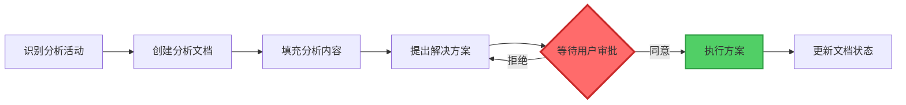
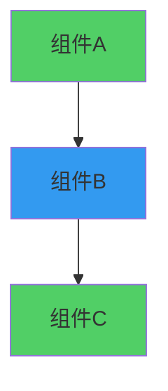
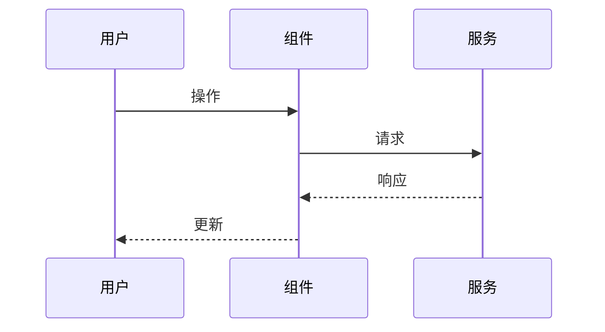

# 文档规则

**文档版本**: v1.0  
**创建时间**: 2026-01-15  
**适用项目**: SpacewareConops v3.0.1

## 📋 核心原则

1. **全程中文**: 所有文档使用中文编写
2. **流程可视化**: 必须使用 Mermaid 图表
3. **结构清晰**: 使用统一模板
4. **自动触发**: 分析活动自动创建文档

## 🌐 语言规范

### 文档语言

- ✅ **对话语言**: 统一使用中文进行所有对话交流
- ✅ **文档语言**: 所有生成的文档、注释、说明均使用中文
- ✅ **代码注释**: 优先使用中文注释，提高团队理解效率
- ✅ **变量命名**: 在不影响代码规范的前提下，适当使用中文拼音或英文

### 代码示例

在文档中的代码示例保持原有语言，但说明使用中文：

```typescript
// ✅ 正确：中文说明 + 英文代码
/**
 * 获取用户信息
 * @param userId 用户ID
 * @returns 用户信息对象
 */
function getUserInfo(userId: string): UserInfo {
  // 实现代码...
}
```

## 📄 格式规范

### 文档格式

- **统一使用 Markdown 格式**
- **使用合适的标题层级** (H1-H6)
- **使用列表组织内容** (有序列表、无序列表)
- **使用代码块展示代码** (指定语言类型)
- **使用表格展示结构化数据**

### 标题层级

```markdown
# H1: 文档标题（每个文档只有一个）

## H2: 主要章节

### H3: 子章节

#### H4: 小节

##### H5: 细节说明

###### H6: 补充信息
```

### 代码块

````markdown
```typescript
// TypeScript 代码
const user: UserInfo = {
  id: '1',
  name: 'John',
};
```

```vue
<!-- Vue 组件 -->
<template>
  <div>{{ message }}</div>
</template>
```
````

## 🏗️ 结构规范

### 标准文档结构

```markdown
# 文档标题

**文档版本**: v1.0
**创建时间**: YYYY-MM-DD
**适用项目**: SpacewareConops v3.0.1

## 📋 概述

简要说明文档的目的和范围

## 🎯 核心内容

详细的内容说明

## 📊 图表展示

使用 Mermaid 图表可视化流程

## ✅ 检查清单

相关的检查项

## 🔗 相关文档

链接到其他相关文档

---

**维护者**: 开发团队
**最后更新**: YYYY-MM-DD
```

### Emoji 使用规范

使用 emoji 增强可读性：

| Emoji | 含义       | 使用场景           |
| ----- | ---------- | ------------------ |
| 📋    | 概述、清单 | 文档概述、检查清单 |
| 🎯    | 目标、核心 | 核心内容、目标说明 |
| 📊    | 图表、数据 | 图表展示、数据分析 |
| ✅    | 完成、正确 | 检查项、正确示例   |
| ❌    | 错误、禁止 | 错误示例、禁止事项 |
| ⚠️    | 警告、注意 | 重要提示、注意事项 |
| 💡    | 建议、提示 | 优化建议、使用提示 |
| 🔗    | 链接、关联 | 相关文档、外部链接 |
| 🚀    | 快速、开始 | 快速开始、性能优化 |
| 🔧    | 工具、配置 | 工具使用、配置说明 |

## 📝 命名规范

### 文件命名

**核心原则**: 文档文件名使用中文命名，便于团队理解和查找

**命名格式**: `类型-主题-日期.md`

| 文档类型     | 命名格式                          | 示例                                        |
| ------------ | --------------------------------- | ------------------------------------------- |
| 代码分析     | `代码分析-<模块名>-<日期>.md`     | `代码分析-拖拽事件-2026-01-15.md`           |
| 原因分析     | `原因分析-<问题名>-<日期>.md`     | `原因分析-地球拖拽失败-2026-01-15.md`       |
| 综合分析     | `综合分析-<主题>-<日期>.md`       | `综合分析-事件总线架构-2026-01-15.md`       |
| 架构分析     | `架构分析-<范围>-<日期>.md`       | `架构分析-双总线系统-2026-01-15.md`         |
| 性能分析     | `性能分析-<模块名>-<日期>.md`     | `性能分析-渲染引擎-2026-01-15.md`           |
| 问题诊断     | `问题诊断-<问题名>-<日期>.md`     | `问题诊断-拖拽事件丢失-2026-01-15.md`       |
| **组件分析** | **`组件分析-<组件名>-<日期>.md`** | **`组件分析-SpacewareWorld-2026-01-16.md`** |
| **包分析**   | **`包分析-<包名>-<日期>.md`**     | **`包分析-spaceworld-2026-01-16.md`**       |
| 修复总结     | `修复总结-<问题名>-<日期>.md`     | `修复总结-拖拽事件-2026-01-15.md`           |
| 编码总结     | `编码总结-<任务名>-<日期>.md`     | `编码总结-对象浏览器-2026-01-15.md`         |
| **开发总结** | **`开发总结-<主题>-<日期>.md`**   | **`开发总结-火焰渲染方案-2026-04-15.md`**   |
| **周报日志** | **`周报-<年份>-W<周次>.md`**      | **`周报-2026-W16.md`**                      |

**命名注意事项**:

- 使用简洁明了的中文描述
- 日期格式统一为 `YYYY-MM-DD`
- 避免使用特殊字符和空格
- 模块名和问题名使用中文或项目约定的中文术语

## 📁 存放规范

### 目录结构

```
doc/
├── analysis/         # 分析文档
│   ├── 代码分析-*.md
│   ├── 原因分析-*.md
│   ├── 综合分析-*.md
│   ├── 组件分析-*.md    # 新增：组件分析文档
│   └── 包分析-*.md      # 新增：包分析文档
├── architecture/     # 架构文档
│   ├── 架构分析-*.md
│   └── 编码总结-*.md
├── features/         # 功能开发文档
│   └── 编码总结-*.md
├── fixes/            # 问题修复文档
│   ├── 问题诊断-*.md
│   └── 编码总结-*.md
├── optimization/     # 性能优化文档
│   ├── 性能分析-*.md
│   └── 编码总结-*.md
├── summaries/        # 开发总结文档
│   └── 开发总结-*.md
├── weekly-reports/   # 周报日志
│   └── 周报-<年份>-W<周次>.md
└── collaboration/    # 协作规则文档
    ├── 核心规则/
    ├── 工作流程/
    ├── 质量保证/
    └── 参考资料/
```

### 存放规则

| 文档类型     | 存放位置            | 说明                           |
| ------------ | ------------------- | ------------------------------ |
| 代码分析     | `doc/analysis/`     | 代码结构、逻辑分析             |
| 原因分析     | `doc/analysis/`     | 问题根因分析                   |
| 综合分析     | `doc/analysis/`     | 多维度综合分析                 |
| **组件分析** | **`doc/analysis/`** | **子组件结构、接口、质量分析** |
| **包分析**   | **`doc/analysis/`** | **子包职责、依赖、API分析**    |
| 架构分析     | `doc/architecture/` | 系统架构分析                   |
| 架构总结     | `doc/architecture/` | 架构相关编码总结               |
| 功能总结     | `doc/features/`     | 功能开发编码总结               |
| 修复诊断     | `doc/fixes/`        | 问题诊断文档                   |
| 修复总结     | `doc/fixes/`        | 问题修复编码总结               |
| 性能分析     | `doc/optimization/` | 性能分析文档                   |
| 性能总结     | `doc/optimization/` | 性能优化编码总结               |
| **开发总结** | **`doc/summaries/`** | **阶段性开发总结、技术复盘**  |
| **周报日志** | **`doc/weekly-reports/`** | **每周工作周报**          |

## 📋 内容规范

### 分析文档内容

所有分析文档必须包含：

1. **分析概述**

   - 分析的目标和范围
   - 分析的方法和工具
   - 分析的时间和背景

2. **详细分析**

   - 分析过程和步骤
   - 关键发现和数据
   - 图表和可视化（如适用）

3. **结论总结**

   - 主要结论和发现
   - 影响范围评估
   - 风险和注意事项

4. **解决方案**（如适用）

   - 推荐的解决方案
   - 实施步骤和优先级
   - 预期效果和验证方法

5. **后续建议**
   - 需要进一步分析的内容
   - 相关的优化建议
   - 预防措施和最佳实践

### 编码总结内容

编码总结文档必须包含：

1. **修改概述**

   - 任务目标和背景
   - 修改的范围和影响

2. **文件清单**

   - 新增的文件
   - 修改的文件
   - 删除的文件

3. **架构图**（Mermaid）

   - 修改后的系统架构
   - 模块关系图

4. **数据流图**（Mermaid）

   - 数据流向
   - 交互流程

5. **构建验证结果**

   - 构建命令和输出
   - 验证结果

6. **影响范围分析**

   - 影响的模块
   - 影响的功能
   - 潜在风险

7. **后续建议**
   - 优化建议
   - 测试建议
   - 维护建议

## 🎨 流程可视化

**核心原则**: 所有涉及流程的部分，都必须使用 Mermaid 图表

详见：[图表规则](./图表规则.md)

### 快速参考

**何时使用图表**:

- ✅ 3步以上的流程
- ✅ 包含分支判断的流程
- ✅ 涉及多个角色/系统的流程
- ✅ 状态转换流程
- ✅ 数据流向说明

**图表类型选择**:

- 流程图 (flowchart): 步骤流程
- 状态图 (stateDiagram): 状态转换
- 时序图 (sequenceDiagram): 交互流程
- 甘特图 (gantt): 时间线流程

## 🔄 自动触发规则

### 触发条件

以下情况必须自动创建对应的分析文档：

| 分析活动     | 触发条件                                     | 文档类型         | 参考规则                                  |
| ------------ | -------------------------------------------- | ---------------- | ----------------------------------------- |
| 代码分析     | 深入分析代码结构、逻辑、性能                 | 代码分析文档     | -                                         |
| 原因分析     | 分析问题的根本原因、影响范围                 | 原因分析文档     | -                                         |
| 综合分析     | 对多个方面进行综合性分析                     | 综合分析文档     | -                                         |
| 架构分析     | 分析系统架构、模块关系                       | 架构分析文档     | -                                         |
| 性能分析     | 分析性能瓶颈、优化方向                       | 性能分析文档     | -                                         |
| 问题诊断     | 诊断错误、异常、故障                         | 问题诊断文档     | -                                         |
| **组件分析** | **交互中提及"分析组件"、"组件分析"**         | **组件分析文档** | **[子组件分析规则](./子组件分析规则.md)** |
| **包分析**   | **交互中提及"分析包"、"分析子包"、"包分析"** | **包分析文档**   | **[子组件分析规则](./子组件分析规则.md)** |

### 触发关键词

**组件分析触发词**:

- "分析组件"
- "组件分析"
- "分析这个组件"
- "分析 XXX 组件"
- "组件结构分析"
- "组件质量分析"

**包分析触发词**:

- "分析包"
- "包分析"
- "分析子包"
- "分析这个包"
- "分析 @spaceware/XXX"
- "包依赖分析"
- "包结构分析"

### 执行流程

**重要**: 这是一个"分析 → 文档 → 审批 → 执行"的工作流程



1. **识别分析活动**: 在交互过程中识别是否触发分析文档输出条件
2. **创建分析文档**: 立即创建对应的分析文档
3. **填充分析内容**: 将分析过程和结果记录到文档中
4. **提出解决方案**: 在文档中详细说明推荐的解决方案
5. **通知用户**: 告知用户已创建分析文档及其位置
6. **等待审批**: ⚠️ **必须等待用户明确同意方案后才能执行**
7. **执行方案**: 用户同意后，按照文档中的方案执行
8. **更新文档**: 执行过程中持续更新文档状态

## 📊 文档模板

### 分析文档模板

```markdown
# [分析类型] 分析标题

**分析时间**: YYYY-MM-DD HH:mm
**分析人员**: AI Assistant
**相关模块**: 模块名称
**问题/需求**: 简要描述

## 📋 分析概述

### 分析目标

- 目标1
- 目标2

### 分析范围

- 范围1
- 范围2

### 分析方法

- 方法1
- 方法2

## 🔍 详细分析

### 1. [分析维度1]

详细分析内容...

### 2. [分析维度2]

详细分析内容...

## 📊 关键发现

### 发现1: 标题

- 详细描述
- 影响范围
- 严重程度

## 💡 结论总结

### 主要结论

1. 结论1
2. 结论2

### 影响范围

- 影响的模块
- 影响的功能

### 风险评估

- 风险1: 描述和等级
- 风险2: 描述和等级

## 🎯 解决方案

### 推荐方案

1. **方案1**: 描述
   - 优点
   - 缺点
   - 实施难度

### 实施步骤

1. 步骤1
2. 步骤2

### 验证方法

- 验证点1
- 验证点2

## 📈 后续建议

### 短期建议

- 建议1
- 建议2

### 长期建议

- 建议1
- 建议2

---

**文档状态**: 待审批

## 📋 审批记录

- [ ] 等待用户审批
- [ ] 用户已同意方案
- [ ] 方案执行中
- [ ] 方案执行完成
```

### 编码总结模板

````markdown
# 编码总结-任务名称-日期

**任务时间**: YYYY-MM-DD
**任务人员**: AI Assistant
**任务类型**: 功能开发/问题修复/性能优化
**相关模块**: 模块名称

## 📝 修改概述

### 任务目标

简要描述任务的目标和背景

### 修改范围

- 影响的模块
- 影响的功能

## 📂 文件清单

### 新增文件

- `path/to/new/file1.ts` - 说明
- `path/to/new/file2.vue` - 说明

### 修改文件

- `path/to/modified/file1.ts` - 修改内容说明
- `path/to/modified/file2.vue` - 修改内容说明

### 删除文件

- `path/to/deleted/file.ts` - 删除原因

## 📊 架构图


````

## 🔄 数据流图



## ✅ 构建验证结果

### 构建命令

```bash
pnpm --filter <package-name> build
```

### 构建输出

```
✓ 构建成功
✓ 类型检查通过
✓ 产物生成完整
```

## 📈 影响范围分析

### 影响的模块

- 模块1: 影响说明
- 模块2: 影响说明

### 影响的功能

- 功能1: 影响说明
- 功能2: 影响说明

### 潜在风险

- 风险1: 描述和缓解措施
- 风险2: 描述和缓解措施

## 💡 后续建议

### 优化建议

- 建议1
- 建议2

### 测试建议

- 测试点1
- 测试点2

### 维护建议

- 建议1
- 建议2

---

**文档状态**: 已完成
**用户测试**: 已通过
**创建时间**: YYYY-MM-DD HH:mm

```

## ✅ 检查清单

### 文档创建时

- [ ] 使用中文编写
- [ ] 使用统一模板
- [ ] 包含所有必需章节
- [ ] 添加了流程图表（如适用）
- [ ] 文件命名符合规范
- [ ] 存放位置正确

### 文档内容检查

- [ ] 标题清晰明确
- [ ] 目标和范围明确
- [ ] 分析过程完整
- [ ] 结论清晰准确
- [ ] 解决方案具体
- [ ] 后续建议实用

### 文档质量检查

- [ ] 语言简洁流畅
- [ ] 逻辑清晰连贯
- [ ] 格式规范统一
- [ ] 图表清晰易懂
- [ ] 无错别字
- [ ] 链接有效

## 🔗 相关文档

- [图表规则](./图表规则.md) - Mermaid 图表规范
- [流程规则](./流程规则.md) - 工作流程和审批机制
- [文档优化流程](../工作流程/文档优化流程.md) - 文档创建流程
- [检查清单](../质量保证/检查清单.md) - 详细的检查项

---

**维护者**: 开发团队
**最后更新**: 2026-01-15
```
