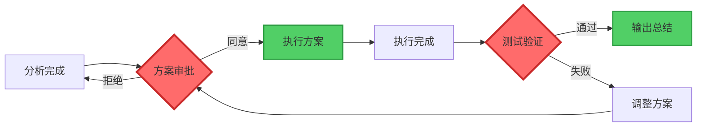
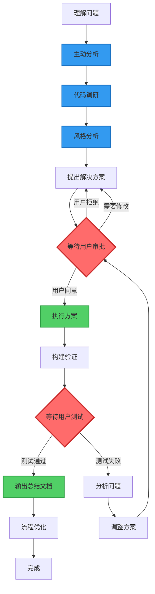
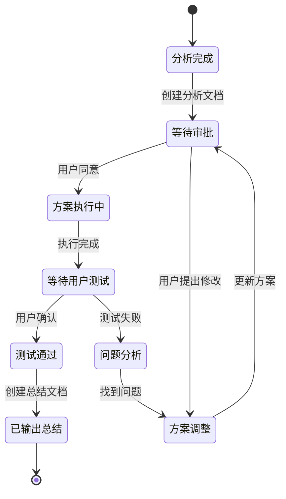
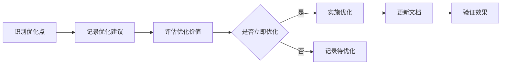

# 流程规则

**文档版本**: v1.0  
**创建时间**: 2026-01-15  
**适用项目**: SpacewareConops v3.0.1

## 📋 核心原则

1. **用户审批机制**: 执行前必须等待用户明确同意
2. **测试验证机制**: 执行后必须等待用户测试通过
3. **持续优化**: 边解决问题边优化流程
4. **文档驱动**: 所有流程都要有文档记录

## 🔴 用户审批机制（最重要）

### 核心原则

**在执行任何代码修改操作之前，必须等待用户明确同意**

### 关键审批点



**两个关键审批点**:

1. **方案审批点**: 分析完成 → 等待用户同意 → 执行方案
2. **测试验证点**: 执行完成 → 等待用户测试 → 输出总结

### 禁止的行为

- ❌ 分析完问题后直接修改代码
- ❌ 假设用户同意而自动执行方案
- ❌ 在用户测试前输出总结文档
- ❌ 跳过审批步骤直接进入下一阶段

### 必须遵循的流程

1. **分析阶段**: 深入分析问题，创建分析文档
2. **方案阶段**: 在文档中详细说明解决方案
3. **审批阶段**: ⚠️ **等待用户明确同意**（"同意"、"执行"、"开始"等）
4. **执行阶段**: 用户同意后才开始修改代码
5. **验证阶段**: 执行完成后等待用户测试
6. **确认阶段**: ⚠️ **等待用户测试通过的反馈**
7. **总结阶段**: 用户确认后才输出总结文档

### 审批检查清单

**执行代码前必须确认**:

- [ ] 已创建详细的分析文档
- [ ] 已在文档中说明解决方案
- [ ] 已明确告知用户"等待您的审批"
- [ ] 已收到用户明确的同意反馈
- [ ] 用户没有提出修改意见

**输出总结前必须确认**:

- [ ] 代码修改已全部完成
- [ ] 构建验证已通过
- [ ] 已通知用户进行测试
- [ ] 已收到用户"测试通过"的明确反馈
- [ ] 用户同意输出总结文档

## 🔄 标准工作流程

### 完整流程图



### 流程详解

#### 1. 理解问题（5 分钟）

**目标**: 明确任务目标和范围

**检查清单**:

- ✅ 任务目标清晰
- ✅ 影响范围明确
- ✅ 技术约束了解
- ✅ 优先级确定

#### 2. 主动分析（10-15 分钟）

**目标**: 全面了解问题背景

**操作步骤**:

1. **查阅项目文档**: 在 `doc/` 目录查找相关文档
2. **阅读相关代码**: 理解当前实现和依赖关系
3. **综合分析**: 结合文档和代码形成全面理解

**输出**: 对问题的全面理解

#### 3. 代码调研（10-15 分钟）

**目标**: 深入理解相关代码

**操作步骤**:

1. 查看相关代码文件
2. 理解数据流和依赖关系
3. 识别潜在影响点
4. 记录代码质量问题（不立即修复）

**输出**: 代码调研笔记

#### 4. 风格分析（5 分钟）

**目标**: 保持代码一致性

**分析维度**:

- 命名规范
- 代码组织结构
- 注释风格
- TypeScript 类型使用
- Vue Composition API 模式

**输出**: 编码风格总结

#### 5. 提出解决方案（10 分钟）

**目标**: 创建完整的解决方案文档

**文档内容**:

- 问题描述
- 原因分析
- 解决方案
- 影响范围
- 风险评估
- 实施步骤

**输出**: 分析文档（自动创建）

#### 6. 等待用户审批（关键）

**目标**: 确保方案正确性

⚠️ **必须等待用户明确同意后才能执行**

**审批内容**:

- 解决方案是否合理
- 影响范围是否可接受
- 实施步骤是否清晰

**结果**:

- ✅ 同意 → 执行方案
- ❌ 拒绝 → 修订方案
- 🔄 修改 → 调整方案

#### 7. 执行方案（30-60 分钟）

**目标**: 实施代码修改

✅ **用户同意后才能执行**

**执行原则**:

- 最小化修改范围
- 保持代码风格一致
- 添加必要注释
- 遵循 TypeScript 严格模式

**输出**: 代码修改

#### 8. 构建验证（5-10 分钟）

**目标**: 确保代码可运行

**构建命令**:

```bash
# 推荐：增量构建
pnpm build:all

# 单包构建
pnpm --filter <package-name> build
```

**验证内容**:

- ✅ 构建成功
- ✅ 无 TypeScript 错误
- ✅ 无 ESLint 警告
- ✅ 依赖包正常

**输出**: 构建验证结果

#### 9. 等待用户测试（关键）

**目标**: 确保功能正常

⚠️ **必须等待用户测试通过**

**测试内容**:

- 核心功能验证
- 边界情况测试
- 性能表现检查
- 兼容性确认

**结果**:

- ✅ 通过 → 输出总结文档
- ❌ 失败 → 分析问题并调整方案

#### 10. 用户确认（关键）

**目标**: 获得用户明确反馈

✅ **等待用户明确回复**

**确认方式**:

- 用户回复"测试通过"
- 用户回复"验证成功"
- 用户回复"可以输出总结"
- 用户提供测试结果描述

#### 11. 输出总结文档（15 分钟）

**目标**: 记录完整的修改过程

✅ **用户确认后才能输出**

**文档内容**:

- 修改概述
- 文件清单
- 架构图（Mermaid）
- 数据流图（Mermaid）
- 构建验证结果
- 影响范围分析
- 后续建议

**输出**: 编码总结文档

#### 12. 流程优化（持续）

**目标**: 边解决边优化

**优化内容**:

- 更新流程文档
- 补充最佳实践
- 记录经验教训
- 改进工作流程

**输出**: 更新的流程文档

## 📊 状态流转

### 文档状态转换图



### 状态说明

| 状态         | 说明                       | 下一步    |
| ------------ | -------------------------- | --------- |
| 分析完成     | 完成问题分析，创建分析文档 | 等待审批  |
| 等待审批     | 等待用户审批方案           | 执行/调整 |
| 方案调整     | 根据用户反馈调整方案       | 等待审批  |
| 方案执行中   | 用户同意后执行代码修改     | 等待测试  |
| 等待用户测试 | 等待用户进行实际测试       | 通过/失败 |
| 问题分析     | 测试失败，分析问题原因     | 方案调整  |
| 测试通过     | 用户确认测试通过           | 输出总结  |
| 已输出总结   | 创建编码总结文档           | 完成      |

## 🔄 持续优化原则

### 优化时机

在解决问题的过程中，识别以下优化机会：

- ✅ 发现流程瓶颈
- ✅ 发现重复性工作
- ✅ 发现可自动化的环节
- ✅ 发现文档不清晰的地方
- ✅ 发现最佳实践

### 优化内容

1. **流程文档**: 更新工作流程说明
2. **最佳实践**: 补充经验和技巧
3. **检查清单**: 添加新的检查项
4. **模板文档**: 改进文档模板
5. **工具脚本**: 创建自动化工具

### 优化流程



## 📝 经验总结机制

### 问题解决后的文档更新

当一个问题得到完整解决后，应该：

1. **更新问题分析文档**

   - 添加"✅ 已解决"标记
   - 记录解决方案和实施步骤
   - 记录验证结果和测试情况

2. **提取经验教训**

   - 分析问题的根本原因
   - 总结解决方案的关键点
   - 提炼可复用的最佳实践

3. **更新协作规则**

   - 将经验教训添加到规则文档
   - 更新相关的编码规范和注意事项
   - 如果涉及新的工具或流程，更新对应章节

4. **创建参考文档**
   - 如果解决方案具有通用性，创建独立的最佳实践文档
   - 在规则文档中添加引用链接

### 经验教训记录模板

```markdown
#### [问题类型] 问题简述

**发现时间**: YYYY-MM-DD
**解决时间**: YYYY-MM-DD
**相关文档**: [链接到详细分析文档]

**问题描述**:
简要描述问题的表现和影响

**根本原因**:
分析问题的根本原因

**解决方案**:

- 关键步骤1
- 关键步骤2

**经验教训**:

- 教训1: 具体说明
- 教训2: 具体说明

**最佳实践**:

- 实践1: 具体说明
- 实践2: 具体说明

**相关规则更新**:

- 更新了哪些编码规范
- 新增了哪些检查项
```

## ✅ 检查清单

### 流程开始前

- [ ] 理解了任务目标
- [ ] 查阅了相关文档
- [ ] 准备了分析工具
- [ ] 确认了工作流程

### 流程执行中

- [ ] 完成了主动分析
- [ ] 完成了代码调研
- [ ] 完成了风格分析
- [ ] 创建了分析文档
- [ ] 等待了用户审批
- [ ] 执行了代码修改
- [ ] 完成了构建验证
- [ ] 等待了用户测试

### 流程结束后

- [ ] 用户测试通过
- [ ] 输出了总结文档
- [ ] 更新了相关流程
- [ ] 记录了经验教训

## 🔗 相关文档

- [编码规则](./编码规则.md) - 编码规范和原则
- [文档规则](./文档规则.md) - 文档创建规范
- [图表规则](./图表规则.md) - 图表绘制规范
- [编码优化流程](../工作流程/编码优化流程.md) - 详细的编码流程
- [文档优化流程](../工作流程/文档优化流程.md) - 详细的文档流程
- [检查清单](../质量保证/检查清单.md) - 详细的检查项

---

**维护者**: 开发团队  
**最后更新**: 2026-01-15
